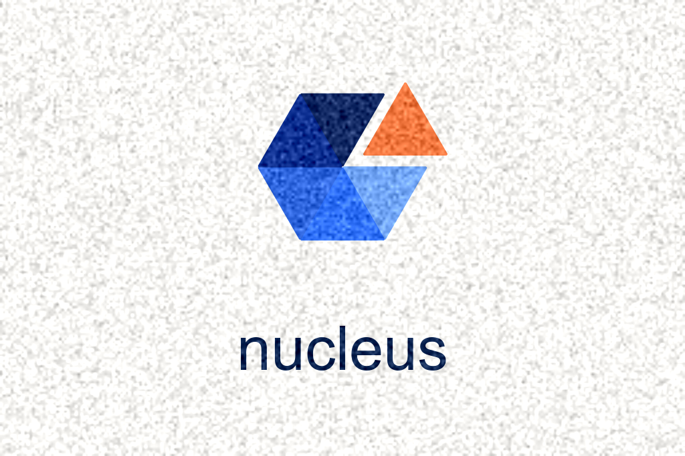

<p align="center">
  
</p>

# Nucleus


**Quickstart:** [`docs/onboarding/quickstart.md`](docs/onboarding/quickstart.md) · **Examples:** [`examples/01-ecommerce-elt/`](examples/01-ecommerce-elt/) · **Roadmap anchor:** [`nucleus_architecture_v4.1.md` section 18 — Roadmap](nucleus_architecture_v4.1.md#18-roadmap)

[](https://pypi.org/project/nucleus/)
[]()
[](LICENSE)
[]()
[](https://nucleus-data.github.io/nucleus/)

> # Ship data products from a laptop.
>
> **Nucleus is a local-first Python SDK and CLI for building Iceberg-native pipelines and analytics stacks.** Wraps DuckDB, Polars, Apache Iceberg, and embedded orchestration into one coherent product. AI-ready by design. Apache 2.0. **No JVM** in the default path. Graduates cleanly to **any Iceberg catalog** (Polaris, Lakekeeper, Unity, R2, Snowflake-Iceberg-compat) — including Databricks and Snowflake — the day a single laptop stops being enough.

---

## 60-second demo

<p align="center">
  <a href="https://github.com/nucleus-data/nucleus/raw/main/assets/demos/v0.2/launch_60s.mp4">
    
  </a>
</p>

*Click to play (60 s, no audio, captions burned in). From `pip install nucleus` to a queried Iceberg snapshot with the Workbench dashboard on `localhost:8765`. Source script: [`docs/release/launch_kit/60_SECOND_DEMO_SCRIPT.md`](docs/release/launch_kit/60_SECOND_DEMO_SCRIPT.md). The MP4 + poster image land alongside the launch tag; if the link is dark in your mirror, the script is the source of truth.*

---

## 3-command quickstart

**Python 3.11** is the primary supported interpreter (3.12 may work; follow `pyproject.toml`).

```bash
pip install nucleus                                  # ~16 deps, <60 s on warm pip cache
nucleus init my-stack && cd my-stack && nucleus up   # scaffold + boot local stack (~6 s)
nucleus run example.greeting                         # materialize your first Iceberg snapshot
```

Optional extras when you need real data sources or the Workbench web IDE:

```bash
pip install "nucleus[postgres,workbench]"
nucleus ingest postgres://localhost/app --table public.orders --as raw.orders
nucleus query "SELECT count(*) FROM {{ ref('raw.orders') }}"
nucleus workbench up                                 # http://localhost:8765
```

Full quickstart with Postgres + S3 + a BI-ready mart in <30 min: [`docs/onboarding/quickstart.md`](docs/onboarding/quickstart.md).

---

## Why Nucleus

- **Graduates to giants, not away from them.** Nucleus writes plain Apache Iceberg snapshots to your own S3 (or filesystem) — no Nucleus-proprietary byte format, ever. The day you outgrow a laptop, you point Databricks, Snowflake, or any Iceberg catalog at the same bucket. Zero migration. The yield-to-giants strategy is a first-class architectural principle, not a fallback ([`nucleus_architecture_v4.1.md` §10](nucleus_architecture_v4.1.md#10-yield-to-giants-strategy)).
- **Local-first by construction.** Cold boot ~6 s (`nucleus up`). Idle RAM ~117 MB. Iceberg snapshots, scheduling daemon, run ledger, and Workbench all run from a single `pip install` on a laptop. No cluster. No JVM. Local-identical-to-prod ([`docs/benchmarks/2026-05-15_baseline.md`](docs/benchmarks/2026-05-15_baseline.md)).
- **AI-assisted, not AI-gated.** `nucleus chat` routes through `litellm` to your provider of choice (Anthropic / OpenAI / Ollama / 100+ more), with opt-in consent, no Nucleus servers, no key logging. The Copilot is a feature; the data path is the product. Lineage-aware refactoring arrives in v0.5 ([ADR-015](docs/decisions/ADR-015-ai-chat-mvp.md)). <!-- banned-term: AI-native -->

---

## What's not in v0.2 (yet)

We are honest about scope. v0.2.0 is the first publicly available release; treat it as beta. The following are **deferred** to v0.3 / v0.5 / v1.0 per the roadmap at [`nucleus_architecture_v4.1.md` §18](nucleus_architecture_v4.1.md#18-roadmap):

- **Lakekeeper REST catalog** — v0.3+ (v0.2 stays on filesystem catalog; bytes are still valid Iceberg).
- **`dbt-duckdb` adapter** — v0.3+ optional. v0.2 ships native `ctx.sql` + Jinja `{{ ref() }}` (~180 LOC, hard 2,500 LOC scope ceiling).
- **Marimo notebooks** — v0.3+. v0.2 ships no notebook runtime.
- **Column-level lineage** — v0.5+ for SQL; v1.0 for Python. v0.2 ships asset-level OpenLineage NDJSON.
- **Lineage-aware AI Copilot** — v0.5+. v0.2 ships single-turn chat only.
- **Hybrid compute dispatch** (`@nucleus.sql_asset(compute="databricks")`) — v1.5+.
- **Nucleus Cloud** (managed catalog, managed S3, managed deploy) — v1.0+. The OSS core is and will remain free forever.

If your problem requires any of these today, Nucleus is not yet for you. The full disclosure of empirical numbers (including 11 measured failures vs aspirational targets) lives at [`docs/benchmarks/2026-05-15_baseline.md`](docs/benchmarks/2026-05-15_baseline.md).

---

## Honest 1-row comparison

| | **Nucleus v0.2** | dbt-core | Airflow | Databricks |
|---|---|---|---|---|
| **Best for** | 5–20 engineer team, 100 GB–5 TB, greenfield Iceberg + laptop-first | SQL-centric transforms on a warehouse you already have | Batch orchestration at scale, mature on-call patterns | 200+ engineer central platform, 100+ TB, distributed compute |

This is not a feature matrix — feature matrices favour whoever picks the features. It is a **persona matrix**. If you are not a 5–20 engineer team building greenfield Iceberg-native analytics on laptops, one of the other three columns is probably the right tool for you, and we will gladly help you graduate ([`docs/release/launch_kit/comparison_vs_databricks_snowflake.md`](docs/release/launch_kit/comparison_vs_databricks_snowflake.md) holds the full capability matrix with honest deltas).

---

## What is Nucleus (slightly longer)

A **local-first Python SDK + CLI** that wraps DuckDB, Polars, Apache Iceberg, PyArrow, and embedded orchestration behind **`ctx`** (programmatic) and **`nucleus`** (operator). A **data product** here means an Iceberg-backed **asset** with transforms, **contracts** (`@nucleus.check`), and lineage metadata — see **`nucleus_architecture_v4.1.md` section 12.1** for the precise definition. Vocabulary guidance for docs and UI: [`AGENTS.md`](AGENTS.md) section 7.

```python
import nucleus.ctx as ctx

ctx.copy_from(
    "postgres://localhost/ecommerce",
    table="public.orders",
    target="raw.orders",
    warehouse_dir="./data/warehouse",
)
df = ctx.sql(
    "SELECT customer_id, sum(amount) AS total FROM {{ ref('raw.orders') }} GROUP BY 1",
    warehouse_dir="./data/warehouse",
).collect()
```

---

## Why Nucleus exists

| You want… | But you often get… |
|-----------|-------------------|
| Lightweight local development | Heavy cluster boot | 
| Open formats | Vendor-only exports |
| Composable engines | Opaque bundles |
| Graduate without re-writing Iceberg | Lock-in by query dialect |

Nucleus optimizes the **on-ramp**; when you exceed single-node scale, **your Iceberg assets remain portable**.

---

## The Five Pillars

Mirrored from **`nucleus_architecture_v4.1.md` section 2** and [`AGENTS.md`](AGENTS.md) section 6:

1. **High performance on minimal resources** — DuckDB + Polars + Arrow; cold start budget **under ~10s** for `nucleus up`.
2. **Composable by constitution** — Tier 1/2 dependencies expose swap interfaces + smoke tests; **full alternate implementations stay on-demand**, not preemptive.
3. **AI-ready by design** — structured errors, schemas, and `ctx` ergonomics that LLMs can steer; **AI assists, it does not replace the data path**.
4. **Familiar UX** — borrow patterns from dbt / Dagster-style assets / modern CLI tooling.
5. **Friendly to giants** — Iceberg portability lets teams **graduate** to Databricks/Snowflake/REST catalogs without re-platforming the warehouse bytes.

---

## Architecture (one page)

Five layers (bottom → top): **Physics** (Arrow, Iceberg, Parquet, S3 API) → **Engines** (DuckDB, Polars, …) → **Coordination** (materialization + lineage) → **Intelligence** (Copilot, agents — staged) → **Experience** (`ctx` + CLI + Workbench).

- [`nucleus_architecture_v4.1.md`](nucleus_architecture_v4.1.md) — source of truth (**section 18** = versioned roadmap).
- [`docs/architecture/`](docs/architecture/) — diagrams and sequences.

---

## Operator & developer surfaces

### `ctx` SDK

```python
import nucleus.ctx as ctx
from nucleus import materialize

warehouse = "./data/warehouse"
ctx.copy_from("sqlite:///./data/events.db", table="events", target="raw.events", warehouse_dir=warehouse)
ctx.sql("SELECT * FROM {{ ref('raw.events') }}", warehouse_dir=warehouse)
ctx.read("raw.events", warehouse_dir=warehouse)
materialize("marts.daily_revenue")  # after `@nucleus.asset` registration + import
```

### `nucleus` CLI (v0.1)

```bash
nucleus init my-project && cd my-project
nucleus up
nucleus ingest sqlite:///./db.sqlite --table t --as raw.events
nucleus query "SELECT * FROM {{ ref('raw.events') }} LIMIT 10"
nucleus run marts.daily_revenue
nucleus down
nucleus version
```

Detailed flag and stability text: [`nucleus_cli_spec.md`](nucleus_cli_spec.md).

---

## Yield-to-giants strategy

Nucleus **complements** Databricks/Snowflake — Iceberg bytes port first; hybrid dispatch and federation are **later roadmap items** (`nucleus_architecture_v4.1.md` section 8).

---

## Repository structure (abridged)

```
.
├── AGENTS.md                      # Contributor + vocabulary rules
├── README.md                      # This file
├── nucleus_architecture_v4.1.md # Architecture + roadmap (section 18)
├── examples/                      # Curated end-to-end samples (start at 01-ecommerce-elt)
├── src/nucleus/                   # Implementation (ctx, CLI, coordination, …)
├── docs/                          # Onboarding, recipes, patterns, decisions
├── tests/
├── poc/                           # Historical PoC snapshots
└── scripts/                       # Governance (vocabulary, pins, LOC, leak check, …)
```

---

## Contributing

**External contributions are limited** while Tier 1 stabilizes — open an issue before large changes.

When the project opens up:

1. Read [`AGENTS.md`](AGENTS.md) — hard constraints are non-negotiable.
2. Follow [`docs/conventions/engineering.md`](docs/conventions/engineering.md).
3. Architectural forks start as recorded decisions under `docs/decisions/`.

---

## License

Apache 2.0 — see [`LICENSE`](LICENSE).

---

## Acknowledgments

Nucleus **wraps** — it does not replace — these projects:

- [Apache Arrow](https://arrow.apache.org/), [Apache Iceberg](https://iceberg.apache.org/) / [PyIceberg](https://py.iceberg.apache.org/), [Apache Parquet](https://parquet.apache.org/)
- [DuckDB](https://duckdb.org/), [Polars](https://pola.rs/)
- [Dagster](https://dagster.io/)
- [OpenLineage](https://openlineage.io/), [OpenTelemetry](https://opentelemetry.io/)

If we ship something useful, it is because these foundations exist. Support them.

---

*For **small teams** who need **Iceberg-native** assets **today** without staffing a platform org — and who want a **documented path** when laptops stop being enough.*
