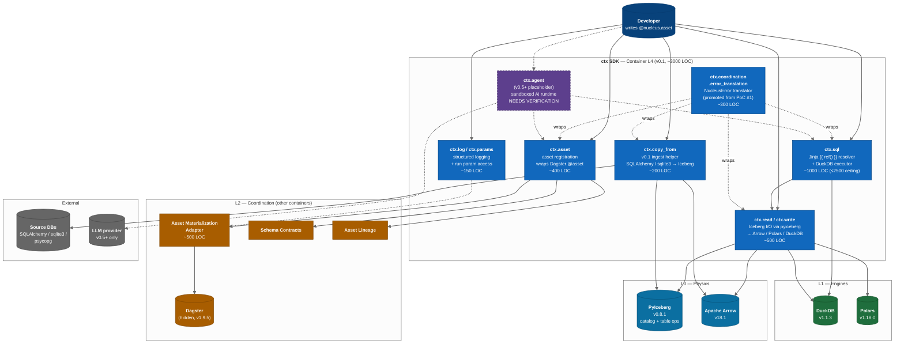

# C4 Level 3 — Component Diagram (inside the `ctx` SDK)

> **Diagram type**: C4 Component (Level 3)
> **Scope**: What lives inside the `ctx` SDK container from [`C4_container.md`](C4_container.md)
> **Audience**: Contributors implementing or reviewing changes to the public Python surface
> **Last updated**: Month 0 (Pre-Heartbeat)
> **Companion docs**: [`C4_context.md`](C4_context.md), [`C4_container.md`](C4_container.md), [`sequence_error_translation.md`](sequence_error_translation.md), [`../specs/nucleus_architecture_v4.1.md`](../specs/nucleus_architecture_v4.1.md)

The C4 model has 4 levels (Context → Container → Component → Code). This document is **Level 3**: it zooms into the **`ctx` SDK** container — the most important box in [`C4_container.md`](C4_container.md) §1, because per [`AGENTS.md`](../../AGENTS.md) §0 the `ctx` SDK is "the developer contract" and per v4.1 §13.1 the only public API. Every other container in L2/L3 exists to serve `ctx`.

---

## §1. The `ctx` SDK in one diagram

**Legend**: solid = v0.1 component; dashed = v0.5+ placeholder; `(())` = wrapped OSS / external; `==>` = user call site; `-.->` = post-v0.1 / cross-cutting. Error Translation is cross-cutting per [`sequence_error_translation.md`](sequence_error_translation.md) §3 — it wraps every outbound call before exceptions can reach user code.

---

## §2. Component-by-component

Every component below lives under `src/nucleus/ctx/` (per [`C4_container.md`](C4_container.md) §2.4) and is part of the public surface defined in v4.1 §13.2. LOC numbers are budgets, not measurements — v0.1 is pre-implementation per [`AGENTS.md`](../../AGENTS.md) §1.

### §2.1 `ctx.asset` — asset registration

Turn a decorated Python function into a Nucleus **asset** (vocab per [`AGENTS.md`](../../AGENTS.md) §7 — never "table", "job", "task"). Per v4.1 §6.1 this is the surface mapping to Dagster's `@asset`; per v4.1 §6.5 (Replaceability Mandate) users must never see `dagster` in their imports. Three responsibilities (v4.1 §6.2) justify a component over a bare decorator: (1) validate the contract pre-materialization, (2) hand the compute function to the AMA, (3) emit lineage. Frozen from v1.0 per v4.1 §13.3.

**Wraps**: Dagster `@asset` (v1.9.5) via the AMA — see [`C4_container.md`](C4_container.md) §6.2.

### §2.2 `ctx.sql` — Jinja resolver + DuckDB executor

Render a SQL string with `{{ ref('schema.name') }}` resolved against the asset graph, execute via DuckDB, return Arrow / Polars / DuckDB-relation. Per v4.1 §5.6 this is the **native** v0.1 transformation path (NOT dbt-duckdb).

**Hard scope ceiling** (v4.1 §5.6.0):

| Boundary | Limit |
|---|---|
| Total LOC for resolver + Jinja + ref/source | **≤ 2500 LOC** |
| Macros | basic primitives + user `macros/` only — no package ecosystem |
| Adapter ecosystem / semantic layer | none |

> If we drift past these limits we are "accidentally rebuilding dbt" — per v4.1 §5.6.0, STOP and integrate dbt-duckdb instead.

**PoC status**: PoC #2 (`poc/p2_ctx_sql/resolver.py`) ships the `{{ ref() }}` primitive; graduates to `src/nucleus/coordination/sql_resolver.py` after acceptance.

**Wraps**: `jinja2==3.1.5` (<https://jinja.palletsprojects.com/en/stable/api/>), `duckdb==1.1.3` (<https://duckdb.org/docs/api/python/overview>).

### §2.3 `ctx.read` / `ctx.write` — Iceberg I/O

Read an Iceberg asset into a chosen form (Polars / Arrow / DuckDB relation) via a lazy `Reader` (per [`C4_container.md`](C4_container.md) §3.1), or write a DataFrame/Arrow table back as a new Iceberg snapshot. Per v4.1 §13.2 these are the two oldest verbs in the SDK (present since the Tier 0 Heartbeat, v4.1 §18.0).

`ctx.write` returns a `Snapshot` ID; per v4.1 §6.2 the atomic commit itself is **the catalog's responsibility**, never ours (Constraint #5: no custom Iceberg commit service).

**Wraps**: `pyiceberg==0.8.1` (<https://py.iceberg.apache.org/api/catalog/>), `polars==1.18.0`, `duckdb==1.1.3`. Arrow flows zero-copy throughout (v4.1 §4.1).

### §2.4 `ctx.copy_from` — v0.1 ingest helper

The "one-liner" ingest path per v4.1 §5.5.1 (Amendment 13): pull a source table into a fresh Iceberg asset with auto-inferred schema and atomic commit. v0.1 supports five sources: **PostgreSQL, MySQL, SQLite, CSV, Parquet, JSON**. Only `mode="full_refresh"` ships in v0.1; incremental is v0.3+. Separated from `ctx.write` so `ctx.write` stays engine-agnostic (v4.1 §13.1 principle #3) — `copy_from` owns source wiring, paginated reads, schema inference.

**PoC status**: PoC #3 (`poc/p3_ingest/ingest.py`) ships SQLite → filesystem-Iceberg; SQLAlchemy/psycopg added during PoC #3 acceptance. Graduates to `src/nucleus/ctx/copy_from.py` (~200 LOC). For dlt integration in v0.3+ see v4.1 §5.5.2.

**Wraps**: `pyiceberg==0.8.1`, `pyarrow==18.1.0`, stdlib `sqlite3`, `SQLAlchemy` (pin TBD).

### §2.5 `ctx.log` / `ctx.params` — observability + parameter access

Give user-authored asset bodies access to (1) structured logging that flows into run history without exposing Dagster's logger directly, and (2) parameters passed to the current materialization run.

`ctx.log` emits structlog records AND OpenTelemetry spans (per [`C4_container.md`](C4_container.md) §8). Privacy rules from [`C4_context.md`](C4_context.md) §5.2 apply — no row data, no PII, ever. `ctx.params` exposes typed access (`ctx.params.get(name, default)`) to values passed via `nucleus run --param=...`.

Both stable from v0.1 per v4.1 §13.2; `ctx.metrics` and `ctx.secrets` follow in v0.2+, `ctx.snapshot` in v0.3+.

### §2.6 `ctx.coordination.error_translation` — NucleusError translator

Intercept every external exception (Dagster, DuckDB, Polars, PyIceberg, source connectors) and re-emit as a `NucleusError` subclass with `user_message`, `fix_hint`, `docs_url`, `cause` populated. Per v4.1 §6.4 this is a **mandatory release blocker** — *"Leaky Dagster errors in user-facing surface = release blocker."* Drawn cross-cutting in §1 because it wraps every outbound call, not a separate call site users invoke; see [`sequence_error_translation.md`](sequence_error_translation.md) §3 for the full sequence. Handlers never re-raise — they return.

**PoC status**: PoC #1 (`poc/p1_error_translation/translator.py`) is the critical first PoC per v4.1 Appendix C. Per [`AGENTS.md`](../../AGENTS.md) §11.1, **no production code under `src/nucleus/` until PoC #1 passes**. Promotes to `src/nucleus/coordination/error_translation.py`.

**8 release-blocker scenarios** (v4.1 §6.4): asset materialization failure, SQL execution error, OOM crash, Iceberg commit conflict, dependency not yet materialized, schema mismatch, timeout/cancellation, concurrent write conflict. All 8 must translate cleanly before v0.1 ships.

### §2.7 `ctx.agent` — sandboxed AI runtime (v0.5+ placeholder)

**Status: NEEDS VERIFICATION** — API surface not yet locked. Per v4.1 §7.3 + §13.2 this component lands in v0.5+; per v4.1 §13.3 AI-related APIs are explicitly excluded from strict versioning (*"Breaking change allowed in minor — 6-month deprecation window"*).

Intended responsibility (v4.1 §7.3): take a natural-language description, ask the LLM to propose `@nucleus.asset` / `@nucleus.sql_asset` / `@nucleus.source` code, write to a **sandbox branch** (not committed), auto-generate tests, surface a diff for human approval. Guardrails (v4.1 §7.3): no modification of L0 Physics or core configs, no commit without human approval, no production-secret access, every action audited.

Drawn as a placeholder because per [`AGENTS.md`](../../AGENTS.md) §3 Constraint #7 *Nucleus is not an "AI/ML platform"*; per [`.cursor/rules/nucleus.mdc`](../../.cursor/rules/nucleus.mdc) "Forbidden Framings" we are AI-**ready**, not AI-native. `ctx.agent` is a thin scaffolder, not a hosting runtime. **The L3 diagram shows the seam; the v0.5+ design will fill it.** <!-- banned-term: AI-native -->

---

## §3. Component-to-container traceability

Each component mapped back to the L2/L1/L0 containers from [`C4_container.md`](C4_container.md) §1:

| ctx component | Primary L2 container | Engine (L1) | Physics (L0) |
|---|---|---|---|
| `ctx.asset` (§2.1) | AMA, Schema Contracts, Asset Lineage | — | — |
| `ctx.sql` (§2.2) | direct to L1 | DuckDB | Arrow |
| `ctx.read` / `ctx.write` (§2.3) | direct to L0 | Polars, DuckDB | PyIceberg, Arrow, Parquet, FileIO |
| `ctx.copy_from` (§2.4) | direct to L0 | — | PyIceberg, Arrow |
| `ctx.log` / `ctx.params` (§2.5) | AMA (per-run state) | — | OpenTelemetry |
| `ctx.coordination.error_translation` (§2.6) | wraps **all** outbound calls | wraps **all** engines | wraps **all** physics |
| `ctx.agent` (§2.7, v0.5+) | NEEDS VERIFICATION | NEEDS VERIFICATION | NEEDS VERIFICATION |

`ctx.sql`, `ctx.read`, `ctx.write`, and `ctx.copy_from` reach L0/L1 directly. Only `ctx.asset` routes through the AMA — per v4.1 §6.2 the AMA owns *asset registration and commit orchestration*, not data-read proxying. The seven components sum to the ~3000 LOC `ctx/*` line in [`C4_container.md`](C4_container.md) §9 (~450 LOC headroom for shared types + `__init__.py`); per Constraint #8 ([`AGENTS.md`](../../AGENTS.md) §3) scope creep here is the highest-leverage v0.1 budget risk.

---

## §4. Open questions (NEEDS VERIFICATION)

Items where the API surface or implementation choice is not yet locked — committed code should carry a `# NEEDS VERIFICATION` comment per [`AGENTS.md`](../../AGENTS.md) §11.12. Tracked long-form in `docs/specs/nucleus_architecture_v4.1.md` Appendix B.

1. **`ctx.agent` surface (§2.7)** — Per v4.1 §7.3 the shape (`agent.scaffold_pipeline(...)`) is sketched but not locked; v4.1 §13.3 explicitly allows breaking changes in minor versions. **Do NOT lock until v0.5 design.**
2. **`ctx.read` materialization default** — `as_="polars"` vs `as_="arrow"` default. PoC #5 beachhead testing decides; v4.1 §13.2 lists both.
3. **`ctx.sql` macro primitives** — v4.1 §5.6.0 caps macros at "built-in primitives + user `macros/`". Exact built-in list (date_trunc, dateadd, current_timestamp, …?) settles at PoC #2 acceptance.
4. **`ctx.copy_from` mode taxonomy** — v0.1 ships `mode="full_refresh"` only (v4.1 §5.5.1). Whether `mode="append"` is a v0.1 stretch or strict v0.3 deferral is open.
5. **`ctx.dagster_context` escape hatch** — v4.1 §6.6 promises a Tier 2 escape hatch; the public name and telemetry-gating remain TBD (v4.1 §13.2).

---

## §5. Where to go next

- [`C4_context.md`](C4_context.md) — L1, system in environment.
- [`C4_container.md`](C4_container.md) — L2, five layers as containers.
- [`sequence_error_translation.md`](sequence_error_translation.md) — the critical sequence proving §2.6 (PoC #1 spec).
- [`../specs/nucleus_architecture_v4.1.md`](../specs/nucleus_architecture_v4.1.md) — §3 (layers), §5 (engines), §6 (coordination), §13 (`ctx` contract).
- [`../../internal/poc/`](../../internal/poc/) — PoCs #1/#2/#3 that this diagram's components graduate from.

---

*L3 source-of-truth. If you add or rename a `ctx` component, update §1, §2, and §3 in the same PR.*
