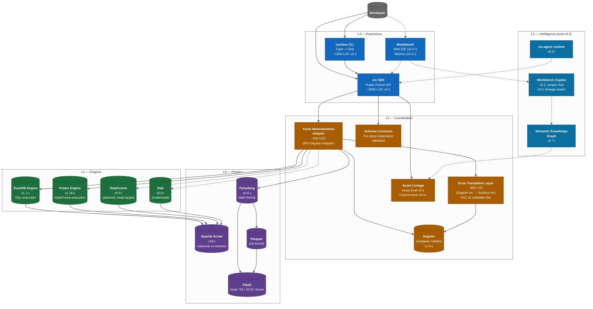

# C4 Level 2 — Container Diagram

> **Diagram type**: C4 Container (Level 2)
> **Scope**: What runs inside the Nucleus system box from L1
> **Audience**: Contributors writing code in this repo
> **Last updated**: Month 0 (Pre-Heartbeat)
> **Companion docs**: [`C4_context.md`](C4_context.md), [`../../nucleus_architecture_v4.1.md`](../../nucleus_architecture_v4.1.md)

This drills inside the **Nucleus Platform** box from the [Context diagram](C4_context.md). A "container" here = a deployable/runnable unit (a process, library, or workbench app). Different sizes are accepted.

---

## §1. The five layers, as containers



**Legend**: solid = present in v0.1; dashed = planned later.

---

## §2. Layer-by-layer breakdown

### §2.0 L0 — Physics (Immutable open standards)

**Purpose**: The data formats we never reinvent. These are *not* our code; they're the substrate.

| Container | Role | Version pin | Status |
|-----------|------|-------------|--------|
| **Apache Arrow** | Zero-copy columnar in-memory format | `pyarrow==18.1.0` | v0.1 ✓ |
| **PyIceberg** | Iceberg table operations (read/write/commit) | `pyiceberg==0.8.1` | v0.1 ✓ |
| **Parquet** | File storage format | via pyarrow | v0.1 ✓ |
| **FileIO** | Storage abstraction (FS / S3 / GCS / Azure) | via pyiceberg | v0.1 ✓ |

**Key principle**: We **delegate** to these projects. We never fork. Constraint #3 (No custom commit service): atomic commits are PyIceberg's job, not ours.

### §2.1 L1 — Engines (Composable compute)

**Purpose**: The query / DataFrame engines that do the actual work.

| Container | Role | Version pin | Status |
|-----------|------|-------------|--------|
| **DuckDB Engine adapter** | Wraps DuckDB for SQL execution + Iceberg reads | `duckdb==1.1.3` | v0.1 ✓ |
| **Polars Engine adapter** | Wraps Polars for DataFrame transformations | `polars==1.18.0` | v0.1 ✓ |
| **DataFusion Engine** | Alternative SQL engine (smoke test only v0.1; real impl v0.5+) | TBD | smoke only |
| **Daft Engine** | Multimodal / distributed (post v0.5) | TBD | future |

**Adapter pattern**: Each engine implements the `Engine` Protocol (per `engineering.md` §7.2). Swap = 1-line config change. Constraint #9 (Composability by Constitution).

### §2.2 L2 — Coordination

**Purpose**: Orchestration + lineage + contracts. **This is where most of the cleverness lives.**

| Container | Role | LOC budget | Status |
|-----------|------|------------|--------|
| **Asset Materialization Adapter** (`coordination/asset_materialization.py`) | Translates `ctx.asset` decorator into Dagster `@asset`. **Thin** wrapper (per F3 review). | ~500 LOC | v0.1 ✓ |
| **Error Translation Layer** (`coordination/error_translation.py`) | Maps Dagster exception types to NucleusError types. **Release blocker per v4.1 §6.4.** | ~300 LOC | v0.1 ✓ (PoC #1) |
| **Asset Lineage Capture** (`coordination/lineage.py`) | Asset-level inputs/outputs from Dagster's asset graph. | ~400 LOC | v0.1 ✓ (asset-level) |
| **Schema Contracts** (`coordination/contracts.py`) | Pre-materialize schema validation, post-materialize assertions. | ~600 LOC | v0.1 ✓ |
| **Dagster** | The hidden orchestrator | `dagster==1.9.5` | v0.1 ✓ |

**Critical: Error translation isn't optional.** If a Dagster error leaks to the user, our abstraction has failed. PoC #1 builds & validates this layer before anything else. See [`sequence_error_translation.md`](sequence_error_translation.md).

### §2.3 L3 — Intelligence (AI-assisted, post v0.2)

**Purpose**: AI features. Not present in v0.1 (per F1 review — staged release).

| Container | Role | Lands in |
|-----------|------|----------|
| **Workbench Copilot (chat)** | Simple "answer questions about my assets" | v0.2 |
| **Workbench Copilot (schema-aware)** | Knows table schemas; better suggestions | v0.3 |
| **Semantic Knowledge Graph (SKG)** | Asset metadata graph for AI reasoning | v0.7+ |
| **Workbench Copilot (lineage-aware)** | Suggests refactors across the asset graph | v0.5 |
| **`ctx.agent` runtime** | User-authored agents that call ctx APIs | v0.5+ |
| **Cost Meter (telemetry)** | Per-asset cost attribution & emission | v0.5+ |
| **Cost-Aware Planner** | Estimates query cost before execution; backfill impact preview | v0.7+ |
| **Replay / Time-Travel Debugger** | Re-run past materializations from Iceberg snapshots | v0.8+ |

**v0.1 NOOP**: This layer has zero code in v0.1. The architecture leaves space for it but we don't pretend to ship AI in the first release.

### §2.4 L4 — Experience

**Purpose**: What users actually touch.

| Container | Role | LOC budget | Status |
|-----------|------|------------|--------|
| **`ctx` SDK** (`src/nucleus/ctx/`) | Python API. The product. | ~3000 LOC v0.1 | v0.1 ✓ |
| **`nucleus` CLI** (`src/nucleus/cli/`) | Operator interface. Typer-based. | ~1500 LOC v0.1 | v0.1 ✓ |
| **Workbench** (separate frontend repo, v0.2+) | Web IDE | (separate repo) | v0.2 ✓ |
| **Marimo notebooks** | Native notebook integration | (Marimo plugin) | v0.3 ✓ |
| **Portal / Hub** (post v1.0) | SaaS landing experience | — | future |

**v4.1 §13.1**: `ctx` and `nucleus` (CLI) are the only public surfaces. Workbench uses `ctx` internally. **No backdoor APIs.**

---

## §3. The two interfaces, in detail

### §3.1 The `ctx` SDK

```python
# src/nucleus/ctx/__init__.py — the entire public surface

# Lifecycle
def context(config: NucleusConfig | None = None) -> Context: ...

# Asset definition
class Asset(Protocol): ...
def asset(name: str, *, deps: list[str] = ..., schema: Schema = ...) -> Decorator: ...

# Ingestion
def copy_from(source: str, *, table: str, target: str, mode: str = "replace") -> Asset: ...
def read_csv(path: str, *, target: str) -> Asset: ...

# Transformation
def sql(query: str, *, target: str, refs: dict[str, str] = ...) -> Asset: ...

# Reading
def read(asset: str) -> Reader: ...   # returns lazy reader, with .to_polars(), .to_arrow(), .to_duckdb_relation()

# Execution
def run(asset: str | list[str], *, dry_run: bool = False) -> RunResult: ...

# Inspection
def lineage(asset: str) -> Lineage: ...
def history(asset: str) -> list[Snapshot]: ...
def schema(asset: str) -> Schema: ...

# Errors (the only public exception type)
class NucleusError(Exception): ...
```

**Stability promise**: v4.1 §13.1 — this surface is **stable** from v1.0 forward (semver). AI-related APIs (`ctx.agent`, `ctx.copilot`) can flex faster (per v4.1 §13.3).

### §3.2 The `nucleus` CLI

```bash
# Lifecycle
nucleus up                                  # boot local stack <10s (Constraint: PoC #4)
nucleus down                                # tear down
nucleus init <project>                      # scaffold new project
nucleus status                              # health check

# Assets
nucleus run [<asset>...]                    # materialize assets
nucleus inspect <asset>                     # schema, snapshots, row count
nucleus lineage <asset>                     # asset DAG
nucleus catalog list [--prefix=raw]         # list assets

# Ingestion shortcuts
nucleus ingest <conn> --table=t --target=t  # copy_from wrapper

# Debugging
nucleus logs                                # structured log view
nucleus history <asset>                     # snapshot history
nucleus doctor                              # diagnose environment

# Workbench (v0.2+)
nucleus workbench                           # open web IDE

# Migrations
nucleus upgrade                             # safe component upgrade workflow (Constraint #11)
```

---

## §4. Process model (what actually runs)

**v0.1 (Tier 1) — single Python process:**

```
┌───────────────────────────────────────────────────────────┐
│  User shell                                                │
│     │                                                      │
│     │  nucleus CLI / Python REPL / script                  │
│     ▼                                                      │
│  ┌────────────────────────────────────────────────────┐   │
│  │ Single Python process                              │   │
│  │   - ctx SDK                                         │   │
│  │   - Asset Materialization Adapter                   │   │
│  │   - Embedded Dagster (DagsterInstance.ephemeral)    │   │
│  │   - In-process DuckDB                               │   │
│  │   - In-process Polars                               │   │
│  │   - PyIceberg (filesystem catalog)                  │   │
│  └─────────────┬──────────────────────────────────────┘   │
│                │                                            │
│                ▼                                            │
│         Local filesystem (./warehouse/, ./catalog.db)       │
└───────────────────────────────────────────────────────────┘
```

No daemons. No background workers. No long-running services. Every `nucleus` invocation = one Python process. **Perfect for local-first.**

**v0.2 (Workbench) — adds a server:**

```
┌────────────────────────────┐      ┌──────────────────────────┐
│  Browser                   │      │  CLI / Python             │
│   - Workbench web app      │      │   - same as v0.1          │
└───────────┬────────────────┘      └──────────────────────────┘
            │ HTTP / WS                       │
            ▼                                  ▼
┌──────────────────────────────────────────────────────────────┐
│  Nucleus Workbench Server (FastAPI, optional)                │
│    - serves UI                                                │
│    - delegates to ctx in-process                              │
│    - LLM proxy (no row data; user's API key)                  │
└────────────────────────────┬─────────────────────────────────┘
                             │
                             ▼
                  Same warehouse + catalog as v0.1
```

**v0.3+ (Hosted Cloud) — adds Nucleus Cloud:**

(Not v0.1 scope. Documented for completeness in `nucleus_architecture_v4.1.md` §10.)

---

## §5. Storage layout on disk

When you run `nucleus up` in a project, you get:

```
my-project/
├── nucleus.toml                  # project config
├── assets/                       # user-authored asset code
│   ├── raw/orders.py
│   ├── staging/customers.py
│   └── marts/daily_revenue.py
├── tests/                        # user-authored asset tests
├── .nucleus/                     # nucleus-managed (gitignored)
│   ├── runs/                     # run history
│   └── logs/                     # structured logs
├── warehouse/                    # Iceberg data (gitignored)
│   ├── raw/orders/
│   │   ├── metadata/
│   │   │   ├── v1.metadata.json
│   │   │   ├── snap-*.avro
│   │   │   └── ...
│   │   └── data/
│   │       └── *.parquet
│   ├── staging/customers/
│   └── marts/daily_revenue/
└── catalog.db                    # SQLite-backed Iceberg catalog (v0.1)
```

This layout is intentional:
- **`assets/` is the user's code.** They version-control it.
- **`warehouse/` is the data.** Gitignored. Reproducible from `assets/`.
- **`catalog.db` is metadata.** Per PyIceberg's SQL catalog implementation. Gitignored.
- **`.nucleus/` is run state.** Gitignored.

**Production deployment**: replace `warehouse/` with S3 path, replace `catalog.db` with Lakekeeper (v0.3) or Glue (v1.0). One config flip.

---

## §6. Inter-container interfaces (the contracts)

The contracts between layers:

### §6.1 `ctx` SDK → Asset Materialization Adapter
**Interface**: `MaterializationRequest` (msgspec struct):
```python
class MaterializationRequest(msgspec.Struct, frozen=True):
    asset_name: str
    deps: tuple[str, ...]
    compute_fn: Callable[..., Arrow | pl.DataFrame | None]
    schema: Schema | None
    target_engine: str  # "duckdb", "polars", or "auto"
    contracts: tuple[Contract, ...]
```

### §6.2 Asset Materialization Adapter → Dagster
**Interface**: Dagster's native `@asset` decorator, programmatically constructed. **Internal**. Users never see Dagster types.

### §6.3 Asset Materialization Adapter → Engines
**Interface**: `Engine` Protocol:
```python
class Engine(Protocol):
    name: ClassVar[str]
    def execute(self, plan: Plan, ctx: ExecContext) -> Iterator[RecordBatch]: ...
    def capabilities(self) -> EngineCapabilities: ...
```

### §6.4 Engines → Physics (Arrow / Iceberg)
**Interface**: `pyarrow.RecordBatch` streams in/out. Iceberg writes via PyIceberg's `Table.append(df)` / `Table.overwrite(df)`.

### §6.5 Error Translation Layer (cross-cutting)
**Interface**: A registered mapping `dict[type[Exception], Callable[[Exception], NucleusError]]`. Every Dagster error type that may surface has a translator. **Unrecognized errors raise `NucleusInternalError` with sanitized info.**

---

## §7. Failure modes & resilience

### §7.1 Materialization fails mid-write
- **Promise**: Iceberg atomic commits = no half-written tables. Either the new snapshot exists, or it doesn't.
- **Implementation**: PyIceberg's `Transaction` API. The Asset Materialization Adapter wraps `compute_fn` in a try/except; on exception, it does NOT call `commit()`. Partial Parquet files become orphans (cleaned by retention later).

### §7.2 Asset Materialization Adapter crashes
- **Promise**: User sees a NucleusError, not a stack trace from Dagster.
- **Implementation**: Error Translation Layer wraps the entire materialization. Any uncaught `dagster.*` exception → `NucleusInternalError` with `cause=` for debugging.

### §7.3 Engine crashes (DuckDB / Polars)
- **Promise**: Materialization fails cleanly. No corrupt files. Process exits or surfaces error.
- **Implementation**: DuckDB / Polars errors → translated by `ETL` (engine-specific table). Examples:
  - `duckdb.IOException` → `NucleusIOError`
  - `polars.SchemaError` → `NucleusSchemaError`

### §7.4 Catalog crashes (filesystem corruption)
- **Promise**: Iceberg metadata files are atomic per-file. Worst case: latest snapshot lost, previous still queryable.
- **Implementation**: PyIceberg's filesystem catalog uses atomic file rename. SQLite catalog uses transactions.

### §7.5 User SIGINT / SIGKILL
- **Promise**: Worst case: incomplete materialization, but no corrupt table. `Ctrl+C` mid-run is safe.
- **Implementation**: Same as §7.1 — no commit = no visible change.

---

## §8. Observability seams

Where we emit telemetry:

| Event | Emitted by | Schema |
|-------|-----------|--------|
| `asset.materialization.started` | AMA | `{asset, run_id, deps, engine}` |
| `asset.materialization.completed` | AMA | `{asset, run_id, rows, bytes, duration_ms, snapshot_id}` |
| `asset.materialization.failed` | AMA | `{asset, run_id, error_type, error_message, duration_ms}` |
| `error.translated` | ETL | `{original_type, translated_type, asset}` |
| `commit.attempted` | physics | `{table, snapshot_id, manifest_count}` |
| `commit.succeeded` | physics | `{table, snapshot_id, duration_ms}` |
| `commit.failed` | physics | `{table, error_type, error_message}` |
| `query.executed` | engine | `{engine, query_hash, rows, bytes, duration_ms}` |

All emitted as structured logs (structlog) AND OpenTelemetry spans (Constraint #7).

**Privacy**: query_hash is a hash of the SQL text after stripping literals. No row data, no PII, ever.

---

## §9. v0.1 LOC budget summary

Estimated lines of owned (Nucleus-authored) code at end of Tier 1:

| Layer | Module | LOC | Cumulative |
|-------|--------|-----|------------|
| L0 (Physics) | adapters/{iceberg, arrow, parquet}/* | ~400 | 400 |
| L1 (Engines) | engines/{duckdb,polars}_engine.py | ~600 | 1000 |
| L2 (Coordination) | coordination/asset_materialization.py | ~500 | 1500 |
| L2 | coordination/error_translation.py | ~300 | 1800 |
| L2 | coordination/lineage.py | ~400 | 2200 |
| L2 | coordination/contracts.py | ~600 | 2800 |
| L4 (Experience) | ctx/* (public SDK) | ~3000 | 5800 |
| L4 | cli/* | ~1500 | 7300 |
| Internal | _internal/{config,logging,errors}/* | ~700 | 8000 |
| **v0.1 Total** | | | **~8000 LOC** |

**Constraint #8**: Hard ceiling at end of v0.1 = 8000 LOC. Scripts in `scripts/loc_budget.py` enforce. (See `engineering.md` §2.2.)

---

## §10. Where to go next

- **[`sequence_error_translation.md`](sequence_error_translation.md)** — The critical flow that proves error translation works (PoC #1).
- **[`../decisions/`](../decisions/)** — ADRs for each architecturally significant choice.
- **[`../patterns/type_mapping.md`](../patterns/type_mapping.md)** — How types flow Postgres → Iceberg → Polars → DuckDB.
- **[`../../nucleus_architecture_v4.1.md`](../../nucleus_architecture_v4.1.md)** — The full architecture doc.

---

*If you change any cross-container interface (§6), update this doc AND raise an ADR.*
