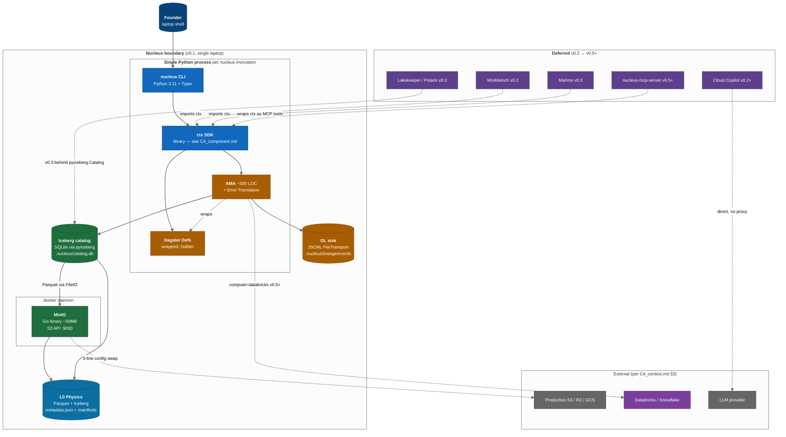

# C4 Level 2 — Container Diagram

> **Diagram type**: C4 Container (Level 2)
> **Scope**: Runtime containers (deployable processes / on-disk substrates) inside the Nucleus boundary, at v0.1 Hello World scope.
> **Audience**: New contributors, founder onboarding, anyone planning v0.3+ container migrations.
> **Last updated**: Month 0 (Pre-Heartbeat)
> **Companion docs**: [`C4_context.md`](C4_context.md) (L1), [`C4_component.md`](C4_component.md) (L3), [`sequence_asset_materialization.md`](sequence_asset_materialization.md), [`sequence_ingestion.md`](sequence_ingestion.md), [`../../nucleus_architecture_v4.1.md`](../../nucleus_architecture_v4.1.md)

The C4 model has four levels (Context → Container → Component → Code). This is **Level 2**: the runtime processes that compose Nucleus on a single machine. Below is L1 (the system in its environment, [`C4_context.md`](C4_context.md)); above is L3 (inside the `ctx` SDK container, [`C4_component.md`](C4_component.md)). Per `v4.1` §3.1 layers are numbered **bottom-up, L0 = Physics, L4 = Experience** — the same numbering [`C4_component.md`](C4_component.md) and `src/nucleus/` use. The diagram in §2 overlays those layers onto the actual containers a v0.1 user runs.

For the v0.1 "Hello World" release (`AGENTS.md` §1, `v4.1` §18.1) every container below runs on the founder's laptop, started by a single `nucleus up` invocation (`v4.1` §11.1 promise). There is **no daemon**, **no JVM**, and **no remote service** in the core path (`AGENTS.md` §3 Constraint #1) — MinIO is the only out-of-process binary, and it ships in a single docker container.

---

## §1. Container inventory (v0.1)

Six v0.1-active containers, layered per `v4.1` §3.1 (Five Layers): **L4 Experience** — `nucleus` CLI (`v4.1` §8.1) and `ctx` SDK (`v4.1` §13); **L2 Coordination** — Dagster Definitions (`v4.1` §6.1, in-process, no Dagit web server) and OpenLineage sink (`v4.1` §6.2 step 4, JSONL `FileTransport`); **L1 Engines** — Iceberg filesystem catalog (`v4.1` §5.7, SQLite via pyiceberg `SqlCatalog`) and MinIO server (`v4.1` §5.8, Go binary in docker). The CLI hosts the SDK + Dagster + AMA + OL emitter as one in-process Python invocation; MinIO is the only out-of-process binary. Deferred v0.2/0.3/0.5+ containers are covered in §3.2.

L1 engines that stay **in-process** (DuckDB, Polars, pyiceberg, jinja2) are not separate containers — they live inside the CLI process and appear in [`C4_component.md`](C4_component.md) §1.

---

## §2. The diagram

**Legend.** Solid border = v0.1 active; dashed = deferred; `==>` = founder call site; `-->` = in-process call or atomic write; `-.->` = cross-cutting / future / graduation. Layer colors: L4 blue, L2 amber, L1 green, L0 deep-blue, deferred purple, external grey, giants violet.

---

## §3. Per-container deep-dive

### §3.1 v0.1 active

| # | Container | Lifetime | Purpose / pin / swap target |
|---|---|---|---|
| 1 | `nucleus` CLI | per command | User entry — `init / up / down / run / ingest / query`. Cold boot <10 s (`v4.1` §11.2, [`poc/p4_boot_time/DESIGN.md`](../../poc/p4_boot_time/DESIGN.md)). Typer assumed (§7 row 1). **Swap target**: none — frozen v1.0 (`v4.1` §13.3). |
| 2 | `ctx` SDK | per CLI / script | The product. Surface enumerated in `v4.1` §13.2; lives in `src/nucleus/ctx/` per [`C4_component.md`](C4_component.md) §1; ~3000 LOC of ≤30K LOC ceiling (`AGENTS.md` §3 #8). Per `v4.1` §6.5 the SDK boundary is the only place Dagster types are wrapped — they MUST NOT cross it. **Swap target**: none; per-component swaps in [`C4_component.md`](C4_component.md) §3. |
| 3 | Dagster Definitions | per CLI command | Orchestration, wrapped + hidden. v0.1 runs `1.9.5` in-process via `dagster.materialize([asset], instance=DagsterInstance.ephemeral())` ([`sequence_asset_materialization.md`](sequence_asset_materialization.md) §2) — no Dagit web server, no JVM (Constraint #1). Inception post-PoC #1 (`AGENTS.md` §11.1). **Swap target**: `nucleus-mini-scheduler` (~3-5K LOC) per `v4.1` §6.7 + [`docs/swap/dagster.md`](../swap/dagster.md); on-demand per `v4.1` §9.3. |
| 4 | Iceberg catalog (filesystem) | persistent | SQLite file (`.nucleus/catalog.db`) + `warehouse/` dir via `pyiceberg.SqlCatalog` ([`docs/internal/research/pyiceberg.md`](../research/pyiceberg.md), pin `0.8.1`). **Owns atomic commits** via metadata-pointer swap ([`ADR-001`](../decisions/ADR-001-no-iceberg-commit-service.md)) — Constraint #5 forbids us from building one. **Swap target**: Lakekeeper (Rust) or Apache Polaris (JVM, ASF TLP 2026-02-18 per [`ADR-002`](../decisions/ADR-002-positioning-decision-2026-05.md) §2.4) at v0.3 co-default behind the same `pyiceberg.Catalog` interface. Polaris JVM lives in its own docker container, not in the always-on core path. |
| 5 | MinIO server | persistent docker volume | Only out-of-process binary in v0.1. Go binary (~50 MB) on `localhost:9000` (S3 API); owns Parquet + Iceberg metadata under `warehouse/`. Started by `nucleus up` (`v4.1` §11.1). **Swap target**: AWS S3 / GCS / Azure Blob / R2 / SeaweedFS (`v4.1` §5.8). Graduation = 3-line `connections/storage.yml` change (`v4.1` §11.3). |
| 6 | OpenLineage sink (FileTransport) | per materialization | In-process emitter → JSONL at `.nucleus/lineage/events` via `openlineage-python` ([`docs/internal/research/openlineage.md`](../research/openlineage.md) §3 row 1, §5 v0.1 row). Called from AMA post-write hook ([`sequence_asset_materialization.md`](sequence_asset_materialization.md) §1 step 17); never blocks — failure degrades gracefully (`docs/internal/research/openlineage.md` §6). v0.3+ swaps transport (not emitter) to `HttpTransport` → Marquez. **Swap target**: none — OL is Tier 0 immortal (`v4.1` §9.2); only transport varies. |

### §3.2 Deferred containers

| Container | Layer | Inception | Notes |
|---|---|---|---|
| Workbench | L4 | v0.2 (Mo 8-14) | Web app; imports `ctx` SDK (`v4.1` §8.1). |
| Inline AI chat (Copilot stage 1) | L3 | v0.2 (Mo 8-14) | Direct user→LLM HTTPS; Nucleus never proxies; never sends rows/PII ([`C4_context.md`](C4_context.md) §3.6 + §5.2). `v4.1` §7.2. |
| Lakekeeper / Polaris | L1 | v0.3 (Mo 14-20) co-default | Behind same `pyiceberg.Catalog` interface (`v4.1` §5.7, [`docs/swap/lakekeeper.md`](../swap/lakekeeper.md)). |
| dlt connectors | L1 | v0.3 (Mo 14-20) | Wrapped via `@nucleus.source(engine="dlt")` (`v4.1` §5.5.2, [`docs/swap/dlt.md`](../swap/dlt.md)); `ctx.copy_from` stays default for v0.1's six sources ([`sequence_ingestion.md`](sequence_ingestion.md) §4). |
| Marquez | L2 | v0.3+ optional | OL HTTP backend via docker-compose ([`docs/internal/research/openlineage.md`](../research/openlineage.md) §5). |
| Marimo | L4 | v0.3 (Mo 14-20) | Reactive notebook server (`v4.1` §8.1, [`docs/internal/research/marimo.md`](../research/marimo.md)). |
| `nucleus-mcp-server` | L3 | v0.5+ (Mo 20-28) | MCP substrate hedge per [`ADR-002`](../decisions/ADR-002-positioning-decision-2026-05.md) §3; wraps `ctx` as MCP tools. |

---

## §4. Container interaction patterns

### §4.1 Boot sequence (`nucleus up`, cold)

Per `v4.1` §11.1 and [`poc/p4_boot_time/DESIGN.md`](../../poc/p4_boot_time/DESIGN.md), the cold-boot budget is **<10 s** total: (1) CLI + lazy-imports of `dagster`/`pyiceberg`/`polars`/`duckdb` (<3 s) → (2) `docker compose up -d minio` + healthcheck (<4.5 s) → (3) `pyiceberg.load_catalog(type='sql', ...)` (<0.5 s) → (4) `Definitions(assets=[...])` constructed in-process (<1.5 s) → (5) AMA registers OL sink (no I/O until first materialization). Warm boot <3 s; idle RAM <500 MB (`v4.1` §11.2).

### §4.2 Materialization & failure across containers

Full step-by-step in [`sequence_asset_materialization.md`](sequence_asset_materialization.md) §1 (happy) / §3 (failure); ingestion in [`sequence_ingestion.md`](sequence_ingestion.md) §2. Container ownership of each step group:

| Step group | Containers |
|---|---|
| `nucleus run X` → `ctx.materialize` | CLI → ctx SDK |
| `materialize([asset])` invocation | ctx SDK → Dagster Definitions (in-process) |
| `ctx.read` / `ctx.sql` execution | ctx SDK → catalog / MinIO / DuckDB (in-process) |
| Contract check + `Table.append(arrow)` | AMA → catalog (atomic commit) |
| `OL RunEvent(COMPLETE)` | AMA → FileTransport JSONL sink |

**Failure isolation** — per `v4.1` §6.4 + PoC #1 release blocker (`AGENTS.md` §11.7) every failure surfaces as a `NucleusError` subclass; no Dagster / DuckDB / pyiceberg classnames in user output. MinIO down → `NucleusStorageUnavailable`. Catalog corrupt → `NucleusCatalogError` ([`sequence_ingestion.md`](sequence_ingestion.md) §3). Dagster internal → translated per PoC #1 (8 scenarios in `v4.1` §6.4). OL FileTransport write fails → asset succeeds, lineage dropped, warning logged ([`docs/internal/research/openlineage.md`](../research/openlineage.md) §6).

---

## §5. Hardware footprint (v0.1 laptop scope)

Source: `v4.1` §11.2 + §16.3; per-container estimates verified by [`poc/p4_boot_time/DESIGN.md`](../../poc/p4_boot_time/DESIGN.md). **Targets, not measurements** — re-verify when the boot harness lands.

| Container | Idle RAM | Active RAM | Disk |
|---|---|---|---|
| `nucleus` CLI | n/a (process-per-command) | ~50-100 MB | n/a |
| `ctx` SDK | inherits CLI | inherits CLI | n/a |
| Dagster Definitions | inherits CLI | ~100-200 MB | n/a |
| Iceberg catalog (SQLite) | n/a | n/a | tens of MB |
| MinIO container | ~150 MB | ~200 MB | scales with data |
| OL FileTransport | inherits caller | inherits caller | 1-10 MB / day |
| **Total v0.1 idle** | **~150 MB** (MinIO only; CLI ephemeral) | — | — |
| **Total v0.1 active run** | — | **~500-700 MB** | scales |

Both numbers fit inside `v4.1` §11.2 targets (idle <500 MB, active <2 GB).

---

## §6. Constraints check (per `AGENTS.md` §3)

- **#1 No JVM in core path** — v0.1 zero JVM containers. v0.3 Polaris co-default runs in its own docker container behind `pyiceberg.Catalog`, not always-on in core path; Lakekeeper (Rust) is the zero-JVM alternate.
- **#3 No custom scheduler** — Dagster wrapped (§3.1 row 3); mini-scheduler on-demand per [`docs/swap/dagster.md`](../swap/dagster.md).
- **#5 No custom Iceberg commit service** — catalog (§3.1 row 4) owns atomic commits per [`ADR-001`](../decisions/ADR-001-no-iceberg-commit-service.md).
- **#6 No custom auth** — v0.1 no auth (single laptop); v0.3+ delegates to OIDC per [`docs/internal/research/oidc_providers.md`](../research/oidc_providers.md).
- **#7 No ML/AI hosting** — Cloud Copilot (§3.2) is direct user→LLM; we never proxy ([`C4_context.md`](C4_context.md) §3.6).
- **#9 Composability by Constitution** — every Tier 1/2 container has a `docs/swap/` target (Dagster, DuckDB, Polars, pyiceberg, Lakekeeper, dlt all present).

---

## §7. NEEDS VERIFICATION

Per `AGENTS.md` §11.12, treat each as a **draft contract** until flipped:

1. **CLI framework** — Typer assumed; `docs/internal/research/typer.md` not yet written. Lock at PoC #1 promotion.
2. **MinIO research** — `docs/internal/research/minio.md` not yet written; §5 RAM/disk numbers are from `v4.1` §5.8 headline only.
3. **Catalog atomicity on Windows** — filesystem catalog relies on `os.replace`; cross-platform stress test queued per [`sequence_ingestion.md`](sequence_ingestion.md) §7 row 5 and [`ADR-001`](../decisions/ADR-001-no-iceberg-commit-service.md).
4. **OL transport** — FileTransport in-process + sync in v0.1; `AsyncHttpTransport` marked experimental ([`docs/internal/research/openlineage.md`](../research/openlineage.md) §10) so v0.3+ Marquez stays sync until GA.
5. **`DagsterInstance.ephemeral()` persistence** — confirm it persists vs drops materializations ([`sequence_asset_materialization.md`](sequence_asset_materialization.md) §5 row 4).
6. **`ctx` SDK as container vs library** — drawn as a sub-box of "Single Python process" because v0.1 has no daemon. Redraw if `nucleus up`-spawned daemon is added in v0.3.

---

## §8. Cross-references

- [`C4_context.md`](C4_context.md) (L1) — same boundary seen from outside.
- [`C4_component.md`](C4_component.md) (L3) — inside the `ctx` SDK container (§3.1 row 2).
- [`sequence_asset_materialization.md`](sequence_asset_materialization.md) / [`sequence_ingestion.md`](sequence_ingestion.md) — runtime flow across §3.1 containers.
- [`../../nucleus_architecture_v4.1.md`](../../nucleus_architecture_v4.1.md) §3 (layers), §5 (engines/catalog/object store), §6 (coordination), §11 (local-first), §16 (footprint), §18 (roadmap).
- [`../../poc/p4_boot_time/DESIGN.md`](../../poc/p4_boot_time/DESIGN.md) — boot budget for §4.1.
- [`../decisions/ADR-001-no-iceberg-commit-service.md`](../decisions/ADR-001-no-iceberg-commit-service.md) / [`../decisions/ADR-002-positioning-decision-2026-05.md`](../decisions/ADR-002-positioning-decision-2026-05.md) §3.
- C4 model spec: <https://c4model.com> (`# NEEDS VERIFICATION` per the no-web-fetch constraint).

---

*L2 source-of-truth. If you add or rename a container, update §1, §2, §3, and §5 in the same PR. If a constraint in §6 is at risk, escalate per `AGENTS.md` §9.*
