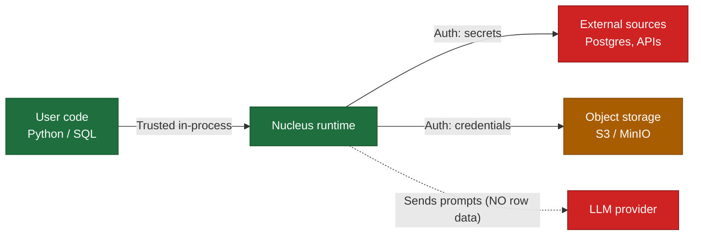

# C4 Level 1 — System Context

> **Diagram type**: C4 Context (Level 1)
> **Scope**: Nucleus as a whole, in its environment
> **Audience**: New contributors, prospective users, potential acquirers
> **Last updated**: Month 0 (Pre-Heartbeat)
> **Companion docs**: [`C4_container.md`](C4_container.md), [`../../nucleus_architecture_v4.1.md`](../../nucleus_architecture_v4.1.md)

The C4 model has 4 levels (Context → Container → Component → Code). This document is **Level 1**: what Nucleus is, who uses it, and what systems it talks to. Read this first to orient yourself.

---

## §1. The system in one diagram

```mermaid
%%{init: {"theme":"neutral", "themeVariables":{"fontSize":"13px"}}}%%
flowchart TB
    classDef user fill:#08427b,stroke:#073b6f,color:#fff
    classDef nucleus fill:#1168bd,stroke:#0b4884,color:#fff
    classDef ext fill:#999,stroke:#666,color:#fff
    classDef giant fill:#7a3e9d,stroke:#5e2f7a,color:#fff

    subgraph users[" "]
        DE["<b>Data Engineer</b><br/>Builds & runs assets<br/>Primary user"]:::user
        DA["<b>Data Analyst</b><br/>Queries marts<br/>Uses BI tools"]:::user
        ML["<b>ML Engineer</b><br/>Trains models<br/>Reads features"]:::user
    end

    NUCLEUS["<b>Nucleus Platform</b><br/>━━━━━━━━━━━━━━━━━<br/>Ship data products<br/>from a laptop.<br/>Local-first Python SDK + CLI<br/>for Iceberg-native pipelines."]:::nucleus

    subgraph sources["Data sources"]
        PG["<b>Operational DBs</b><br/>Postgres, MySQL,<br/>SQLite"]:::ext
        SAAS["<b>SaaS APIs</b><br/>Stripe, Salesforce,<br/>Shopify (v0.3+)"]:::ext
        FILE["<b>Files</b><br/>CSV, JSON, Parquet<br/>on local FS / S3"]:::ext
    end

    subgraph storage["Storage"]
        S3["<b>Object Storage</b><br/>S3 / MinIO / GCS / Azure<br/>(or local FS for dev)"]:::ext
        CAT["<b>Iceberg Catalog</b><br/>Filesystem (v0.1)<br/>Lakekeeper (v0.3+)<br/>Glue/Polaris (v1.0+)"]:::ext
    end

    subgraph consumers["Consumers"]
        BI["<b>BI Tools</b><br/>Metabase, Superset,<br/>Tableau, PowerBI"]:::ext
        NB["<b>Notebooks</b><br/>Jupyter, Marimo,<br/>VSCode"]:::ext
        APP["<b>Apps & APIs</b><br/>via DuckDB / Polars /<br/>Arrow Flight"]:::ext
    end

    subgraph giants["Hyperscalers (Yield-to-Giants)"]
        DBR["<b>Databricks</b><br/>Reads our Iceberg<br/>directly. Mode 1+2."]:::giant
        SNOW["<b>Snowflake</b><br/>Reads our Iceberg via<br/>external tables. Mode 1."]:::giant
        TRN["<b>Trino / Athena</b><br/>Federated SQL across<br/>our warehouse. Mode 3."]:::giant
    end

    AI["<b>LLM Providers</b><br/>OpenAI, Anthropic,<br/>local Ollama (v0.2+)"]:::ext

    DE -- "Writes Python/SQL,<br/>runs nucleus CLI" --> NUCLEUS
    DA -- "Queries marts via<br/>BI tool" --> NUCLEUS
    ML -- "Reads features<br/>via SDK" --> NUCLEUS

    NUCLEUS -- "Pulls data<br/>(ctx.copy_from)" --> PG
    NUCLEUS -- "Pulls data<br/>(ctx.read_csv etc.)" --> FILE
    NUCLEUS -- "Pulls data<br/>(connector framework)" --> SAAS

    NUCLEUS -- "Writes Parquet<br/>+ Iceberg metadata" --> S3
    NUCLEUS -- "Atomic commits" --> CAT

    BI -- "SQL via DuckDB<br/>or direct Iceberg" --> S3
    NB -- "ctx SDK<br/>or direct Iceberg" --> S3
    APP -- "Arrow / Polars" --> S3

    DBR -. "Mode 1: read tables<br/>Mode 2: hybrid dispatch" .-> S3
    SNOW -. "Mode 1:<br/>external tables" .-> S3
    TRN -. "Mode 3:<br/>federated SQL" .-> S3

    NUCLEUS -. "AI-assisted features<br/>(post v0.2)" .-> AI
```

---

## §2. Who uses Nucleus

### §2.1 Primary persona — Data Engineer

**Profile**: Builds and runs data pipelines. 2-10 years experience. Comfortable in Python and SQL.

**Their day**:
- Define new data assets (raw → staging → marts)
- Run materialization (one-time or scheduled)
- Debug failures
- Add new sources / sinks
- Tune performance

**What they want from Nucleus**:
- `git clone` → BI-ready table in <30 min
- Local-first development that mirrors production
- AI assistance for boilerplate (post v0.2)
- A platform that doesn't fight them

**What they explicitly do NOT want**:
- Cluster management
- A heavy JVM stack
- Vendor lock-in
- A rewrite to migrate to a bigger platform later

### §2.2 Secondary persona — Data Analyst

**Profile**: Builds dashboards, writes ad-hoc SQL, owns business metrics.

**Touch with Nucleus**: Usually indirect — they query the marts that data engineers produce. They may use `nucleus catalog list` and `nucleus inspect marts.foo` to explore what's available.

**v0.1 expectation**: None. They use their BI tool of choice, which queries Iceberg directly or via DuckDB.

### §2.3 Secondary persona — ML Engineer

**Profile**: Trains models, manages features.

**Touch with Nucleus**: Reads from feature tables (`marts.features.*`). May contribute to multimodal asset types in v0.5+ (Daft, LanceDB).

**v0.1 expectation**: Treat features as Iceberg tables. Read via `ctx.read("marts.features.user_features").to_polars()`.

---

## §3. What systems Nucleus connects to

### §3.1 Data sources (Nucleus reads from)

| Source | Protocol | v0.1 | Later |
|--------|----------|------|-------|
| **Postgres** | `psycopg`, SQLAlchemy | ✓ `ctx.copy_from` | Incremental CDC (v0.3) |
| **MySQL** | `pymysql`, SQLAlchemy | ✓ `ctx.copy_from` | Incremental (v0.3) |
| **SQLite** | stdlib | ✓ `ctx.copy_from` | — |
| **CSV / JSON / Parquet** | DuckDB / Polars native | ✓ `ctx.read_csv` etc. | — |
| **REST APIs** | Custom adapter | ✗ | v0.3 (dlt-style) |
| **SaaS (Stripe, Salesforce, …)** | Connectors | ✗ | v0.3 (or AirByte adapter) |
| **Kafka / Kinesis** | Streaming | ✗ | v0.5+ (consider) |
| **CDC (Debezium)** | Streaming | ✗ | v0.5+ |

**Design principle**: v0.1 covers 80% of small-team needs (Postgres + files). Don't chase connectors prematurely.

### §3.2 Storage (Nucleus writes to)

| Backend | Protocol | v0.1 | Notes |
|---------|----------|------|-------|
| **Local filesystem** | `pathlib` | ✓ Default for dev | Iceberg metadata is regular JSON files; works directly. |
| **MinIO** | S3 API | ⏸ v0.2 | Local "production-like" via `nucleus up --object-store` |
| **AWS S3** | boto3 / s3fs | ✓ | Iceberg writes via PyIceberg's `FileIO` |
| **GCS** | gcsfs | ✓ | Same as above |
| **Azure Blob** | adlfs | ✓ | Same as above |

### §3.3 Iceberg catalogs

| Catalog | Type | v0.1 | v0.3+ | v1.0+ |
|---------|------|------|-------|-------|
| **Filesystem catalog** (just JSON files) | Local | ✓ Default | Still supported | Still supported |
| **Lakekeeper** | REST | ✗ | ✓ Self-hosted | ✓ |
| **AWS Glue** | REST | ✗ | ✗ | ✓ |
| **Polaris** | REST | ✗ | ✗ | ✓ |
| **Tabular / Databricks UC** | REST | ✗ | ✗ | ✓ |

**Why filesystem first**: Per F2/F3 review, the filesystem catalog is sufficient for solo-dev/early-adopter scale. Adding Lakekeeper too early would be a complexity tax. PyIceberg ships with native filesystem catalog support.

### §3.4 Consumers (read from Iceberg)

Nucleus does not "serve" data — the Iceberg tables we write are queryable by **anything that speaks Iceberg**:

| Consumer | How they read |
|----------|---------------|
| **DuckDB** | Native Iceberg extension (`SELECT * FROM iceberg_scan(...)`) |
| **Polars** | Native scan (`pl.scan_iceberg`) |
| **PyIceberg** | Direct API |
| **Trino** | Iceberg connector |
| **Athena** | Iceberg tables in Glue catalog |
| **Databricks** | Unity Catalog read or external table |
| **Snowflake** | External tables on Iceberg |
| **Spark** | Iceberg-Spark integration |
| **Daft** | Native scan |
| **BI tools** (Metabase, Superset, etc.) | Via DuckDB or Trino |

**This is the entire point**. The Iceberg table format is the contract; everything else is optional.

### §3.5 Hyperscalers (the giants)

We **yield to** Databricks/Snowflake/BigQuery/Athena in three modes (per [`v4.1` §8](../../nucleus_architecture_v4.1.md)):

- **Mode 1 — Graduation**: Customer outgrows us. Iceberg tables move untouched. Zero migration.
- **Mode 2 — Hybrid Dispatch** (v0.5+): `@nucleus.sql_asset(compute="databricks")` ships heavy queries to Databricks (per v4.1 §10.2); rest stays local.
- **Mode 3 — Federation** (v1.0+): Nucleus orchestrates assets that live in Databricks/Snowflake. Mesh-style.

### §3.6 LLM providers (post-v0.2)

| Provider | Role | When |
|----------|------|------|
| **Anthropic Claude** | Workbench Copilot suggestions | v0.2+ |
| **OpenAI GPT** | Alternative provider | v0.2+ |
| **Local Ollama** | Privacy / offline mode | v0.4+ |

API keys configured per-user. **Nucleus never proxies LLM calls.** Direct user→provider. (Reduces our liability + security surface.)

---

## §4. What is NOT in scope

To be clear about Nucleus boundaries:

| ❌ Not Nucleus | Why |
|---------------|-----|
| Authentication system | Use OIDC providers (§12.1) |
| BI / visualization tool | Use Metabase/Superset/Tableau |
| Streaming engine | Future consideration; not v0.1-v1.0 |
| Distributed compute fabric | Yield to Databricks/Spark |
| Data quality framework | Native `@nucleus.check` (v0.1); optional Soda Core integration (v0.5+ per v4.1 §20) |
| ML serving | Out of scope; use Modal/Replicate/etc. |
| Workflow scheduler (cron replacement) | Dagster wrapped, but not surfaced as a separate scheduler |
| Cluster manager | We have no clusters |

**If a feature request crosses these lines, the answer is "use the right tool; we'll integrate"**.

---

## §5. Trust boundaries

Where data and credentials cross trust zones:

### §5.1 Inputs we treat as untrusted
- User-supplied SQL strings (parameterize, never f-string)
- User-supplied file paths (resolve, prevent traversal)
- User-supplied connection strings (don't log them)
- Source database results (validate schemas before commit)

### §5.2 What we never send to LLM providers (Constraint #5 + AGENTS.md §10)
- Raw row data
- Connection strings or credentials
- File contents from secret locations
- Customer PII

LLMs receive:
- Schema / column names
- Pipeline structure / DAG shape
- Error messages (already user-translated by error translation layer)
- Asset names
- (Optional, user-opted) anonymized query patterns

---

## §6. Quality attributes (top of mind)

Cross-cutting concerns Nucleus optimizes for, in priority order:

1. **Developer experience** — "Wow, that was easy" within 30 minutes. Beachhead metric.
2. **Correctness** — atomic Iceberg commits, no half-written tables, no silent data corruption.
3. **Local-first speed** — <10s cold start, queries don't slow as workspace grows.
4. **Composability** — engines & catalogs replaceable. Constraint #9.
5. **Upgradeability** — components upgrade per the rules in Constraint #11.
6. **AI augmentation** — Copilot helps but never authors critical paths alone (post v0.2).
7. **Operational simplicity** — solo founder runs this for years if needed.

**Explicitly not in the top 7**:
- Multi-tenancy (Tier 4+)
- High availability of the control plane (HA only matters for hosted Cloud, post v0.3)
- Fine-grained access control (basic ACL v0.3, RBAC v1.0+)
- Petabyte scale (yield to giants)

---

## §7. Where to go next

- **[`C4_container.md`](C4_container.md)** — Level 2: what containers/processes compose Nucleus internally.
- **[`sequence_error_translation.md`](sequence_error_translation.md)** — Critical-path sequence: how a Dagster failure becomes a NucleusError.
- **[`../../nucleus_architecture_v4.1.md`](../../nucleus_architecture_v4.1.md)** — Full 1678-line source-of-truth doc.
- **[`../decisions/`](../decisions/)** — ADRs explaining "why this, not that".

---

*Diagram source: this file is the source. Mermaid renders directly in GitHub. If you change architecture, change this diagram.*
