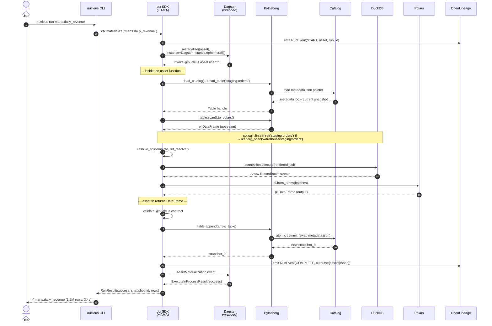
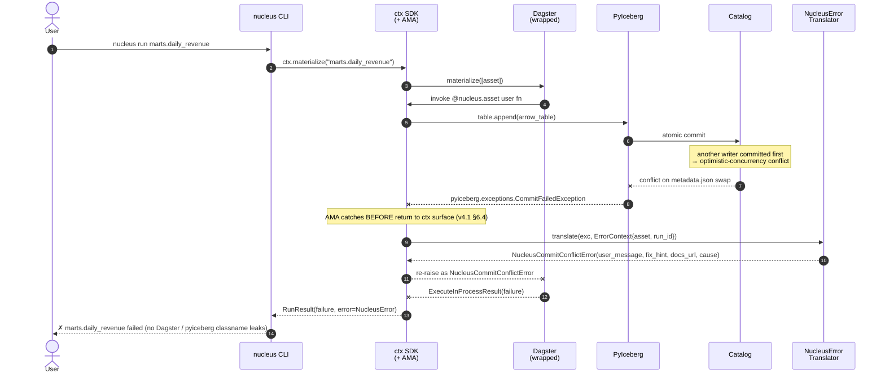

# Sequence — Asset Materialization (Happy Path + Failure)

> **Diagram type**: UML Sequence
> **Scope**: One `@nucleus.asset` materialization, end-to-end — `nucleus run` / `ctx.materialize` → new Iceberg snapshot.
> **Audience**: Anyone touching `coordination/asset_materialization.py` (the ~500-LOC AMA), `coordination/iceberg_io_manager.py`, or the `ctx.sql` resolver.
> **Status**: Pre-implementation. Most steps not yet built — see §5 `NEEDS VERIFICATION`.
> **Companion**: [`sequence_error_translation.md`](sequence_error_translation.md), [`C4_container.md`](C4_container.md), [`../specs/nucleus_architecture_v4.1.md`](../specs/nucleus_architecture_v4.1.md) §6.2 / §6.3 / §6.4.

The **on-success twin** of [`sequence_error_translation.md`](sequence_error_translation.md). That doc owns failure translation; this one owns the happy path it defends. Together they define the full `@nucleus.asset` boundary.

Per v4.1 §6.2 the **Asset Materialization Adapter** (AMA, ~500 LOC) wraps Dagster + PyIceberg: pre-write contract + partition check, delegated atomic commit to the **catalog** (filesystem v0.1; Lakekeeper/Polaris v0.3+), OpenLineage emit, asset-registry update. AMA hides inside `ctx SDK` — per v4.1 §6.5 zero Dagster types cross the `ctx` boundary.

---

## §1. The happy path

Dagster appears in the middle but its types never cross the AMA boundary (v4.1 §6.5 + [`sequence_error_translation.md`](sequence_error_translation.md) §1). User sees `marts.daily_revenue`, never `Op` / `OpExecutionContext` / `AssetMaterialization`.

---

## §2. Key contracts (per step group)

| Steps | Contract | Source-of-truth |
|---|---|---|
| 1–2 | `nucleus run X` ≡ `ctx.materialize("X")` *(spelling — §5 row 1)* | v4.1 §13.2 |
| 3, 17 | OpenLineage `RunEvent(START / COMPLETE)` w/ asset + snapshot_id | v4.1 §6.2 step 4, §12.4; [`../internal/research/openlineage.md`](../internal/research/openlineage.md) §4 |
| 4–5 | `dagster.materialize([asset], instance=DagsterInstance.ephemeral())`; **zero Dagster types reach `ctx`** | [`../internal/research/dagster.md`](../internal/research/dagster.md) §5; v4.1 §6.5 row 2 |
| 6–8 | `ctx.read("staging.orders", as_="polars")` → `Catalog.load_table(...).scan().to_polars()` | [`../internal/research/pyiceberg.md`](../internal/research/pyiceberg.md) §5 |
| 9 | Jinja `{{ ref('schema.name') }}` + arity / cycle / unknown-asset checks | PoC #2 — [`../../poc/p2_ctx_sql/resolver.py`](../../poc/p2_ctx_sql/resolver.py) |
| 10–12 | DuckDB executes; Arrow → Polars zero-copy | v4.1 §5.1, §5.2 |
| 13 | Contract pre-write: schema + nullability (v0.1). Fail → `NucleusSchemaError` ([`sequence_error_translation.md`](sequence_error_translation.md) §4.3) | v4.1 §6.2 step 1, §12.5 |
| 14–16 | `Table.append(arrow)` → catalog atomically swaps `metadata.json` → `snapshot_id`. **Catalog owns atomicity** (Hard Constraint #5) | [ADR-001](../decisions/ADR-001-no-iceberg-commit-service.md), [`../internal/research/pyiceberg.md`](../internal/research/pyiceberg.md) §5 |
| 18–21 | `AssetMaterialization(metadata={"snapshot_id": ...})` → Dagster; rich-render success line | [`../internal/research/dagster.md`](../internal/research/dagster.md) §5 |

On failure, OpenLineage also emits `RunEvent(FAIL)` w/ `errorMessage=<NucleusError.user_message>` + `errorType` (§5 row 3).

---

## §3. The failure path

How an asset-materialization failure intercepts and routes into the per-exception translation tables in [`sequence_error_translation.md`](sequence_error_translation.md) §4.1–§4.6 (not duplicated here):

`CommitFailedException` is illustrative; equivalent paths exist for every row in the error-translation tables. The PoC #1 baseline at [`../../poc/p1_error_translation/translator.py`](../../poc/p1_error_translation/translator.py) already covers the Dagster wrapper + DuckDB + Polars + PyIceberg + stdlib handlers.

---

## §4. Out of scope

- **Multi-asset graphs / backfills / sensors / schedules** — Dagster's executor. v0.3+.
- **Incremental / snapshot / view modes** — v4.1 §12.3 deferred v0.3 / v0.5; this sequence assumes `materialize="table"`.
- **Multi-table atomic commits** — deferred per v4.1 §6.2; v1.0+ (REST Catalog v2) or v2.0+ (Nessie).
- **Retries / backoff** — `tenacity`-wrapped `CommitFailedException` retry ([`../internal/research/pyiceberg.md`](../internal/research/pyiceberg.md) §6) is AMA's job, not the translator's ([`sequence_error_translation.md`](sequence_error_translation.md) §8).
- **`@nucleus.sql_asset` specialization** — pulls `ctx.sql` to top of fn; otherwise identical. See `docs/specs/nucleus_asset_model_spec.md`.
- **Cost meter / asset registry update** — v4.1 §6.2 step 5; post-PoC #1.

---

## §5. NEEDS VERIFICATION + open questions

Per AGENTS.md §11.12, each wrapped-library step needs official-docs + triggered-in-anger confirmation. Log drift in [`../internal/research/ai_hallucinations.md`](../internal/research/ai_hallucinations.md). Treat each row as a **draft contract** until flipped by PoC #1 / PoC #4.

1. **`ctx.materialize(...)` spelling** — not in v4.1 §13.2; may ship as `ctx.run(...)`. Lock when `docs/specs/nucleus_ctx_sdk_spec.md` finalizes.
2. **Dagster ↔ ctx bridging** — substituting `ctx` for `OpExecutionContext` inside a wrapped `@dagster.asset`; v4.1 §6.5 row 2 must pass.
3. **OpenLineage event shapes** — [`../internal/research/openlineage.md`](../internal/research/openlineage.md) §1 + §4 lock the four nouns + three event types and pin candidate `openlineage-python==1.47.1`; remaining verifications: exact facet set per call site, console-vs-HTTP transport choice, Marquez backend wiring. Open Q: pre-fn failures emit `FAIL` or nothing?
4. **Canonical AMA write path** — direct `Table.append` vs `IcebergIOManager.handle_output`? Confirm `DagsterInstance.ephemeral()` + `materialize` (not `_to_memory`) actually persists ([`../internal/research/dagster.md`](../internal/research/dagster.md) §7).
5. **`ctx.read` identifier translation** — `"staging.orders"` → `("staging","orders")` vs `"warehouse.staging.orders"`? Open Q: `at_snapshot=...` pinning; `ctx.snapshot(name)` lands v0.3 (v4.1 §13.2).
6. **Contract validation timing** — v4.1 §6.2 says pre-write; §12.5 says "at materialization". Draft shows pre-write only (step 13); confirm post-write. Open Q: per-batch vs final-frame for streaming `to_arrow_batch_reader()`.
7. **PyIceberg version drift** — pinned 0.8.1; latest 0.11.1 ([`../internal/research/pyiceberg.md`](../internal/research/pyiceberg.md) §2). `Table.append` / `update_schema` churned across 0.8 → 0.11; upgrade ADR queued.
8. **DuckDB connection lifecycle** — per asset / per run / process-singleton? Affects PoC #4 (boot) + v4.1 §14.4 (concurrency).

---

## §6. Cross-references

Companion: [`sequence_error_translation.md`](sequence_error_translation.md) (on-failure twin), [`C4_container.md`](C4_container.md) (same actors as containers), [ADR-001](../decisions/ADR-001-no-iceberg-commit-service.md) (Catalog owns atomicity). Architecture: [`../specs/nucleus_architecture_v4.1.md`](../specs/nucleus_architecture_v4.1.md) §5 / §6.2 / §6.3 / §6.4 / §6.5 / §12. Other inline refs are linked from §2 / §5: [`../internal/research/dagster.md`](../internal/research/dagster.md), [`../internal/research/pyiceberg.md`](../internal/research/pyiceberg.md), [`../../poc/p1_error_translation/translator.py`](../../poc/p1_error_translation/translator.py), [`../../poc/p2_ctx_sql/resolver.py`](../../poc/p2_ctx_sql/resolver.py).

*Next: when PoC #1 closes, reconcile every §5 flag against the running 1.9.5 / 0.8.1 stack and log drift to [`../internal/research/ai_hallucinations.md`](../internal/research/ai_hallucinations.md).*
