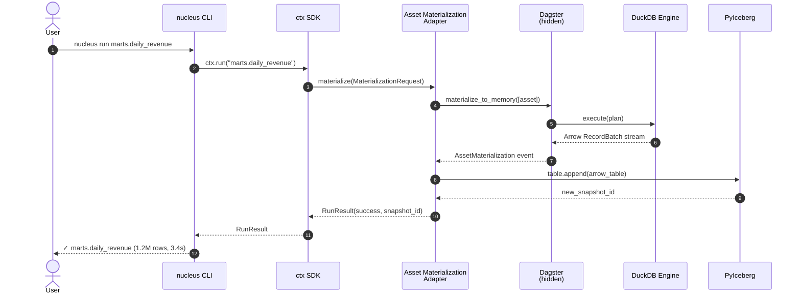

# Sequence — Error Translation (Critical Path)

> **Diagram type**: UML Sequence
> **Scope**: How a Dagster failure becomes a NucleusError visible to the user
> **Audience**: Anyone touching `coordination/error_translation.py`
> **Status (2026-05-13)**: PoC #1 translator landed in [`../../poc/p1_error_translation/translator.py`](../../poc/p1_error_translation/translator.py) — 17 typed handlers, two-pass match in `translate()`, and a `_iter_causes` walker that traverses both `__cause__` and `__context__`. Promotion to `src/nucleus/coordination/error_translation.py` pending founder review — see [`../../poc/p1_error_translation/PROMOTION_PR_DRAFT.md`](../../poc/p1_error_translation/PROMOTION_PR_DRAFT.md). Tests: 21/22 green.
> **Companion**: [`C4_container.md`](C4_container.md), [`sequence_asset_materialization.md`](sequence_asset_materialization.md), [`../../nucleus_architecture_v4.1.md`](../../nucleus_architecture_v4.1.md) §6.4 (canonical spec), [`../../AGENTS.md`](../../AGENTS.md) §11.7 (enforcement discipline).

This is the **most important sequence in the whole platform**. If a Dagster error ever leaks past `ctx`, our entire abstraction has failed — we're "Dagster with extra steps". This document defines the contract.

---

## §1. Why this matters

Per F3 senior review (incorporated as v4.1 Amendment 7), our central architectural risk is:

> **The leaky abstraction**: Users will write Python with `ctx.asset`. When something fails, they see a `dagster.DagsterExecutionStepNotFound` traceback. They learn Dagster. We become "the layer that adds friction on top of Dagster" — a worst-of-both-worlds tax.

**Counter-promise**: Users **never** see a Dagster exception type. **Never** see a Dagster file path in a stack trace they're meant to read. **Never** debug by reading Dagster docs.

To deliver this promise, every Dagster exception type that can reach the user **must** have a translator registered in the Error Translation Layer (ETL). Unregistered types → `NucleusInternalError` with bug-report instructions.

---

## §2. The happy path (for context)

Before showing failures, the happy path:



Note: Dagster appears in the middle but its types never cross the AMA → CTX boundary.

---

## §3. The failure path — what Nucleus must do

```mermaid
sequenceDiagram
    autonumber
    actor User
    participant CLI as nucleus CLI
    participant CTX as ctx SDK
    participant AMA as Asset Materialization<br/>Adapter
    participant ETL as Error Translation<br/>Layer
    participant DAG as Dagster<br/>(hidden)
    participant ENG as DuckDB Engine

    User->>CLI: nucleus run marts.daily_revenue
    CLI->>CTX: ctx.run("marts.daily_revenue")
    CTX->>AMA: materialize(MaterializationRequest)
    AMA->>DAG: materialize_to_memory([asset])
    DAG->>ENG: execute(plan)

    Note over ENG: SQL references<br/>missing table

    ENG--xDAG: DuckDB CatalogException("Table 'staging.foo' does not exist")
    DAG--xAMA: DagsterExecutionStepExecutionError<br/>(wraps DuckDB exc)

    Note over AMA: catch dagster.* exception<br/>BEFORE returning to ctx

    AMA->>ETL: translate(DagsterExecutionStepExecutionError, ctx={asset, run_id})

    Note over ETL: 1. _iter_causes(exc) — walk __cause__ then __context__<br/>   (bounded depth 8; cycle-safe; honors __suppress_context__)<br/>2. Pass 1 — specific lib handler wins (skip Dagster wrapper)<br/>3. Pass 2 — Dagster-wrapper fallback iff nothing else matched<br/>4. Build NucleusError(user_message, fix_hint, docs_url, cause=exc)<br/>(see §3.1 for the full algorithm)

    ETL-->>AMA: NucleusAssetNotFound(<br/>  user_message="Asset 'staging.foo' is referenced<br/>    but not defined or materialized",<br/>  fix_hint="Run `nucleus run staging.foo` first,<br/>    or add @nucleus.asset decorator to its definition",<br/>  docs_url="https://nucleus.dev/errors/asset-not-found",<br/>  asset="marts.daily_revenue",<br/>  cause=<DuckDB exc>)

    AMA-->>CTX: RunResult(failure, error=<NucleusAssetNotFound>)
    CTX-->>CLI: RunResult

    Note over CLI: Render NucleusError<br/>via rich formatter

    CLI-->>User: ✗ marts.daily_revenue failed<br/><br/>Asset 'staging.foo' is referenced but not defined<br/>or materialized.<br/><br/>How to fix:<br/>  Run `nucleus run staging.foo` first,<br/>  or add @nucleus.asset decorator to its definition.<br/><br/>Docs: https://nucleus.dev/errors/asset-not-found
```

---

## §3.1. Translator internals (PoC #1 — landed 2026-05-13)

Three implementation details cement the architectural promise of §1 and §3 against real-world Dagster `materialize()` re-raise semantics. All three landed in [`../../poc/p1_error_translation/translator.py`](../../poc/p1_error_translation/translator.py) today; see [`PROMOTION_PR_DRAFT.md` §Architectural changes](../../poc/p1_error_translation/PROMOTION_PR_DRAFT.md) for founder-ratification context.

### §3.1.1 The cause walker — `_iter_causes`

`translator.py:43-61` defines a generator that yields `exc` then walks the chain outer→inner:

1. Prefer `__cause__` (explicit `raise X from Y`).
2. Fall through to `__context__` (implicit chaining via an `except` block) when `__cause__ is None`.
3. Skip the implicit chain when `__suppress_context__` is set (`raise X from None`).
4. Bounded at `_MAX_CAUSE_DEPTH = 8` and cycle-safe via an `id()` seen-set so a malformed `__context__ ↔ __cause__` back-edge can't loop.

Dual-traversal is required because some wrapped libraries (Polars, pyiceberg) chain via `__cause__` while others (DuckDB inside an `except` block, naturally-raised stdlib errors) chain via `__context__`. A `__cause__`-only walker would miss the latter; a `__context__`-only walker would surface accidental context for `raise X from None` patterns.

### §3.1.2 Two-pass match — specific handler wins over generic Dagster fallback

`translator.py:351-402` implements `translate()` as **two passes** over `list(_iter_causes(exc))`:

- **Pass 1**: for each candidate, try every registered handler **except** `DagsterExecutionStepExecutionError`'s. First `isinstance` match wins; the matched candidate (not the outer exception) is passed to the handler so the user sees the original library message. The outer chain is preserved on the returned `NucleusError` via `__cause__`.
- **Pass 2**: if no specific match, look for `DagsterExecutionStepExecutionError` in the candidates. Hits route to the generic `_dagster_step_handler` → `NucleusInternalError`.
- **Final fallback**: nothing matched → `NucleusInternalError` with a bug-report `fix_hint`.

This restructure replaced the original v0 design ("`_unwrap_cause` once, look up the innermost"). In Dagster 1.9.5, `materialize()` re-raises the user's original library exception (e.g. `duckdb.BinderException`) wrapped in a synthetic two-node chain: the wrapper's `__context__` points at the original cause, and a back-edge `__cause__` points from the original cause to the wrapper. A naïve "unwrap then look up" walked into that cycle and returned the wrapper — hiding the specific library cause behind `NucleusInternalError`. Two passes break the cycle without sacrificing the precise message.

**NEEDS VERIFICATION**: The exact class name `dagster.DagsterExecutionStepExecutionError` and its import path are pinned against `dagster==1.9.5`. If a future minor or major Dagster bump renames the wrapper, the translator imports must be updated and a row added to [`../research/ai_hallucinations.md`](../research/ai_hallucinations.md). Cite of intent: AGENTS.md §11.12 + §11.13.

### §3.1.3 Known limitation — Dagster `do_raise` rewrites `__context__`

CPython's `do_raise` (invoked when Dagster's `execute_plan` re-raises) **overwrites** `wrapper.__context__` with the currently-handled exception. If a test (or real failure) sets the inner cause manually on `wrapper.__context__` **before** raising the wrapper, that pre-set context is irrecoverably lost by the time `translate()` sees the exception.

This is Python language semantics, not a translator bug. Real-world failures are unaffected because they raise naturally via `try / except / raise` inside the asset — the implicit `__context__` chain survives the Dagster boundary because Dagster's wrapping happens around the *naturally raised* wrapper, not a hand-constructed one. Documented in [`PROMOTION_PR_DRAFT.md` §Known issues](../../poc/p1_error_translation/PROMOTION_PR_DRAFT.md); the lone failing test in the 21/22 suite (`test_context_only_chain_falls_through_to_inner_handler`) exercises this limitation deliberately and is queued for either rewrite (natural-chain shape) or `@pytest.mark.skip` per founder decision.

**NEEDS VERIFICATION**: The `do_raise` interaction may differ in Dagster 1.10+ if Dagster changes its internal re-raise pattern. AGENTS.md §11.13's upgrade SOP requires re-running the translator suite (especially `test_dagster_wrapper_falls_through_to_inner_library`) after any Dagster minor-version bump.

---

## §4. Translation table (initial — must grow with PoC #1)

The `ErrorTranslator` registers handlers by type. Below is the **minimum viable table** for v0.1; PoC #1 validates each row.

### §4.1 Dagster-originated errors

| Dagster exception | Trigger | Nucleus translation | docs_url |
|-------------------|---------|--------------------|----------|
| `DagsterAssetNotFoundError` | Asset name doesn't exist in repo | `NucleusAssetNotFound` | `/errors/asset-not-found` |
| `DagsterExecutionStepNotFoundError` | Step in plan doesn't exist | `NucleusAssetNotFound` (with hint about typo) | `/errors/asset-not-found` |
| `DagsterExecutionStepExecutionError` | User code raised inside an asset | **Unwrap inner cause and re-translate** | (varies) |
| `DagsterExecutionInterruptedError` | User Ctrl+C | `NucleusRunCancelled` (clean exit code 130) | `/errors/cancelled` |
| `DagsterInvalidDefinitionError` | Bad `@nucleus.asset` decorator usage | `NucleusInvalidAssetDefinition` | `/errors/invalid-asset` |
| `DagsterInvariantViolationError` | Dagster's internal invariant | `NucleusInternalError` (bug, file report) | `/errors/internal` |
| `DagsterResourceFunctionError` | Resource init failed | `NucleusConfigError` | `/errors/config` |
| `DagsterTypeCheckDidNotPass` | Output type mismatch | `NucleusSchemaError` | `/errors/schema` |
| `DagsterUserCodeProcessError` | User code subprocess crashed | `NucleusInternalError` (we use in-process, shouldn't happen in v0.1) | `/errors/internal` |

### §4.2 DuckDB-originated errors (when wrapping inner cause)

| DuckDB exception | Trigger | Nucleus translation | docs_url |
|------------------|---------|--------------------|----------|
| `duckdb.CatalogException` ("does not exist") | Table reference unknown | `NucleusAssetNotFound` | `/errors/asset-not-found` |
| `duckdb.BinderException` | SQL referencing unknown column | `NucleusSchemaError` | `/errors/schema` |
| `duckdb.ParserException` | SQL syntax error | `NucleusSQLSyntaxError` (with error position) | `/errors/sql-syntax` |
| `duckdb.IOException` | File read/write failed | `NucleusIOError` | `/errors/io` |
| `duckdb.ConnectionException` | DuckDB DB file locked | `NucleusEngineError` | `/errors/engine` |
| `duckdb.ConversionException` | Type coercion failed | `NucleusSchemaError` | `/errors/schema` |
| `duckdb.OutOfMemoryException` | Query exceeded RAM | `NucleusResourceError` (with `--large` hint) | `/errors/resource` |
| `duckdb.TransactionException` | Concurrent write conflict | `NucleusCommitConflictError` | `/errors/commit-conflict` |

### §4.3 Polars-originated errors

| Polars exception | Trigger | Nucleus translation | docs_url |
|------------------|---------|--------------------|----------|
| `polars.SchemaError` | Column not in frame | `NucleusSchemaError` | `/errors/schema` |
| `polars.ColumnNotFoundError` | Same | `NucleusSchemaError` | `/errors/schema` |
| `polars.ComputeError` | Arithmetic / type error in expr | `NucleusEngineError` | `/errors/engine` |
| `polars.ShapeError` | Frame shape mismatch | `NucleusSchemaError` | `/errors/schema` |
| `polars.NoDataError` | Empty source | `NucleusEmptyAssetError` | `/errors/empty-asset` |

### §4.4 PyIceberg-originated errors

| PyIceberg exception | Trigger | Nucleus translation | docs_url |
|----------------------|---------|--------------------|----------|
| `pyiceberg.exceptions.NoSuchTableError` | Asset not yet materialized | `NucleusAssetNotMaterialized` (different from "not defined") | `/errors/not-materialized` |
| `pyiceberg.exceptions.CommitFailedException` | Concurrent commit conflict | `NucleusCommitConflictError` (retry suggested) | `/errors/commit-conflict` |
| `pyiceberg.exceptions.CommitStateUnknownException` | Network failure mid-commit | `NucleusCommitUnknownError` (manual recovery) | `/errors/commit-unknown` |
| `pyiceberg.exceptions.NoSuchNamespaceError` | Namespace not created | `NucleusCatalogError` (auto-create or instruct) | `/errors/catalog` |
| `pyiceberg.exceptions.AuthorizationExpiredError` | Cloud credentials | `NucleusAuthError` | `/errors/auth` |
| `pyiceberg.exceptions.ValidationError` | Schema evolution invalid | `NucleusSchemaEvolutionError` | `/errors/schema-evolution` |

### §4.5 Source connector errors (psycopg, pymysql, …)

| Exception | Trigger | Nucleus translation | docs_url |
|-----------|---------|--------------------|----------|
| `psycopg.OperationalError` (connection refused) | Postgres down / wrong host | `NucleusSourceConnectionError` | `/errors/source-connection` |
| `psycopg.errors.UndefinedTable` | Source table missing | `NucleusSourceNotFound` | `/errors/source-not-found` |
| `psycopg.errors.InsufficientPrivilege` | No SELECT grant | `NucleusSourceAuthError` | `/errors/source-auth` |
| `pymysql.err.OperationalError` | Connection failed | `NucleusSourceConnectionError` | `/errors/source-connection` |
| `sqlalchemy.exc.SQLAlchemyError` (catch-all) | Other SQLAlchemy failure | `NucleusSourceError` | `/errors/source` |

### §4.6 Generic Python errors that may surface

| Exception | Trigger | Nucleus translation |
|-----------|---------|--------------------|
| `FileNotFoundError` | Asset code references missing file | `NucleusIOError` |
| `PermissionError` | Filesystem / storage operation denied | `NucleusPermissionError` |
| `ConnectionError` | Source IO connect failed (Postgres/MySQL/dlt) | `NucleusSourceConnectionError` *(`translator.py:97-104`)* |
| `TimeoutError` | Source connect / read timeout | `NucleusSourceConnectionError` *(revisit vs. `NucleusTimeoutError` post-telemetry — `translator.py:264-272`)* |
| `ValueError` (anywhere in stack) | User bug — schema-flavored vs. generic | `NucleusSchemaError` if `"schema" in msg.lower()`; else `NucleusInternalError` *(`translator.py:107-126`)* |
| `KeyError` (in user asset code) | User bug | Pass through (no handler registered) |
| **Anything else uncaught** | Unknown | `NucleusInternalError` with bug-report URL |

**PoC #1 note (2026-05-13)**: `ConnectionError` and `ValueError` are now **first-class registry entries** in `_registry()` (`translator.py:339-340`); previously they were inner-cause branches of `_dagster_step_handler`. The extraction means a `ValueError` raised inside an asset gets a typed schema/internal error even when no Dagster wrapper is involved (e.g. in unit tests). The class-name choice `NucleusIOError` for `FileNotFoundError` matches `src/nucleus/errors.py` — there is no `NucleusFileNotFound` class.

**Critical rule**: User-domain errors (KeyError in their pandas code) **pass through unchanged** unless we have a registered handler. We translate only **platform-domain errors**. The user's debugging context is their code, not ours. `ValueError` is the deliberate exception because schema-flavored messages are the highest-signal failure mode for the v0.1 beachhead (`AGENTS.md` §11.7 + v4.1 §1.5).

---

## §5. The translator implementation contract

> **PoC #1 status (2026-05-13)**: The class-based `ErrorTranslator` + `ErrorContext` shape below is the **v0.5 target**. PoC #1 ships a **simplified module-level surface** — a single `translate(exc: BaseException) -> NucleusError` function plus a lazy `_registry()` built on first call (`translator.py:282-342`, `:351-402`). `ErrorContext` (asset / run_id / source / sql_position) is deferred to v0.5 — it requires plumbing the AMA's per-asset metadata into the call site, which the PoC #1 LOC budget did not afford. The architectural promise (typed result, walk MRO, preserve cause) is identical; v0.5 graduation only **adds** the metadata-carrying context object.

```python
# src/nucleus/coordination/error_translation.py — outline (NOT yet implemented)

from typing import Callable, TypeVar

E = TypeVar("E", bound=Exception)

class ErrorTranslator:
    """Single registry of translators. Looked up by exception type, with MRO walking."""

    def __init__(self) -> None:
        self._registry: dict[type[Exception], Callable[[Exception, ErrorContext], NucleusError]] = {}

    def register(self, exc_type: type[E], handler: Callable[[E, ErrorContext], NucleusError]) -> None:
        """Register a translator for an exception type."""
        ...

    def translate(self, exc: Exception, ctx: ErrorContext) -> NucleusError:
        """Translate, walking MRO. Unwrap Dagster wrappers to inner cause first.
        Falls back to NucleusInternalError if no translator found."""
        ...


@dataclass(frozen=True)
class ErrorContext:
    """Metadata available to translators for richer error construction."""
    asset: str | None = None
    run_id: str | None = None
    source: str | None = None  # e.g. "postgres://..."
    sql_position: tuple[int, int] | None = None  # line, column for SQL errors
```

**Rules for handlers**:
1. **Never re-raise** — return a NucleusError.
2. **Always include** `user_message`, `fix_hint`, `docs_url`.
3. **Set `cause=exc`** so debugging info is preserved (but not shown by default).
4. **Sanitize** sensitive info (connection strings, file paths under `/home/user/...`) before putting in `user_message`.

---

## §6. CLI rendering contract

When `ctx.run()` returns a `RunResult(failure, error=NucleusError)`, the CLI renders the **three-field contract** every `NucleusError` carries — `user_message` + `fix_hint` + `docs_url` — via `NucleusError.rendered()` (see [`../../src/nucleus/errors.py`](../../src/nucleus/errors.py) `rendered()`, lines 106-146). The category header (e.g. `AssetNotFound`, derived from the class name stripped of the `Nucleus` prefix) and the optional `asset=` slot complete the five-field shape per v4.1 §6.4:

```
✗ marts.daily_revenue failed in 1.4s

  Asset 'staging.foo' is referenced but not defined or materialized.

  How to fix:
    Run `nucleus run staging.foo` first,
    or add @nucleus.asset decorator to its definition.

  Docs: https://nucleus.dev/errors/asset-not-found
  Run ID: 2026-05-12-abc123
```

**No Python traceback shown by default.** Add `--debug` to surface stack traces (for our own debugging or expert users).

**Why**: Python tracebacks include our internal file paths (`/site-packages/nucleus/coordination/...`). Users get scared. Default = clean. `--debug` = full info for power users.

---

## §7. Tests required (PoC #1 acceptance criteria)

> **Status (2026-05-13)**: PoC #1 ships **17 typed handlers** spanning Dagster + Polars + DuckDB + pyiceberg + stdlib. `pytest poc/p1_error_translation/ -v` is **21/22 green**; the lone failure (`test_context_only_chain_falls_through_to_inner_handler`) is documented in §3.1.3 as a Python `__context__` overwrite limitation, not a translator bug. The §7.4 "50 known cases" fixture is still pending — PoC #1 acceptance bar is "no specific handler matched ⇒ deterministic fallback to `NucleusInternalError` with bug-report URL"; the 50-case bar moves to v0.1 production graduation. See [`../../poc/p1_error_translation/PROMOTION_PR_DRAFT.md`](../../poc/p1_error_translation/PROMOTION_PR_DRAFT.md) for the full pre-merge gate.

For PoC #1 to pass:

### §7.1 Each translator must have a test
- Construct a real instance of the source exception (e.g., actually call DuckDB with a missing table to get a real `CatalogException`).
- Assert translator returns the expected NucleusError type.
- Assert `user_message`, `fix_hint`, `docs_url` all populated and non-empty.
- Assert `cause` is set.

### §7.2 Round-trip test
- Run a real asset that fails with a known cause.
- Assert the user sees a NucleusError message and **no Dagster file path** in the rendered output.
- Use `pytest`'s `capsys` to verify CLI output.

### §7.3 Unknown exception fallback
- Raise a custom `class MyWeirdException` in user asset code.
- Assert it surfaces as `NucleusInternalError` with the bug-report URL.
- Assert `cause` is the original exception.

### §7.4 The 50 known cases
- Build a fixture set of **50 realistic failure scenarios** (sampled from real-world data engineering bugs).
- For each: assert translation produces a NucleusError with no Dagster types in the message.
- PoC #1 success bar: ≥45/50 produce good messages on first try.

### §7.5 The leak detector
- A script `scripts/dagster_leak_check.py` greps the CLI output of running the test suite for any string containing `dagster.` (case-sensitive). **Must return 0 matches.**
- Run in CI on every PR.

---

## §8. What this layer doesn't do

To prevent scope creep:

- **No retry logic** — that's the Asset Materialization Adapter's job.
- **No logging side effects** — the layer translates synchronously. Logging happens at the AMA boundary.
- **No metrics emission** — same. AMA emits the `error.translated` event using the result.
- **No partial recovery** — translators don't try to "fix" things. They map exception → message.
- **No localization** — English only in v0.1-v1.0. i18n is post-v1.0.

---

## §9. Evolution & versioning

- **Adding new translators**: PR, no ADR needed.
- **Changing a NucleusError class** (rename, restructure): PR + ADR. NucleusError types are part of the public surface.
- **Removing a translator**: ADR required (breaking — user might catch the specific type).
- **Reorganizing the translation table**: PR + update this doc.

---

## §10. Open questions (for PoC #1)

1. **Should we surface partial Dagster info on `--verbose`?** (Default: no. Power users may want it. TBD.)
2. **Async error context** — does Dagster's async execution wrap exceptions differently? PoC must test.
3. **Schema errors with line/column info** — can we pull SQL error positions from DuckDB consistently? PoC investigates.
4. **Multi-error scenarios** — if 3 assets fail in parallel, do we show 3 errors or a summary? (Default: 3 individual errors, ordered by failure time. TBD.)
5. **Localization stub** — do we wire i18n infrastructure now (even though English only) to avoid retrofit? (Default: skip; YAGNI.)

PoC #1 outputs will resolve these. Update this doc with answers when PoC #1 completes.

---

## §11. Why a doc, not just code

This sequence is the single most important architectural promise in Nucleus. It must be:

- **Visible** to anyone touching the codebase.
- **Reviewable** before code is written (this doc is the spec).
- **Testable** to acceptance criteria (§7).
- **Owned** — the solo founder authors any change here.

If `coordination/error_translation.py` ever diverges from this doc, the doc wins. Update the code.

---

*Next: read [`../decisions/_template.md`](../decisions/_template.md) to see how we capture decisions, then [`../decisions/ADR-001-no-iceberg-commit-service.md`](../decisions/ADR-001-no-iceberg-commit-service.md) for the first real ADR.*
