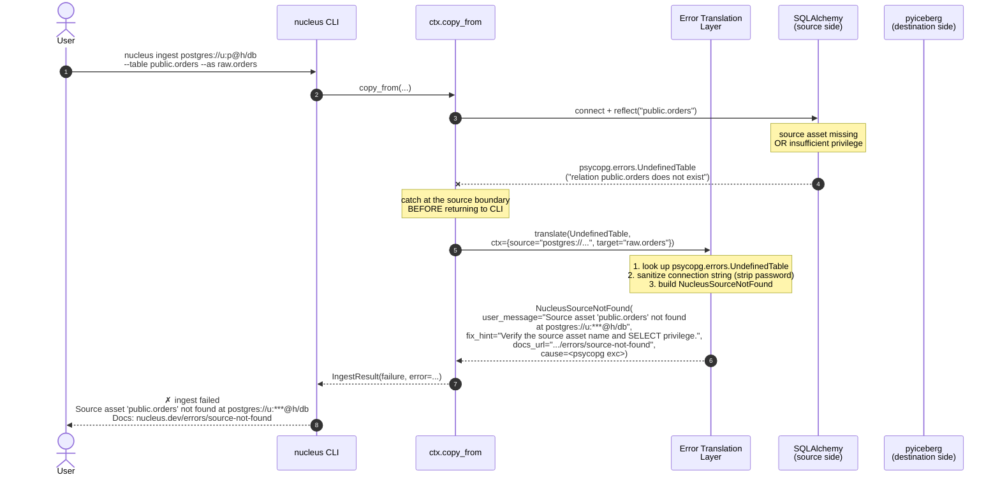

# Sequence — Ingestion (`nucleus ingest`)

> **Diagram type**: UML Sequence
> **Scope**: How `nucleus ingest <source-url> --table <name>` lands a first Iceberg asset on the laptop
> **Audience**: Anyone touching `ctx/copy_from.py` (v0.1)
> **Status**: v0.1 path via `ctx.copy_from` (~200 LOC). Prototyped by **PoC #3** (`poc/p3_ingest/ingest.py`); graduates to `src/nucleus/ctx/` only after PoC #1 ships `nucleus.errors`.
> **Companion**: [`sequence_error_translation.md`](sequence_error_translation.md) (TEMPLATE), [`sequence_query.md`](sequence_query.md), [`../../nucleus_architecture_v4.1.md`](../../nucleus_architecture_v4.1.md) §5.5 + §5.5.1, [`../research/dlt.md`](../research/dlt.md) (v0.3+ futures)

---

## §1. Why this matters

Per `nucleus_architecture_v4.1.md` §5.5.1 (Amendment 13) and `nucleus_poc_plan.md` §3, the 30-minute beachhead promise breaks if the first asset requires Python boilerplate or external connector tools. `ctx.copy_from` does five things in order:

1. Connect to the source via SQLAlchemy (`postgresql://`, `mysql://`, `sqlite://`) or a stdlib reader (`file://*.csv|*.parquet|*.json`).
2. Introspect the source schema; map types into Arrow + Iceberg (per `../patterns/type_mapping.md` §3).
3. Stream rows as Arrow `RecordBatch`es into a destination Iceberg asset, auto-creating namespace + asset if absent.
4. Hand the atomic commit to the catalog via pyiceberg (per [ADR-001](../decisions/ADR-001-no-iceberg-commit-service.md)).
5. Emit an OpenLineage event (source dataset → output dataset).

If any step fails, the user must see a `NucleusError`. The translator catalog in [`sequence_error_translation.md`](sequence_error_translation.md) §4.4–§4.5 is the contract — `ctx.copy_from` does not own its own translation logic.

---

## §2. The happy path (Postgres → Iceberg)

```mermaid
sequenceDiagram
    autonumber
    actor User
    participant CLI as nucleus CLI
    participant CTX as ctx.copy_from
    participant SA as SQLAlchemy<br/>(source side)
    participant ICE as pyiceberg<br/>(destination side)
    participant CAT as Catalog<br/>(filesystem in v0.1)
    participant OL as OpenLineage<br/>emitter

    User->>CLI: nucleus ingest postgres://u:p@h/db<br/>--table public.orders --as raw.orders
    CLI->>CTX: copy_from(source=..., table="public.orders",<br/>target="raw.orders", mode="full_refresh")

    Note over CTX: parse URL → driver = "postgresql"<br/>validate target asset name (AGENTS.md §7)

    CTX->>SA: create_engine + connect + reflect("public.orders")
    SA-->>CTX: Table metadata (cols, types, NOT NULL, PK)

    Note over CTX: map source types → Arrow + Iceberg<br/>(docs/patterns/type_mapping.md §3)

    CTX->>CAT: load_catalog("default", type="sql", uri=..., warehouse=...)
    CTX->>CAT: create_namespace("raw") if not exists
    CTX->>CAT: create_table(("raw","orders"), schema=...)<br/>OR load_table if exists
    CAT-->>CTX: Table (snapshot=None on first run)

    loop until source exhausted (batch_size ≈ 10k rows)
        CTX->>SA: fetchmany(batch_size)
        SA-->>CTX: rows
        CTX->>CTX: build pa.RecordBatch (schema-checked)
        CTX->>ICE: Table.append(record_batch)
        ICE->>CAT: commit (atomic metadata-pointer swap)
        CAT-->>ICE: new_snapshot_id
    end

    CTX->>OL: emit(RunEvent: COMPLETE,<br/>inputs=[postgres://h/db/public.orders],<br/>outputs=[iceberg://raw.orders@snap=...])
    OL-->>CTX: ack (best-effort; never blocks ingest)

    CTX-->>CLI: IngestResult(rows=N, snapshot=..., duration=...)
    CLI-->>User: ✓ raw.orders ingested<br/>  N rows · S MB · D s · snapshot snap-abc123
```

In v0.1 the catalog is the filesystem-backed `SqlCatalog` (SQLite metadata, `file://` warehouse). v0.3+ swaps it to Lakekeeper or Apache Polaris (`nucleus_architecture_v4.1.md` §5.7); the sequence above is unchanged — only the participant changes.

---

## §3. The failure path — what Nucleus must do



**Alternate failure points** (same pattern; translators registered per [`sequence_error_translation.md`](sequence_error_translation.md) §4):

- `psycopg.OperationalError` (connection refused) → `NucleusSourceConnectionError` (§4.5)
- `psycopg.errors.InsufficientPrivilege` → `NucleusSourceAuthError` (§4.5)
- Source column outside the v0 supported type set → `NucleusUnsupportedTypeError` (raised by `ctx.copy_from` directly; see `poc/p3_ingest/ingest.py` lines 80-89)
- `pyiceberg.exceptions.CommitFailedException` → `NucleusCommitConflictError` (§4.4) — retryable per `docs/research/pyiceberg.md` §6
- `pyiceberg.exceptions.NoSuchNamespaceError` (race against auto-create) → `NucleusCatalogError` (§4.4)
- `pyiceberg.exceptions.CommitStateUnknownException` (network mid-commit) → `NucleusCommitUnknownError` (**not** retried blindly)
- Filesystem write failure under `warehouse/` → `NucleusIOError`

---

## §4. v0.1 scope envelope

Per `nucleus_architecture_v4.1.md` §5.5.1 and `nucleus_poc_plan.md` §3:

| Aspect | v0.1 in-scope | Deferred |
|---|---|---|
| Sources | PostgreSQL, MySQL, SQLite, CSV, Parquet, JSON (6) | 100+ SaaS connectors → dlt v0.3+ (`docs/research/dlt.md`) |
| Modes | `full_refresh` | `incremental` (cursor-based merge) → v0.3 |
| Schema | Auto-infer from source introspection | User-supplied contract overrides → v0.3 |
| Partitioning | Optional `--partition <col>:<transform>` (identity / day / month) | Hidden partitioning evolution → v0.5 |
| Atomicity | Single-asset atomic commit via catalog (ADR-001) | Multi-asset transactions → v1.0+ |
| Lineage | Asset-level (OpenLineage) | Column-level → v0.5 (SQL) / v1.0 (Python) |
| Catalog | Filesystem (`SqlCatalog` + `file://` warehouse) | Lakekeeper / Apache Polaris co-default → v0.3 (§5.7) |
| LOC budget | ≤ 500 (`nucleus_poc_plan.md` §3 criterion 7) | — |

Past these limits the answer is **defer to v0.3 (dlt path)** — see `nucleus_architecture_v4.1.md` §5.5.2.

---

## §5. Acceptance criteria (PoC #3 → v0.1 `ctx.copy_from`)

From `nucleus_poc_plan.md` §3:

1. `nucleus ingest postgres://u:p@h/db --table public.orders --as raw.orders` runs end-to-end.
2. Schema auto-inferred per `docs/patterns/type_mapping.md` §3.
3. Iceberg destination asset auto-created (namespace + asset) on first run; reused after.
4. Atomic commit — no partial snapshots visible (Iceberg optimistic concurrency, `docs/research/pyiceberg.md` §6).
5. Preview shows 10 rows — rendered by a follow-up `ctx.sql("SELECT * FROM raw.orders LIMIT 10")` (see [`sequence_query.md`](sequence_query.md) §2).
6. All 6 v0.1 sources pass the round-trip + type-mapping suite (fallback: drop to 3 if any family fails, per `nucleus_poc_plan.md` §3).
7. LOC under `src/nucleus/ctx/copy_from.py` ≤ 500.
8. No connector classname leaks — `scripts/dagster_leak_check.py` extends to grep `psycopg.`, `pymysql.`, `sqlalchemy.`, `pyiceberg.` in CLI output. Must return 0.

---

## §6. What this sequence doesn't do

- **No retry orchestration.** Retries belong to the Asset Materialization Adapter, not `ctx.copy_from` ([`sequence_error_translation.md`](sequence_error_translation.md) §8).
- **No staging / dedup.** `mode="full_refresh"` appends a fresh snapshot; row-level merge is a v0.3 dlt-shaped problem (`docs/research/dlt.md` §4.1).
- **No schema evolution.** A mid-stream source-schema change raises `pyiceberg.exceptions.ValidationError` → `NucleusSchemaEvolutionError`.
- **No background daemon.** Every `nucleus ingest` is one synchronous Python process. Scheduling is the user's responsibility in v0.1; `@nucleus.schedule` lands v0.2 (`nucleus_architecture_v4.1.md` §6.1).

---

## §7. NEEDS VERIFICATION

Per AGENTS.md §11.12, before graduating PoC #3 → `src/nucleus/ctx/copy_from.py`:

1. **SQLAlchemy reflection on Postgres / MySQL.** PoC #3 currently uses stdlib `sqlite3` (`poc/p3_ingest/ingest.py` lines 122-159). v0.1 graduates to `engine.connect()` + `MetaData().reflect(only=[table])`. Confirm reflection covers `PRIMARY KEY` + `NOT NULL` on Postgres 14+ / MySQL 8+ — required to synthesize Iceberg `required`. Log drift in `docs/research/ai_hallucinations.md`.
2. **`Table.append(arrow_table)` signature across pyiceberg 0.8.1 → 0.11.x.** [ADR-003](../decisions/ADR-003-pyiceberg-upgrade-0.8.1-to-0.11.x.md) queues the upgrade; signature has churned per `docs/research/pyiceberg.md` §9.
3. **OpenLineage emitter wire-up.** v4.1 §6.2 lists emission as step 4 of the Asset Materialization Adapter; concrete client library, transport (HTTP vs file), and namespace convention for ingest events are unresolved. Neither PoC #1 nor PoC #3 exercises the emitter end-to-end.
4. **Type coverage for `JSONB` / `TIMESTAMPTZ` / `NUMERIC(p,s)` / `ARRAY`.** PoC #3 supports only `INTEGER`, `REAL`, `TEXT`, `BLOB` (`poc/p3_ingest/ingest.py` lines 55-60); v0.1 acceptance requires the full Postgres set (`docs/patterns/type_mapping.md` §3).
5. **Filesystem-catalog atomicity on Windows.** Filesystem catalogs rely on `os.replace` for the metadata-pointer swap; Windows behaves differently from POSIX. ADR-001 mandates a kill-9 stress test on Win + macOS + Linux. Until passed, `commit(...)` is not proven on Windows.

---

## §8. Evolution & versioning

- New source family within SQLAlchemy: PR + smoke test + `docs/patterns/type_mapping.md` extension. No ADR.
- Switch to dlt for a source (v0.3+): ADR required. Per `docs/research/dlt.md` §5.1, dlt sources surface as `@nucleus.source(engine="dlt")`; `ctx.copy_from` stays the simple default for the six v0.1 sources.
- Change to `IngestResult` shape: PR + spec note (public surface per `nucleus_architecture_v4.1.md` §13.1).
- Remove a source family: ADR required (breaking).

---

*Next: read [`sequence_query.md`](sequence_query.md) for the `ctx.sql` companion flow, then [`sequence_error_translation.md`](sequence_error_translation.md) for the translation contract every step here depends on.*
