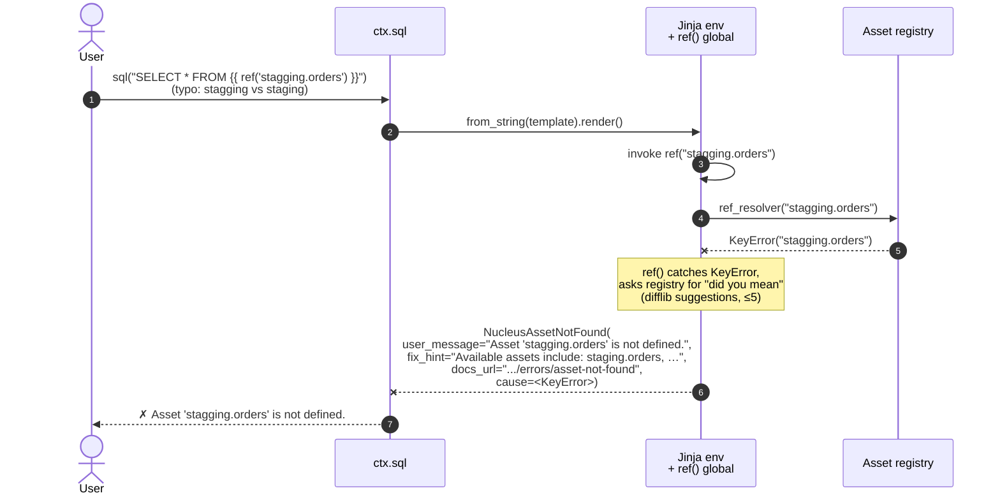
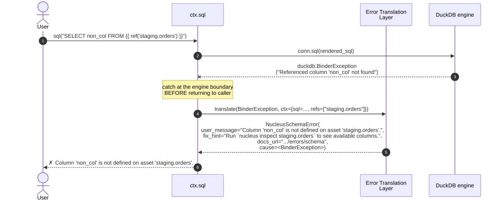
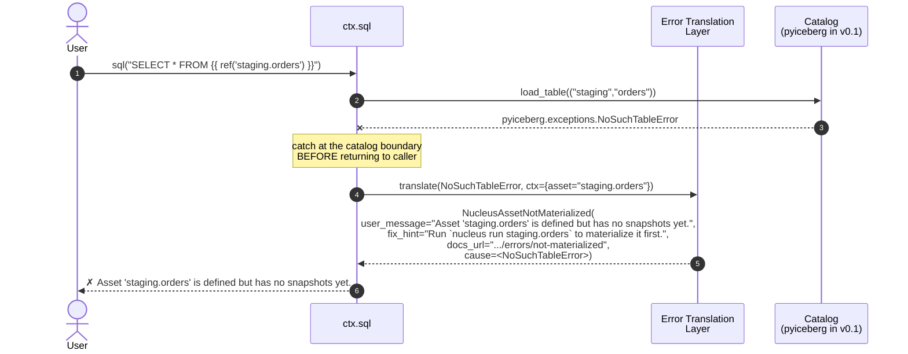

# Sequence — Query (`ctx.sql` / `nucleus query`)

> **Diagram type**: UML Sequence
> **Scope**: How `ctx.sql("SELECT … {{ ref('schema.asset') }} …")` becomes Arrow batches and a Polars `DataFrame`
> **Audience**: Anyone touching `coordination/sql_resolver.py` (v0.1) or `engines/duckdb_engine.py`
> **Status**: v0.1 native `ctx.sql` + Jinja path under the §5.6.0 ceiling. Prototyped by **PoC #2** (`poc/p2_ctx_sql/resolver.py`); graduates to `src/nucleus/coordination/sql_resolver.py` only after PoC #1 ships `nucleus.errors`.
> **Companion**: [`sequence_error_translation.md`](sequence_error_translation.md) (TEMPLATE), [`sequence_ingestion.md`](sequence_ingestion.md), [`../../nucleus_architecture_v4.1.md`](../../nucleus_architecture_v4.1.md) §5.6 + §5.6.0, [`../research/duckdb.md`](../research/duckdb.md)

---

## §1. Why this matters

Per `nucleus_architecture_v4.1.md` §5.6 (Amendment 6), v0.1 ships **native** SQL transformation, not dbt-duckdb. The resolver renders `{{ ref('schema.asset') }}` against the asset registry, hands the resolved SQL to DuckDB, and streams Arrow batches back. The user sees no rendering details — they call `ctx.sql(template)` and receive a `pl.DataFrame` (or an Arrow `Table`, or a lazy `DuckDBPyRelation`).

If `ctx.sql` ever leaks a `jinja2`, `duckdb`, `pyiceberg`, or `polars` classname, the wrap thesis (`AGENTS.md` §3, §11.7) is broken — same way Dagster leaks break it in [`sequence_error_translation.md`](sequence_error_translation.md). Translators live in the same registry; the resolver does not own its own translation logic.

**Hard scope ceiling** (v4.1 §5.6.0): ≤ 2500 LOC for resolver + Jinja + ref/source. Drift past = wrap dbt-duckdb as a v0.3 optional adapter, do **not** grow the native path.

---

## §2. The happy path (`ctx.sql` with one `ref`)

```mermaid
sequenceDiagram
    autonumber
    actor User
    participant CLI as nucleus CLI<br/>(or user Python)
    participant CTX as ctx.sql
    participant JIN as Jinja env<br/>+ ref() global
    participant REG as Asset registry<br/>+ ref resolver
    participant CAT as Catalog
    participant DUCK as DuckDB engine
    participant ICE as pyiceberg<br/>(snapshot lookup)
    participant POL as Polars
    participant OL as OpenLineage<br/>emitter

    User->>CLI: nucleus query "SELECT * FROM {{ ref('staging.orders') }} LIMIT 10"
    CLI->>CTX: sql(template, target=None)

    Note over CTX: construct Jinja env<br/>(StrictUndefined, autoescape=False)<br/>install ref() global

    CTX->>JIN: from_string(template).render()
    JIN->>JIN: invoke ref("staging.orders")
    JIN->>REG: ref_resolver("staging.orders")

    Note over REG: validate name shape<br/>look up asset → current snapshot

    REG->>CAT: load_table(("staging","orders"))
    CAT-->>REG: Table (metadata pointer)
    REG->>ICE: Table.current_snapshot() / scan plan
    ICE-->>REG: snapshot_id + manifest URI
    REG-->>JIN: scan expression<br/>(pyiceberg-registered DuckDB view)
    JIN-->>CTX: rendered SQL, refs=["staging.orders"]

    Note over CTX: open / reuse DuckDB connection<br/>(:memory: in v0.1)

    CTX->>DUCK: SET timezone='UTC'; INSTALL iceberg; LOAD iceberg;
    CTX->>DUCK: conn.sql(rendered_sql)
    DUCK->>ICE: resolve manifest (read-only)
    ICE-->>DUCK: data file URIs (Parquet)
    DUCK->>DUCK: vectorized columnar execution
    DUCK-->>CTX: DuckDBPyRelation (lazy)

    Note over CTX: materialize on demand<br/>(.fetch_arrow_table() or .pl())

    CTX->>DUCK: relation.fetch_arrow_table()
    DUCK-->>CTX: pyarrow.Table (zero-copy)
    CTX->>POL: pl.from_arrow(arrow_table)
    POL-->>CTX: pl.DataFrame (zero-copy via Arrow C-data)

    CTX->>OL: emit(RunEvent: COMPLETE,<br/>inputs=[iceberg://staging.orders@snap=...],<br/>outputs=[query://<query_hash>])
    OL-->>CTX: ack (best-effort)

    CTX-->>CLI: SqlResult(rows=pl.DataFrame, refs, snapshot_ids)
    CLI-->>User: ✓ 10 rows · 1 column · 47 ms
```

Notes:

- The **Jinja env** is freshly constructed per call in v0.1 (`poc/p2_ctx_sql/resolver.py` lines 142-147). Caching is a v0.3 optimisation.
- The **ref resolver** validates the asset name (`<schema>.<name>`, lowercase, no injection shape — `poc/p2_ctx_sql/resolver.py` `_REF_NAME_RE`), looks up the asset's current snapshot via the catalog, and returns a DuckDB-scannable expression. v0.1 prefers `Table.scan().to_duckdb(name)` over `iceberg_scan('…/metadata.json')` (composes with the Asset Materialization Adapter; `docs/internal/research/duckdb.md` §8).
- DuckDB runs in `:memory:` (v4.1 §5.1, `docs/internal/research/duckdb.md` §4). Persistence is Iceberg, not the DuckDB file. The Iceberg extension is **read-only** in 1.1.3; writes never go through this sequence — they belong to [`sequence_ingestion.md`](sequence_ingestion.md) and [`sequence_error_translation.md`](sequence_error_translation.md) §2.

---

## §3. The failure paths — what Nucleus must do

`ctx.sql` has three failure surfaces. Each is translated at its own boundary; none ever surface a `jinja2.`, `duckdb.`, `pyiceberg.`, or `polars.` classname.

### §3.1 Jinja / `ref()` failure (template side)



Other template-side translations, all at the same boundary (`poc/p2_ctx_sql/resolver.py` lines 149-167):

| Trigger | Translates to |
|---|---|
| `ref()` called with 0 or 2+ args | `NucleusSQLSyntaxError` |
| `ref(some_var)` (unquoted, `StrictUndefined`) | `NucleusSQLSyntaxError` |
| Malformed asset name (e.g. `ref('Foo')`) | `NucleusSQLSyntaxError` |
| Mismatched braces (`{{ ref('x') }`) | `NucleusSQLSyntaxError` |
| `ref()` cycle (`a → b → a`) | `NucleusInvalidAssetDefinition` |
| `source()`, `config()`, user macros | `NucleusSQLSyntaxError` with hint "v0 supports only `{{ ref('schema.name') }}`" |

### §3.2 DuckDB execution failure (engine side)



Complete DuckDB → Nucleus translator table lives in [`sequence_error_translation.md`](sequence_error_translation.md) §4.2 and mirrors `docs/internal/research/duckdb.md` §6. The query path reuses that registry — no per-feature duplication.

### §3.3 pyiceberg snapshot-lookup failure (catalog side)



The distinction `sequence_error_translation.md` §4.4 enforces: **not defined** (Jinja `ref` → `NucleusAssetNotFound`) ≠ **not materialized** (pyiceberg → `NucleusAssetNotMaterialized`). Different `fix_hint`s.

---

## §4. v0.1 scope envelope

Per `nucleus_architecture_v4.1.md` §5.6.0 and `nucleus_poc_plan.md` §2:

| Aspect | v0.1 in-scope | Deferred |
|---|---|---|
| Templating | `{{ ref('schema.name') }}` only | `source()`, `config()`, user macros → v0.3 |
| Built-in macros | `date_trunc`, `dateadd`, `current_timestamp` (§5.6.0) | Macro package ecosystem — **never** |
| Engine | DuckDB (`docs/internal/research/duckdb.md`) | DataFusion swap **interface** only; full adapter on-demand (v4.1 §9.3) |
| Output | `pl.DataFrame`, `pyarrow.Table`, `DuckDBPyRelation` | Streaming `RecordBatchReader` for >100 MB → v0.3 |
| Materialization strategies | `table`, `view` | `incremental` → v0.3; `snapshot` (SCD2) → v0.5 |
| Checks | `@nucleus.check` on the output asset | dbt-style test framework — **never** in native path (§5.6.0) |
| Lineage | Asset-level (OpenLineage) | Column-level via sqlglot → v0.5 (`nucleus_architecture_v4.1.md` §12.4) |
| LOC budget | ≤ 2500 (v4.1 §5.6.0 ceiling) | — |

Past the §5.6.0 ceiling the answer is **wrap dbt-duckdb (v0.3 optional adapter)**, not "grow the native resolver". Non-negotiable per AGENTS.md §11.7.

---

## §5. Acceptance criteria (PoC #2 → v0.1 `ctx.sql`)

From `nucleus_poc_plan.md` §2 and the PoC #2 hardening pass (`poc/p2_ctx_sql/test_resolver.py`):

1. `ctx.sql("SELECT * FROM {{ ref('staging.orders') }}")` returns a `pl.DataFrame` with the expected rows and columns.
2. Multiple refs in one template render in encounter order; `refs` deduplicates while preserving order.
3. Jinja `StrictUndefined` is the configured mode (unknown variables fail; no silent empty rendering).
4. Malformed asset names rejected at validation; `ref_resolver` is never called for `Foo`, `staging.Foo`, `staging.foo.bar`, `1staging.orders`.
5. `ref()` cycle detected and surfaced as `NucleusInvalidAssetDefinition`.
6. **No `jinja2.` / `duckdb.` / `pyiceberg.` / `polars.` classname leaks** — `scripts/dagster_leak_check.py` extends to grep these prefixes in rendered error output. Must return 0.
7. DuckDB `BinderException`, `ParserException`, `CatalogException`, `OutOfMemoryException` translate to the `NucleusError` subclasses in [`sequence_error_translation.md`](sequence_error_translation.md) §4.2.
8. pyiceberg `NoSuchTableError` translates to `NucleusAssetNotMaterialized` (not `NucleusAssetNotFound`).
9. Total LOC for resolver + Jinja env + ref/source ≤ 2500 (v4.1 §5.6.0).

---

## §6. What this sequence doesn't do

- **No SQL parsing for lineage.** Column-level lineage requires sqlglot and is deferred to v0.5. v0.1 emits asset-level lineage from the resolver's `refs` list — not from parsing the rendered SQL.
- **No writes via DuckDB.** Iceberg writes go through pyiceberg only (Constraint #5; `docs/internal/research/duckdb.md` §8). `ctx.sql` is read-only against assets. Materializing a query result into a new asset goes through `@nucleus.sql_asset`, which routes via the Asset Materialization Adapter and [`sequence_error_translation.md`](sequence_error_translation.md) §2.
- **No query caching.** Repeat `ctx.sql(same_template)` re-executes. A cache is a v0.5+ telemetry-driven decision per `AGENTS.md` §5 q7.
- **No semantic layer.** v4.1 §5.6.0 hard limit.
- **No adapter ecosystem.** No `nucleus-sql adapter for X`. v4.1 §5.6.0.

---

## §7. NEEDS VERIFICATION

Per AGENTS.md §11.12, before graduating PoC #2 → `src/nucleus/coordination/sql_resolver.py`:

1. **DuckDB Iceberg extension on Windows.** `INSTALL iceberg; LOAD iceberg;` is autoloadable; Windows extension download path is `~/.duckdb/extensions/` (`docs/internal/research/duckdb.md` §7). Air-gapped CI needs pre-download. PoC #2 has not yet exercised the extension end-to-end.
2. **`Table.scan().to_duckdb(name)` zero-copy semantics across pyiceberg 0.8.1 → 0.11.x.** v0.1 prefers this over `iceberg_scan('…/metadata.json')`. [ADR-003](../decisions/ADR-003-pyiceberg-upgrade-0.8.1-to-0.11.x.md) queues the upgrade; smoke test required.
3. **`duckdb.ParserException` exposes line/column position.** Translator surfaces SQL error position; PoC #1 acceptance flags verification on 1.1.3. If unavailable, downgrade to "SQL syntax error near …" without position.
4. **`SET timezone='UTC'` applied on every connection.** Required for determinism (`engineering.md` §6.1, `docs/internal/research/duckdb.md` §4 + §7). v0.1 resolver must wire this as a connection-init hook before any user SQL runs.
5. **OpenLineage event schema for read-only `ctx.sql` runs.** Inputs are concrete (resolved assets); the output dataset for a transient query is ambiguous. v4.1 §6.2 specifies emission for materialization only; the query-side convention is not yet defined.

---

## §8. Evolution & versioning

- New built-in macro (e.g., `current_date`): PR + unit test, stays under §5.6.0 ceiling.
- `source()` resolution (v0.3 candidate): ADR required — semantically distinct from `ref()`.
- dbt-duckdb optional adapter (v0.3): ADR required. Per `nucleus_architecture_v4.1.md` §5.6, dbt-duckdb stays optional, never default.
- Change to `SqlResult` shape: PR + spec note (public surface per `nucleus_architecture_v4.1.md` §13.1).
- Remove a NucleusError translator used here: ADR required (breaking — user catches may exist).

---

*Next: read [`sequence_ingestion.md`](sequence_ingestion.md) for the write-side companion, then [`sequence_error_translation.md`](sequence_error_translation.md) for the translation contract every step here depends on.*
