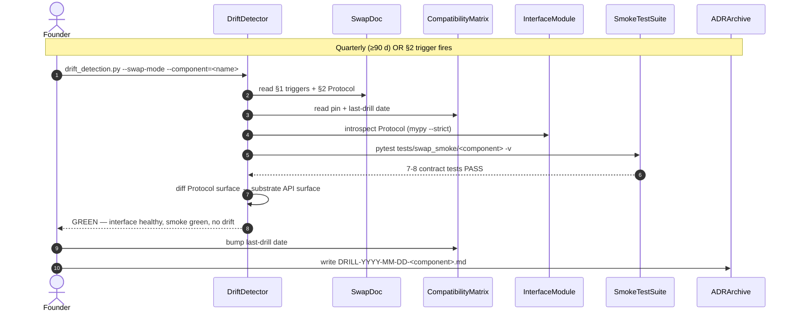
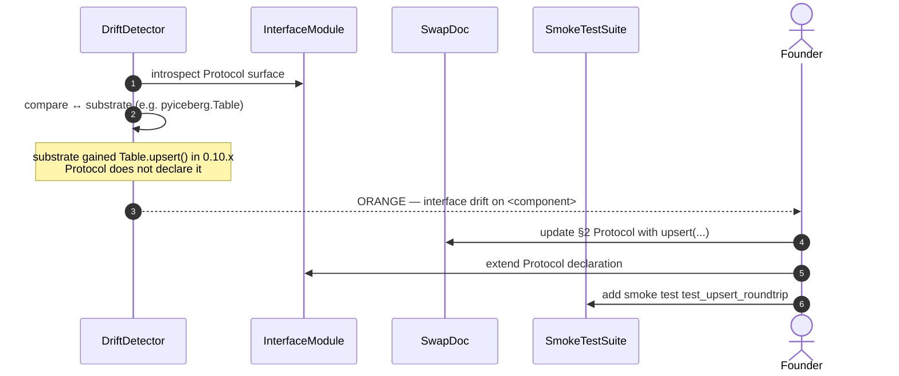
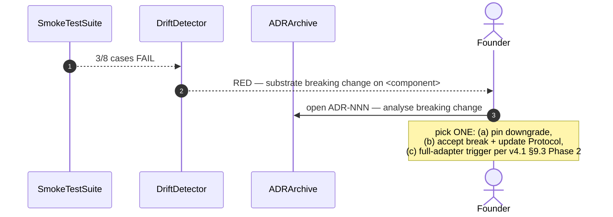
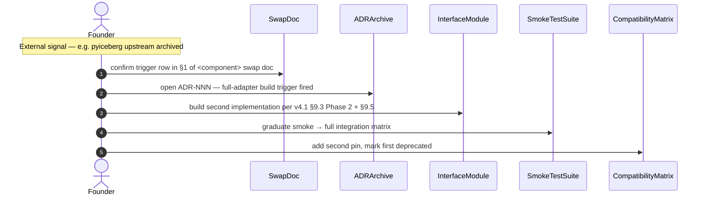

# Sequence — Composability Swap Drill (Process)

> **Diagram type**: UML Sequence (process spec, **not** a runtime hot path).
> **Scope**: Validating that a Tier 1/2 dependency can still be swapped per `nucleus_architecture_v4.1.md` §9.3.
> **Cadence**: Quarterly (≥ every 90 days) per v4.1 §9.3, OR triggered by a §2 stop-condition. Distinct from the **monthly Drift Detection Pass** in `AGENTS.md` §11.11 — see §9 row 1.
> **Status**: PROCESS spec. v0.1 drills are manual; v0.5+ adds CI scaffolding (placeholder, §9 row 2).
> **Companion**: [`../swap/dagster.md`](../swap/dagster.md), [`../swap/duckdb.md`](../swap/duckdb.md), [`../swap/pyiceberg.md`](../swap/pyiceberg.md), [`../../nucleus_architecture_v4.1.md`](../../nucleus_architecture_v4.1.md) §9, [`../../AGENTS.md`](../../AGENTS.md) §3 #9 + §11.11.
> **Last touched**: 2026-05-13

---

## §1. Why this matters

Per v4.1 §9 (Composability by Constitution, revised — Amendment 3 / D12), Nucleus does **not** maintain full second implementations of every Tier 1/2 dependency. Instead: clean swap interface (Protocol) + 5-10 smoke tests in CI, **always**; full adapter built **on-demand** when a trigger fires. v4.1 §9.3 calls these "Phase 1" and "Phase 2" and frames the tradeoff as "80% of safety at 10% of cost" versus the rejected "Composability Tax".

A stale swap interface is **worse than no swap interface** — it creates the illusion of safety without the substance. The **drill** keeps it honest. v4.1 §9.3 mandates the quarterly cadence; the drill itself — who does what, in what order, with what acceptance criteria — was previously unspecified. This document closes that gap. The first three swap docs (`../swap/{dagster,duckdb,pyiceberg}.md`) are in place; the founder runs the first drill against them after PoC #1 ships and the v0.1 swap interfaces land.

---

## §2. Trigger conditions

A drill fires when **any** of these hold for a tracked Tier 1/2 component:

1. **Calendar** — ≥ 90 days since last drill (`docs/compatibility.md` last-drill column).
2. **Vendor signal** — upstream OSS commit count drops ≥ 50% over 30 days (per-component thresholds in `docs/swap/<component>.md` §1; auto-alert per v4.1 §9.4).
3. **License change** — Tier 1/2 dep relicenses outside {Apache-2.0, MIT, BSD-3}.
4. **Performance regression** — smoke benchmark slows >2x in a release (`scripts/benchmark_regression.py` in CI today).
5. **Hostile fork / archive** — dominant maintainer disappears or repo archived.
6. **Drift Detection Pass flag** — monthly sweep per `AGENTS.md` §11.11 surfaces a drift symptom (unpinned dep, new substrate method, classname leak).

Per v4.1 §9.3 + §19 row 11, **calendar is the floor, never the ceiling**. Each `docs/swap/<component>.md` §1 carries a component-specific subclass (e.g. PoC #4 boot regression for DuckDB; iceberg-spec-v3 lag for PyIceberg). Read both lists together before declaring GREEN.

---

## §3. Participants

- **Founder** — runs + reviews (v0.1); receives CI report (v0.5+).
- **DriftDetector** — `scripts/drift_detection.py` (v0.5+; §9 row 2).
- **SwapDoc** — `docs/swap/<component>.md` (3 in place at 2026-05-13).
- **InterfaceModule** + **SmokeTestSuite** — `src/nucleus/swap/<component>` + `tests/swap_smoke/test_<component>.py` (v0.5+; §9 row 3).
- **CIPipeline** — `.github/workflows/ci.yml`.
- **CompatibilityMatrix** — `docs/compatibility.md` (per `AGENTS.md` §11.13).
- **ADRArchive** — `docs/decisions/` (ADR-001 … ADR-006 today).

In v0.1 most boxes resolve to the founder reading swap docs by hand; the sequences below describe the **target end state**, with v0.1 manual fallbacks called out where they differ.

---

## §4. The happy path (drill GREEN)

In v0.1 the founder performs steps 1-7 manually using §6; the automated path lands in v0.5+ (§9 row 2).

---

## §5. Failure paths

Three modes, with very different responses.

### §5.1 Interface drift (ORANGE — fix the doc)

Substrate added a method, or our Protocol diverged from substrate behavior, but smoke still passes.

Fix lands in the same drill window. Founder logs `DRILL-YYYY-MM-DD-<component> ORANGE` to ADRArchive; no full-adapter trigger.

### §5.2 Smoke fails (RED — analyse + decide)

A previously-green smoke test failed: pinned substrate regressed, or substrate quietly changed behavior.

The founder picks one of three paths and records the choice in the ADR:

- **(a) pin downgrade** — pin previous known-good version in `docs/compatibility.md`; ADR documents the downgrade reason.
- **(b) accept + update** — amend Protocol in `src/nucleus/swap/<component>` to reflect new behavior; re-baseline smoke tests.
- **(c) full-adapter trigger** — drill becomes MIGRATION (see §5.3); per §8 it must consume the at-most-one full-adapter slot.

### §5.3 Trigger fires (full-adapter migration)

External signal — vendor death, license pivot, or >2x perf regression — hits a §2 row. The drill becomes a **migration**.

Cost rows in `docs/swap/{dagster,duckdb,pyiceberg}.md` §4 (Dagster ~5 wk, DuckDB ~3 wk, PyIceberg ~7-8 wk) are **drill-validated** estimates already carried in the swap docs — re-validating them is part of every drill, not a separate exercise. Per §8 only 1 full adapter is active at a time during v0.5-v1.0.

---

## §6. Acceptance criteria for a "GREEN" drill

GREEN requires **all** of:

1. **Swap doc current** — last-edited < 90 days OR no documented behavior changes upstream.
2. **Interface compiles clean** — `mypy --strict src/nucleus/swap/<component>.py` returns 0 (placeholder until v0.5+; §9 row 3).
3. **Smoke tests pass** — 5-10 cases per component (7 Dagster, 8 each DuckDB / PyIceberg per the swap-doc §3 sketches), green on the pinned substrate AND on any built swap target.
4. **CI matrix runs** — primary + (skipped-where-absent) swap interface tests both reported; no spurious skips outside documented `_has_<adapter>()` guards.
5. **Compatibility matrix refreshed** — current pin, tested set, bumped last-drill date.
6. **Drill log entry created** — `DRILL-YYYY-MM-DD-<component>.md` (location per §9 row 5; **not** a full ADR — ADRs reserved for §5 RED outcomes).

Any fail → ORANGE (§5.1) or RED (§5.2).

---

## §7. Drill cost budget

Per v4.1 §9 + §17.2 (solo-founder runway): ≤ 30 minutes per-component-per-drill, ≤ 4 hours per quarter across all Tier 1/2 components, ≈ 16 hrs/year ≈ ~0.4% of solo-founder capacity. A full-adapter build (when triggered) is 3-8 weeks per `docs/swap/*` §4.

If a per-component drill repeatedly takes >30 min, that is itself the signal that the Protocol drifted — close the gap (§5.1) **before** the next quarter. The asymmetry is intentional per Amendment 3: drills are **insurance** (cheap + frequent + shallow), full adapters are **migrations** (expensive + rare + deep). Drill hours do **not** count against the 30K-LOC v1.0 budget (Hard Constraint #8); they count against founder calendar.

---

## §8. Composability budget guardrails

Per v4.1 §9.3, during v0.5-v1.0:

- **At most 1 component with a full adapter active at a time.** Each requires its own ADR + the §4 calendar window.
- **Tier 0 components are not drilled** (Arrow, Iceberg, Parquet, Lance, S3 API, OpenLineage, OpenTelemetry — v4.1 §4 + §9.2 = immortal; §9 row 4 confirms the "skip" reading).
- **Pin changes + adapter-building are forbidden inside a drill.** Pin changes belong to upgrade PRs per `AGENTS.md` §11.13; full adapters are the §5.2(c) / §5.3 escalation.
- **Benchmarks are consumed, not re-run** — `scripts/benchmark_regression.py` runs per-PR; the drill consults the latest result.

---

## §9. NEEDS VERIFICATION

Per `AGENTS.md` §11.12 (no fabricated APIs; cite official docs):

1. **Cadence collision: monthly Drift Detection Pass (28 d) vs swap drill (90 d).** `AGENTS.md` §11.11 sweeps the repo every 4 weeks; this doc drills per component every 90 days. §2 row 6 wires the monthly pass as a possible early-drill trigger, but it is unverified that the founder doesn't duplicate effort when both fall in the same week. Possible mitigation: schedule the swap drill in week 3 of each quarter so the latest monthly Drift Pass feeds it. Decide before the first drill runs.
2. **`scripts/drift_detection.py` does not yet exist.** `scripts/` carries only `dagster_leak_check.py`, `check_layering.py`, `check_pinning.py`, `check_vocabulary.py`, `loc_budget.py`, `benchmark_regression.py`, `beachhead_e2e.py`. A `--swap-mode` flag is v0.5+ work; until then §4 collapses to the §6 manual checklist.
3. **`src/nucleus/swap/` + `tests/swap_smoke/` do not yet exist in v0.1.** The Protocol sketches inside `docs/swap/{dagster,duckdb,pyiceberg}.md` §2 are normative; the file layout that hosts them is not yet decided.
4. **Tier 0 treatment.** v4.1 §4 + §9.2 say Tier 0 is immortal with no swap target. Confirm: drill **skipped for Tier 0** (preferred, encoded in §8) vs **trivially asserted** as a one-line entry per component.
5. **Drill log location.** `docs/decisions/DRILL-YYYY-MM-DD-<component>.md` (§6 row 6) vs a new `docs/drills/` folder. Mixing drill notes with ADR-001 … ADR-006 may dilute the "we changed our minds" reading of `docs/decisions/`. Decide before the first drill log lands.

---

## §10. Cross-references

- [`../../nucleus_architecture_v4.1.md`](../../nucleus_architecture_v4.1.md) §9 (constitution; Amendment 3 / D12), §9.2-§9.5 (tier classification, Phase 1 / Phase 2 cadence, license & health monitor, forking), §6.5 (Dagster replaceability — highest-stakes drill).
- [`../../AGENTS.md`](../../AGENTS.md) §3 #9 (operating rule), §11.11 (monthly Drift Detection Pass — distinct, see §9 row 1), §11.13 (upgrade safety).
- [`../swap/dagster.md`](../swap/dagster.md), [`../swap/duckdb.md`](../swap/duckdb.md), [`../swap/pyiceberg.md`](../swap/pyiceberg.md); format templates [`sequence_error_translation.md`](sequence_error_translation.md), [`sequence_ingestion.md`](sequence_ingestion.md), [`sequence_asset_materialization.md`](sequence_asset_materialization.md).

---

*Next: when post-PoC #1 swap interfaces land, run the first drill against [`../swap/dagster.md`](../swap/dagster.md) and post the result as `DRILL-YYYY-MM-DD-dagster.md`. Resolve §9 row 5 (drill log location) before the first drill log lands.*
