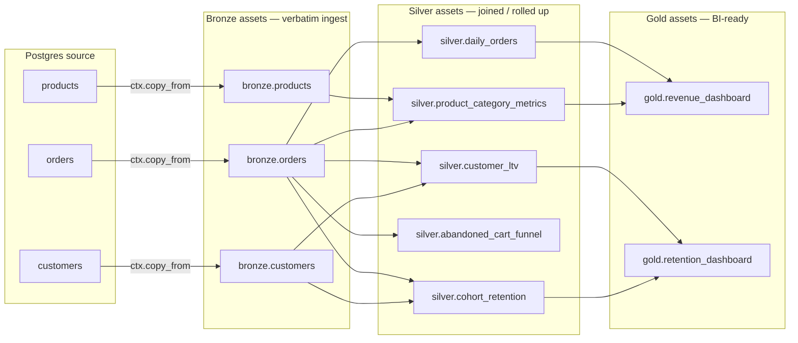

# E-commerce ELT — Postgres → Iceberg → BI in one project

> **30-second pitch**: A small online store has Postgres tables for `orders`, `customers`, and `products`. This recipe walks an engineer from `nucleus init` to a refreshable revenue + retention dashboard in roughly an hour. Postgres lands as bronze assets via `ctx.copy_from`; five silver assets join and rollup; two gold assets feed BI. Schedules are declared on the asset; quality is enforced through `@nucleus.check`. Everything stays on a laptop until the team graduates the same Iceberg snapshots to a managed catalog.
>
> **Time to implement**: ~1 hour for a fresh 5-engineer team.
> **Cost**: $0 local. ~$5/month cloud (single small VM + a few GB of S3 storage; tune up as data grows). Treat any cloud number here as illustrative — refresh against current quotes per [`production-deployment.md`](../production-deployment.md).

---

## Architecture



All edges resolve via `{{ ref('schema.name') }}` inside `nucleus.ctx.sql` calls — no hand-coded paths, no Iceberg manifest URIs, no schema duplication.

---

## Project layout

After `nucleus init my-store`:

```text
my-store/
├── nucleus_project.yaml          # warehouse + catalog + lineage config
├── docker-compose.yaml           # local stack (storage + workbench)
├── data/
│   └── warehouse/                # Iceberg metadata + Parquet land here
├── .nucleus/
│   ├── catalog.db                # filesystem SQL catalog (SQLite-backed)
│   └── runs/runs.ndjson          # durable run ledger
└── assets/
    ├── __init__.py
    ├── bronze.py                 # 3 source assets (Postgres → Iceberg)
    ├── silver.py                 # 5 transform assets
    ├── gold.py                   # 2 BI assets
    └── checks.py                 # @nucleus.check quality gates
```

The `nucleus_project.yaml` is the only config file you edit by hand. Everything else regenerates from CLI commands or is committed by Nucleus.

---

## Step 1 — Initialize and start the local stack

```bash
nucleus init my-store
cd my-store
nucleus up
```

`nucleus up` boots the local SeaweedFS storage substrate and the Workbench server (default port `8765`). Cold boot benchmarked at ~5.82 s on a developer laptop per [`production-deployment.md`](../production-deployment.md). No Java, no Spark daemon, no externally-managed catalog server.

Confirm everything is alive:

```bash
nucleus version          # exits 0 when wheels + dependencies resolved
curl -fsS http://127.0.0.1:8765/api/health
```

---

## Step 2 — Bronze assets (Postgres → Iceberg)

`assets/bronze.py` declares one `@nucleus.asset` per source relation. The asset body delegates to `nucleus.ctx.copy_from`, which dispatches by URL scheme to the dlt-backed Postgres helper (`ctx.ingest_postgres_to_iceberg` underneath, per [`cloud-credentials.md`](../cloud-credentials.md)).

```python
# assets/bronze.py
"""Bronze layer — verbatim Postgres ingest (no transforms)."""
from __future__ import annotations

import os
from pathlib import Path

import polars as pl

import nucleus
import nucleus.ctx as ctx

WAREHOUSE = Path("./data/warehouse")
PG_URL = os.environ["NUCLEUS_PG_URL"]  # e.g. postgresql://reader:***@db/store?sslmode=require


@nucleus.asset("bronze.orders", schedule="@hourly")
def bronze_orders() -> pl.DataFrame:
    rows = ctx.copy_from(
        PG_URL,
        table="public.orders",
        target="bronze.orders",
        warehouse_dir=WAREHOUSE,
        write_disposition="replace",
    )
    return ctx.read("bronze.orders", warehouse_dir=WAREHOUSE).collect().head(0)
    # The asset's row count is owned by the bronze materialization above;
    # returning an empty frame is the v0.1 idiom that keeps lineage edges
    # intact while the AMA records the snapshot the copy_from call produced.
    # `rows` is captured to surface the count in `nucleus runs show <id>`.


@nucleus.asset("bronze.customers", schedule="@daily")
def bronze_customers() -> pl.DataFrame:
    ctx.copy_from(
        PG_URL,
        table="public.customers",
        target="bronze.customers",
        warehouse_dir=WAREHOUSE,
        write_disposition="replace",
    )
    return ctx.read("bronze.customers", warehouse_dir=WAREHOUSE).collect().head(0)


@nucleus.asset("bronze.products", schedule="@daily")
def bronze_products() -> pl.DataFrame:
    ctx.copy_from(
        PG_URL,
        table="public.products",
        target="bronze.products",
        warehouse_dir=WAREHOUSE,
        write_disposition="replace",
    )
    return ctx.read("bronze.products", warehouse_dir=WAREHOUSE).collect().head(0)
```

Notes you should care about:

- **Connection string lives in the environment**, never in `nucleus_project.yaml`. Source 1 of [`cloud-credentials.md`](../cloud-credentials.md) shows how to inject `NUCLEUS_PG_URL` from Vault / AWS Secrets Manager / GCP Secret Manager / direnv. Nucleus does not own identity; the URL string is built once at process start.
- **`write_disposition="replace"`** truncates and reloads each materialization. For a small store this is honest and cheap. The dlt incremental cursor pattern lands at v0.3+; until then, schedule frequency × `replace` is the v0.1 lever.
- **`schedule="@hourly"`** is stored as a 5-field cron expression by `croniter`. Active execution by the mini-scheduler daemon ships in v0.2 (per [ADR-017](../../decisions/ADR-017-asset-schedule-kwarg.md)). In v0.1 you can still run on demand: `nucleus run bronze.orders`.

---

## Step 3 — Silver assets (joined and rolled up)

Silver assets read from bronze with `nucleus.ctx.sql` and `{{ ref('schema.name') }}`. The resolver auto-derives dependencies from each `ref()` call, so the `deps=` kwarg is optional except for dynamic patterns.

```python
# assets/silver.py
"""Silver layer — five business assets joined out of bronze."""
from __future__ import annotations

from pathlib import Path

import polars as pl

import nucleus
import nucleus.ctx as ctx

WAREHOUSE = Path("./data/warehouse")


@nucleus.asset("silver.daily_orders", deps=["bronze.orders"], schedule="@daily")
def silver_daily_orders() -> pl.DataFrame:
    return ctx.sql(
        """
        SELECT
            date_trunc('day', order_ts)                AS day,
            COUNT(*)                                    AS n_orders,
            COUNT(DISTINCT customer_id)                 AS n_customers,
            SUM(amount)                                 AS gross_revenue,
            SUM(CASE WHEN status = 'refunded' THEN amount ELSE 0 END) AS refunds,
            SUM(amount) - SUM(CASE WHEN status = 'refunded' THEN amount ELSE 0 END)
                                                        AS net_revenue
        FROM {{ ref('bronze.orders') }}
        WHERE status IN ('completed', 'refunded')
        GROUP BY 1
        ORDER BY 1
        """,
        warehouse_dir=WAREHOUSE,
    ).collect()


@nucleus.asset("silver.customer_ltv", deps=["bronze.orders", "bronze.customers"])
def silver_customer_ltv() -> pl.DataFrame:
    return ctx.sql(
        """
        SELECT
            c.customer_id,
            c.email_hash,
            c.signup_date,
            COUNT(o.order_id)                          AS lifetime_orders,
            COALESCE(SUM(o.amount), 0)                 AS lifetime_revenue,
            COALESCE(AVG(o.amount), 0)                 AS avg_order_value,
            MAX(o.order_ts)                            AS last_order_ts
        FROM {{ ref('bronze.customers') }} c
        LEFT JOIN {{ ref('bronze.orders') }} o
            ON o.customer_id = c.customer_id
            AND o.status = 'completed'
        GROUP BY 1, 2, 3
        """,
        warehouse_dir=WAREHOUSE,
    ).collect()


@nucleus.asset(
    "silver.product_category_metrics",
    deps=["bronze.orders", "bronze.products"],
    schedule="@daily",
)
def silver_product_category_metrics() -> pl.DataFrame:
    return ctx.sql(
        """
        SELECT
            p.category,
            date_trunc('week', o.order_ts)             AS week,
            SUM(o.amount)                              AS gross_revenue,
            COUNT(DISTINCT o.order_id)                 AS n_orders,
            SUM(o.quantity)                            AS units_sold
        FROM {{ ref('bronze.orders') }} o
        JOIN {{ ref('bronze.products') }} p
            ON p.product_id = o.product_id
        WHERE o.status = 'completed'
        GROUP BY 1, 2
        """,
        warehouse_dir=WAREHOUSE,
    ).collect()


@nucleus.asset("silver.abandoned_cart_funnel", deps=["bronze.orders"], schedule="@daily")
def silver_abandoned_cart_funnel() -> pl.DataFrame:
    # `state` is the application-side cart state captured into the orders feed:
    # 'cart_created' → 'checkout_started' → 'completed' / 'abandoned'.
    return ctx.sql(
        """
        SELECT
            date_trunc('day', order_ts)                AS day,
            SUM(CASE WHEN state = 'cart_created' THEN 1 ELSE 0 END)        AS carts,
            SUM(CASE WHEN state = 'checkout_started' THEN 1 ELSE 0 END)    AS checkouts,
            SUM(CASE WHEN state = 'completed' THEN 1 ELSE 0 END)           AS completed,
            SUM(CASE WHEN state = 'abandoned' THEN 1 ELSE 0 END)           AS abandoned
        FROM {{ ref('bronze.orders') }}
        GROUP BY 1
        """,
        warehouse_dir=WAREHOUSE,
    ).collect()


@nucleus.asset("silver.cohort_retention", deps=["bronze.orders", "bronze.customers"])
def silver_cohort_retention() -> pl.DataFrame:
    return ctx.sql(
        """
        WITH first_purchase AS (
            SELECT customer_id,
                   date_trunc('month', MIN(order_ts)) AS cohort_month
            FROM {{ ref('bronze.orders') }}
            WHERE status = 'completed'
            GROUP BY 1
        ),
        activity AS (
            SELECT o.customer_id,
                   date_trunc('month', o.order_ts) AS active_month
            FROM {{ ref('bronze.orders') }} o
            WHERE o.status = 'completed'
        )
        SELECT
            f.cohort_month,
            a.active_month,
            COUNT(DISTINCT a.customer_id) AS active_customers
        FROM first_purchase f
        JOIN activity a USING (customer_id)
        GROUP BY 1, 2
        ORDER BY 1, 2
        """,
        warehouse_dir=WAREHOUSE,
    ).collect()
```

Two patterns worth noting:

1. **`{{ ref('schema.name') }}` is the only way to point at another asset.** No hand-built joins on warehouse paths, no `from raw__orders` (the BI tool's flattened mirror). The resolver translates `ref()` to a registered DuckDB view at execution time and surfaces clean errors via `NucleusAssetNotFound` (NE3002) when a dep is missing — never a raw stack trace from the SQL engine.
2. **`schedule="@daily"` declared on assets** makes the cadence visible to `nucleus schedule list` and the Workbench schedule view. Daemon execution lights up in v0.2.

---

## Step 4 — Gold assets (BI-ready)

Gold assets are the BI surface — flat, dashboard-shaped, ready for Superset / Evidence / Streamlit (per [`bi-connectivity.md`](../bi-connectivity.md)).

```python
# assets/gold.py
"""Gold layer — two dashboards: revenue + retention."""
from __future__ import annotations

from pathlib import Path

import polars as pl

import nucleus
import nucleus.ctx as ctx

WAREHOUSE = Path("./data/warehouse")


@nucleus.asset(
    "gold.revenue_dashboard",
    deps=["silver.daily_orders", "silver.product_category_metrics"],
    schedule="@daily",
)
def gold_revenue_dashboard() -> pl.DataFrame:
    return ctx.sql(
        """
        SELECT
            d.day,
            d.gross_revenue,
            d.net_revenue,
            d.n_orders,
            d.n_customers,
            (
                SELECT category
                FROM {{ ref('silver.product_category_metrics') }} p
                WHERE date_trunc('day', p.week) <= d.day
                ORDER BY p.gross_revenue DESC
                LIMIT 1
            ) AS top_category
        FROM {{ ref('silver.daily_orders') }} d
        ORDER BY d.day DESC
        """,
        warehouse_dir=WAREHOUSE,
    ).collect()


@nucleus.asset(
    "gold.retention_dashboard",
    deps=["silver.customer_ltv", "silver.cohort_retention"],
    schedule="@daily",
)
def gold_retention_dashboard() -> pl.DataFrame:
    return ctx.sql(
        """
        SELECT
            r.cohort_month,
            r.active_month,
            r.active_customers,
            ROUND(100.0 * r.active_customers /
                  FIRST_VALUE(r.active_customers)
                    OVER (PARTITION BY r.cohort_month ORDER BY r.active_month), 1)
                    AS retention_pct,
            (SELECT AVG(lifetime_revenue)
             FROM {{ ref('silver.customer_ltv') }}
             WHERE date_trunc('month', signup_date) = r.cohort_month) AS avg_cohort_ltv
        FROM {{ ref('silver.cohort_retention') }} r
        ORDER BY r.cohort_month, r.active_month
        """,
        warehouse_dir=WAREHOUSE,
    ).collect()
```

Each gold asset becomes a row in `_nucleus_catalog_info` and a flattened `gold__revenue_dashboard` view in the auto-generated `nucleus.db` — point Superset, Evidence, Rill, or Streamlit at it per [`bi-connectivity.md`](../bi-connectivity.md).

---

## Step 5 — Schema contracts and quality gates

`@nucleus.check` runs after the materialization commits, sees the new snapshot, and rejects (or warns about) bad data without rolling the whole snapshot back. v0.1 supports `severity="error"` (default — failed check rejects the materialization) and `severity="warn"` (allows commit, surfaces warning).

```python
# assets/checks.py
"""Quality gates — runtime checks that gate / annotate snapshots."""
from __future__ import annotations

from pathlib import Path

import polars as pl

import nucleus
import nucleus.ctx as ctx

WAREHOUSE = Path("./data/warehouse")


@nucleus.check("bronze.orders")
def orders_have_no_negative_amounts() -> nucleus.CheckResult:
    df = ctx.read("bronze.orders", warehouse_dir=WAREHOUSE).collect()
    bad = df.filter(pl.col("amount") < 0)
    return nucleus.CheckResult(
        passed=len(bad) == 0,
        metric=len(bad),
        message=f"{len(bad)} orders with negative amount",
    )


@nucleus.check("silver.daily_orders", severity="warn")
def daily_orders_freshness() -> nucleus.CheckResult:
    df = ctx.read("silver.daily_orders", warehouse_dir=WAREHOUSE).collect()
    if df.is_empty():
        return nucleus.CheckResult(passed=False, metric=0, message="no rows")
    latest = df["day"].max()
    return nucleus.CheckResult(
        passed=True,
        metric=int(latest.timestamp()) if latest else 0,
        message=f"latest day in rollup: {latest}",
    )
```

Failed checks land in the run ledger (`nucleus runs show <run-id>`) with the same NE-coded error envelope every other Nucleus failure carries (NE3007 for check execution, per [ADR-006](../../decisions/ADR-006-error-codes.md)).

---

## Step 6 — Run the graph

Materialize a single asset:

```bash
nucleus run bronze.orders
nucleus run silver.daily_orders
nucleus run gold.revenue_dashboard
```

Inspect what just happened:

```bash
nucleus runs list --asset gold.revenue_dashboard --limit 5
nucleus snapshot list gold.revenue_dashboard
```

Pin a snapshot for compliance / rollback:

```bash
nucleus snapshot tag create gold.revenue_dashboard v2026-05-15-end-of-day \
    --snapshot-id 8823671234
```

Open the Workbench (default `http://localhost:8765`) to inspect the asset graph visually, drill into a snapshot, and (with opt-in) chat with the Copilot per [`ai-copilot-setup.md`](../ai-copilot-setup.md):

```bash
nucleus workbench up
```

---

## Connect the BI tool

`nucleus up` regenerates `nucleus.db` (DuckDB file) under the project root with one native view per materialized asset. Point Superset / Evidence / Rill / Streamlit at it per [`bi-connectivity.md`](../bi-connectivity.md):

```text
duckdb:///<absolute-path>/my-store/nucleus.db
```

The `gold__revenue_dashboard` and `gold__retention_dashboard` views show up under the `main` schema — every column already aggregated, every snapshot ID retained in `_nucleus_catalog_info` for audit.

---

## When NOT to use Nucleus for this

- **Per-customer real-time personalization on > 10 M live users.** Nucleus targets batch + microbatch (single-node DuckDB / Polars). Sub-second OLAP at that fan-out wants ClickHouse, Pinot, or Druid.
- **Source-of-truth OLTP for the storefront itself.** Iceberg is your *analytical* substrate. Postgres stays the system of record; Nucleus reads from it, does not replace it.
- **Multi-region active-active analytics.** v0.2 is single-node by design. Multi-region is a yield-to-giants problem (Mode 2 dispatch to Databricks / Snowflake — see below).
- **Storefront-grade SLOs that demand 5-nines availability.** v0.2 ships SeaweedFS + Caddy + a single Workbench node. For Iceberg analytics that is plenty; if your dashboard going dark for 30 minutes on a node failure is unacceptable, push the analytical workload to a managed catalog earlier.

---

## How this graduates to Databricks / Snowflake

The same Iceberg snapshots that power the laptop dashboards graduate without re-modeling — that is the explicit yield-to-giants strategy of `docs/specs/nucleus_architecture_v4.1.md` §10.

1. **Mode 1 — portability**: point Databricks Unity Catalog or Snowflake's Iceberg catalog at the same `gold/` warehouse path. Existing dashboards keep reading the same snapshots; Nucleus continues to author new ones from the laptop or a small VM.
2. **Mode 2 — hybrid compute**: when one nightly cohort retention asset starts pushing your single-node memory budget, mark only that asset `compute="databricks"` (lights up at v0.3+). Everything else stays local. The asset graph stays one graph; only the materializing engine changes.
3. **Mode 3 — federation** (v2.0+): when multiple teams stand up their own catalogs, federate at the Iceberg REST catalog layer. The `gold.*` namespace becomes the team's published surface across the org's mesh.

Iceberg is the contract; Nucleus is the laptop tooling on top of it. Graduation is a **catalog change**, not a **rewrite**.

---

## Cost (illustrative — refresh quotes before commitments)

| Mode | Order of magnitude | Notes |
| --- | --- | --- |
| Local laptop dev | $0 / mo | DuckDB + Polars + SeaweedFS in Docker — no SaaS bill |
| Single small cloud VM (m6i.xlarge-ish) + S3 | ~$60-100 / mo | Per [`production-deployment.md`](../production-deployment.md) sizing for < 100 GB |
| Snowflake / Databricks for the same gold tier | dollars per DBU / TB scanned | Cheaper at exploratory-burst usage; more expensive at steady moderate load |

Treat all numbers above as rough magnitude. The point is not "Nucleus is cheaper" — it is that the same Iceberg snapshots travel between the two cost models without rework.

---

## Cross-references

- [`docs/cookbook/cloud-credentials.md`](../cloud-credentials.md) — Postgres credentials in `.env.local` and Vault patterns
- [`docs/cookbook/production-deployment.md`](../production-deployment.md) — single-node deployment sizing + backup cadence
- [`docs/cookbook/bi-connectivity.md`](../bi-connectivity.md) — Superset / Evidence / Rill / Streamlit setup
- [`docs/cookbook/ai-copilot-setup.md`](../ai-copilot-setup.md) — Copilot opt-in + provider keys (`nucleus chat`)
- [`docs/specs/nucleus_architecture_v4.1.md`](../../specs/nucleus_architecture_v4.1.md) §6.2 (AMA), §6.4 (Error Translation), §10 (Yield to giants)
- [ADR-014 — dlt Postgres source](../../decisions/ADR-014-dlt-postgres-source.md)
- [ADR-017 — `schedule=` kwarg](../../decisions/ADR-017-asset-schedule-kwarg.md)
- [ADR-028 — snapshot branch + tag CLI](../../decisions/ADR-028-snapshot-branch-tag-cli.md)
