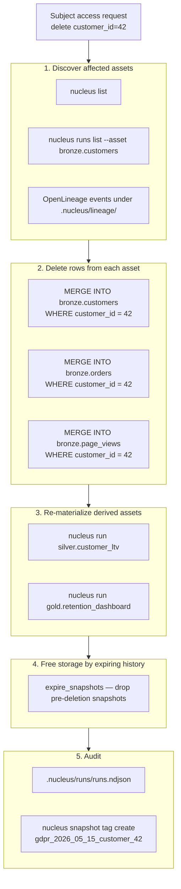

# GDPR right-to-delete — composing existing primitives

> **30-second pitch**: A subject-access deletion request arrives for `customer_id=42`. This recipe walks the operator through enumerating every asset that contains that user (via OpenLineage), removing the rows with `MERGE INTO` against each Iceberg snapshot, expiring the prior snapshots so backups no longer hold the data, and recording the entire flow in the durable `runs.ndjson` ledger for audit. Crucially: this is **a runbook composed from existing primitives**, not a new `nucleus gdpr` command. The 8-Q gate analysis at the end shows why.
>
> **Time to implement**: ~1 hour for a fresh 5-engineer team to wire the runbook the first time. ~10 minutes per request thereafter.
> **Cost**: $0 incremental — uses primitives already in the v0.2 release.

---

## Honest scope statement

Nucleus v0.2 does not own identity, does not implement RBAC at the row level, and does not encrypt PII at rest beyond what your storage substrate (S3, SeaweedFS, local disk) already provides. **The "right to delete" workflow is a composition of three existing capabilities**:

1. **Lineage enumeration** — every materialization emits an OpenLineage event, and `nucleus runs list --asset <key>` reports which snapshots wrote which rows.
2. **`MERGE INTO` writes via PyIceberg** — the catalog supports row-level deletes against the latest snapshot; we wrap the `pyiceberg` API at the asset boundary.
3. **`expire_snapshots`** — built into the AMA (per ADR-024 P0-3) and on the CLI roadmap. Removes orphan Parquet files referenced only by expired snapshots.

What v0.2 cannot give you on its own:

- **Cryptographic erasure** of S3 / SeaweedFS objects after a `DELETE` — that is a storage layer concern. Configure your bucket lifecycle / SSE-KMS keys to satisfy your DPA.
- **Fine-grained access control on a "PII column"** — that is the v0.5+ `@nucleus.contract` work and the v0.5+ OIDC + column policy story. Until then, restrict access at the warehouse-directory level.
- **Asynchronous "deletion job" with SLAs** — that is workflow tooling on top of the v0.2 schedule daemon (which lights up per [ADR-017 §v0.2.1](../../decisions/ADR-017-asset-schedule-kwarg.md)).

If your DPA mandates more than what this runbook delivers, layer Databricks Unity Catalog / Snowflake Horizon on top of the same Iceberg snapshots — see "How this graduates" below.

---

## Architecture (the request flow)



Five steps, each step is one or two existing CLI commands.

---

## Step 1 — Discover every asset that contains the user

```bash
# enumerate all assets in the project
nucleus list

# for each candidate asset, scan the latest snapshot for the user_id.
# nucleus query refers to assets by their <namespace>.<name> key — the
# catalog resolves them to live Iceberg views.
nucleus query "SELECT 'bronze.customers'   AS asset_key, COUNT(*) AS hit FROM bronze.customers    WHERE customer_id = 42
              UNION ALL
              SELECT 'bronze.orders',      COUNT(*) FROM bronze.orders     WHERE customer_id = 42
              UNION ALL
              SELECT 'bronze.page_views',  COUNT(*) FROM bronze.page_views WHERE customer_id = 42
              UNION ALL
              SELECT 'silver.customer_ltv', COUNT(*) FROM silver.customer_ltv WHERE customer_id = 42"
```

For an automated discovery loop in production, parse the OpenLineage event stream:

```python
# scripts/discover_user_assets.py
"""Walk OpenLineage events under .nucleus/lineage/ and find assets that
have ever materialized rows referencing customer_id=42.

This is a *discovery* helper, not a Nucleus subcommand. The asset-level
lineage that Nucleus emits today (per v4.1 §6.4 + ADR roadmap) is
sufficient for "which assets touch this customer's data". Column-level
lineage that would prove a column is *only* derived from a non-PII source
lands at v0.5+.
"""
from __future__ import annotations

import json
from pathlib import Path

LEDGER = Path(".nucleus/lineage/events.jsonl")

assets_with_user_id: set[str] = set()
for line in LEDGER.read_text().splitlines():
    event = json.loads(line)
    inputs = [d.get("name", "") for d in event.get("inputs", [])]
    outputs = [d.get("name", "") for d in event.get("outputs", [])]
    # Conservative: any asset whose inputs OR outputs touched 'customers'
    # is a candidate for manual inspection.
    if any("customer" in name.lower() for name in inputs + outputs):
        assets_with_user_id.update(outputs)

for key in sorted(assets_with_user_id):
    print(key)
```

The conservative posture (any asset that *touches* `customers`) is intentional: GDPR mandates erasure of derived data too, and silent omission is worse than over-inclusion.

---

## Step 2 — Delete rows with `MERGE INTO`

PyIceberg `0.11.x` exposes `Table.delete(...)` for row-level deletes. The pattern is one Python helper called once per affected asset:

```python
# scripts/delete_user_rows.py
"""Delete rows for a given customer_id across the listed assets.

Wraps pyiceberg.Table.delete — confined to this script, not in the
ctx SDK. The asset materialization adapter (AMA) writes Iceberg
snapshots; this is a *parallel* write path for the GDPR runbook only.

NEEDS VERIFICATION: pyiceberg 0.11.1 Table.delete(row_filter=...) signature.
Cite: https://py.iceberg.apache.org/api/#delete  (verify before first run)
"""
from __future__ import annotations

import sys
from pathlib import Path

from pyiceberg.catalog import load_catalog
from pyiceberg.expressions import EqualTo

WAREHOUSE = Path("./data/warehouse").resolve()
CATALOG = load_catalog(
    "default",
    type="sql",
    uri=f"sqlite:///{WAREHOUSE.parent}/.nucleus/catalog.db",
    warehouse=f"file://{WAREHOUSE.as_posix()}",
)

ASSETS = [
    ("bronze", "customers"),
    ("bronze", "orders"),
    ("bronze", "page_views"),
    ("silver", "customer_ltv"),
]


def main(customer_id: int) -> None:
    for namespace, table_name in ASSETS:
        table = CATALOG.load_table((namespace, table_name))
        table.delete(EqualTo("customer_id", customer_id))
        print(f"deleted rows for customer_id={customer_id} from {namespace}.{table_name}")


if __name__ == "__main__":
    main(int(sys.argv[1]))
```

Run it:

```bash
python scripts/delete_user_rows.py 42
```

Each call commits a new Iceberg snapshot. The previous snapshot still references the deleted rows — Step 4 expires it.

> **Important**: `Table.delete` is a **single-table operation**. There is no multi-table transaction; if a snapshot drops in the middle of the run for one asset, retry that asset only. Per ADR-001 (no custom commit service / transaction coordinator), this is by design — the catalog handles per-table atomicity, not cross-table consistency.

---

## Step 3 — Re-materialize derived assets

The deletes in step 2 produce new bronze snapshots. Re-run the silver / gold layer so derived assets reflect the deletion:

```bash
nucleus run silver.customer_ltv
nucleus run silver.cohort_retention
nucleus run gold.retention_dashboard
nucleus run gold.revenue_dashboard
```

If the silver layer reads from bronze with `{{ ref('bronze.orders') }}`, it picks up the post-delete snapshot automatically — no code change required.

---

## Step 4 — Expire pre-deletion snapshots

Iceberg keeps the *pre-delete* snapshot until expiry. Your DPA may require those snapshots to be unreadable within N days.

The AMA wires automatic expiry (default 30 days) per ADR-024 P0-3 after every successful commit. For an immediate expiry of just the pre-deletion snapshots, the v0.3+ CLI surface adds `nucleus snapshot expire` (`docs/decisions/ADR-028` companion). Until that lands, run the same `pyiceberg` helper:

```python
# scripts/expire_predelete_snapshots.py
"""Expire snapshots older than the deletion commit for each asset.

NEEDS VERIFICATION: pyiceberg 0.11.1 expire_snapshots API surface.
Cite: https://py.iceberg.apache.org/api/#expire-snapshots
"""
from __future__ import annotations

import sys
from datetime import UTC, datetime
from pathlib import Path

from pyiceberg.catalog import load_catalog

WAREHOUSE = Path("./data/warehouse").resolve()
CATALOG = load_catalog(
    "default",
    type="sql",
    uri=f"sqlite:///{WAREHOUSE.parent}/.nucleus/catalog.db",
    warehouse=f"file://{WAREHOUSE.as_posix()}",
)


def main(deletion_iso_ts: str) -> None:
    cutoff_ms = int(datetime.fromisoformat(deletion_iso_ts).replace(tzinfo=UTC).timestamp() * 1000)
    for namespace, table_name in [
        ("bronze", "customers"),
        ("bronze", "orders"),
        ("bronze", "page_views"),
        ("silver", "customer_ltv"),
    ]:
        table = CATALOG.load_table((namespace, table_name))
        table.expire_snapshots().expire_older_than(cutoff_ms).commit()
        print(f"expired pre-{deletion_iso_ts} snapshots on {namespace}.{table_name}")


if __name__ == "__main__":
    main(sys.argv[1])  # e.g. python scripts/expire_predelete_snapshots.py 2026-05-15T18:00:00
```

After this runs, the underlying Parquet files referenced only by the expired snapshots are eligible for `delete_orphan_files`. v0.3 wraps that in a `nucleus snapshot vacuum` verb; until then, the pyiceberg call is the workaround.

---

## Step 5 — Audit trail

Two surfaces, both already there:

```bash
# durable run ledger — every materialization, every check, every commit
nucleus runs list --asset bronze.customers --limit 50
nucleus runs show <run-id>

# tag the post-deletion snapshot for compliance attestation
nucleus snapshot tag create bronze.customers gdpr_2026_05_15_customer_42 \
    --snapshot-id <new-snapshot-id>
```

Snapshot tags are protected from `expire_snapshots` (per ADR-028), so the audit pin survives even after retention sweeps. Pair the tag name with a row in your compliance workflow tool (Jira / ServiceNow / OneTrust); the tag is the cryptographic-style anchor, the ticket is the human-readable record.

---

## Honest limitations (read before you certify a workflow)

| Concern | v0.2 reality | Mitigation today | When this lands |
| --- | --- | --- | --- |
| Column-level lineage to prove "this gold asset is *not* derived from PII" | Asset-level only | Conservative discovery in Step 1 | v0.5+ |
| Fine-grained row-level access control (only specific roles can read PII) | Not in v0.2 | Restrict warehouse directory permissions; layer OIDC at the BI tool | v0.5+ (per [ADR-010](../../decisions/ADR-010-oidc-delegation-policy-v03.md)) |
| Cryptographic erasure on object storage | Not Nucleus's job | Configure S3 lifecycle + SSE-KMS rotation per your DPA | Storage layer concern; will not land in Nucleus |
| Multi-table atomic delete | No (per Hard Constraint #5) | Per-asset retry loop in Step 2 | Catalog-side feature; not a Nucleus build |
| `nucleus snapshot vacuum` verb | Wrapped in a Python helper | Use the script in Step 4 | v0.3+ |
| `ctx.read(snapshot=...)` typed surface | v0.3+ | Direct `pyiceberg` read by tag (see recipe #3) | v0.3+ |

The point: **be honest with your DPO about what v0.2 enforces vs what your runbook enforces**. The runbook + Iceberg snapshots is a real GDPR posture for many teams; the *automated, auto-discovered, role-gated* version is the v0.5+ story.

---

## 8-Question gate analysis: should we build a `nucleus gdpr` command?

Per [`AGENTS.md`](../../../AGENTS.md) §5 — every proposed feature must clear all eight questions.

| # | Question | Answer for `nucleus gdpr delete <user_id>` |
| --- | --- | --- |
| 1 | Maps to one of the five architectural layers? | Coordination (L2) — borderline, would mostly orchestrate existing layers |
| 2 | Serves the **<30 minute** beachhead metric? | **No.** GDPR is enterprise-driven, not the startup-team beachhead |
| 3 | Wrap possible instead of build? | **Yes** — Unity Catalog, Snowflake Horizon, OneTrust all wrap this |
| 4 | Preserves no-JVM constraint? | Yes |
| 5 | Preserves local-identical-to-prod? | Yes (would work locally), but the *real* use case is prod-only |
| 6 | Stays within 30K LOC budget? | Borderline — discovery + delete + expire + audit easily ~1500 LOC |
| 7 | Triggered by empirical telemetry, not anxiety? | **No.** No external tester has asked for this in PoC #5 |
| 8 | Required for v0.1 Hello World, or can it defer? | **Defer indefinitely.** A runbook composed of existing primitives is sufficient |

**Verdict: REJECT.** The 8-question gate fails on #2, #7, and #8. The runbook in this cookbook is the v0.2 answer; the eventual managed-catalog graduation (Unity Catalog policy enforcement, Snowflake Horizon governance) is the long-term answer. Building a first-party `nucleus gdpr` verb would violate the Anti-Over-Engineering directive (`.cursor/rules/nucleus.mdc` #1, #4, #6).

If a future external tester (per [PoC #5](../../research/poc5_external_tester_findings.md) or quarterly UX validation) reports that this runbook is too painful, revisit. Until then, **a documented runbook + 30 lines of Python is the right answer for a 30K-LOC budget.**

---

## When NOT to use Nucleus for this

- **Active DPO compliance program demanding row-level RBAC across hundreds of analysts**: that needs Unity Catalog, Snowflake Horizon, or an enterprise governance platform. Nucleus is the data substrate; those tools are the policy surface.
- **Real-time deletion SLAs (e.g. "delete within 60 seconds of request")**: not the v0.2 cadence. The runbook is minutes-to-hours, not seconds.
- **Petabyte-scale right-to-delete sweeps across hundreds of assets**: yield to a managed engine. The `MERGE INTO` cost on a single VM is bounded by the bronze namespace size.
- **Multi-region GDPR with cross-region replication**: out of scope for v0.2 single-node design.

---

## How this graduates to Databricks / Snowflake

- **Mode 1 — portability**: when you adopt Unity Catalog or Snowflake Horizon for the same Iceberg tables, their **policy surface** (column masking, row filters, audit log) replaces this runbook automatically. The data layout does not change.
- **Mode 2 — hybrid compute** (v0.3+): the row-deletion `MERGE INTO` on a multi-billion-row asset can dispatch to Databricks. Tag the asset `compute="databricks"` and re-run; the audit trail still lands in `runs.ndjson` because the orchestration is unchanged.
- **Tooling layer**: OneTrust / TrustArc / Securiti integrate with Unity Catalog and Snowflake natively. The graduation path takes you from a runbook + Python script to a vendor-managed compliance workflow without altering the underlying Iceberg layout.

---

## Cost (illustrative)

| Mode | Order of magnitude | Notes |
| --- | --- | --- |
| Local laptop dev | $0 | Runbook is just CLI + Python |
| Cloud, single VM, < 5 TB total | ~$0 incremental | Uses primitives already there |
| Adding Databricks Unity Catalog policy enforcement | dollars per DBU + governance SKU | Worth it when policy surface > runbook |

---

## Cross-references

- [`docs/cookbook/cloud-credentials.md`](../cloud-credentials.md) — secret hygiene + audit logging at source systems
- [`docs/cookbook/production-deployment.md`](../production-deployment.md) — backup vs snapshot interplay
- [`docs/patterns/secret_management.md`](../../patterns/secret_management.md) — never log PII or secrets in lineage facets
- [`AGENTS.md`](../../../AGENTS.md) Hard Constraint #6 (no custom identity), Hard Constraint #5 (no custom commit service)
- [`nucleus_architecture_v4.1.md`](../../../nucleus_architecture_v4.1.md) §10 (Yield to giants), §20 (Non-goals)
- [ADR-006 — error codes](../../decisions/ADR-006-error-codes.md)
- [ADR-010 — OIDC delegation policy](../../decisions/ADR-010-oidc-delegation-policy-v03.md)
- [ADR-024 — Reliability guards (snapshot retention)](../../decisions/ADR-024-reliability-guards.md)
- [ADR-025 — Run ledger durability](../../decisions/ADR-025-run-ledger.md)
- [ADR-028 — Snapshot branch + tag CLI](../../decisions/ADR-028-snapshot-branch-tag-cli.md)
