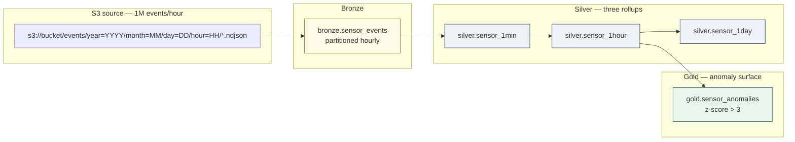

# IoT sensor rollup — S3 NDJSON → Iceberg time-series with anomaly detection

> **30-second pitch**: A fleet of 5 000 devices drops ~1 M NDJSON events per hour into an S3 prefix. This recipe lands the raw stream as a partitioned bronze asset, computes 1-minute / 1-hour / 1-day rollups in silver, and flags z-score anomalies in gold. Schema evolution is handled by Iceberg's column-add semantics so a new sensor type does not break yesterday's snapshot. Storage is bounded by `expire_snapshots` retention. The Copilot is the analyst's fallback when an unfamiliar device id starts misbehaving.
>
> **Time to implement**: ~1.5 hours for a fresh 5-engineer team.
> **Cost**: $0 local. ~$30-150 / month cloud at this volume (one small VM + S3 storage + minor egress). Treat as illustrative; refresh against current quotes per [`production-deployment.md`](../production-deployment.md).

---

## Architecture



The bronze asset partitions by hour. Silver rollups read only the partitions touched since the last successful snapshot. Gold rolls forward incrementally on top of the hour rollup.

---

## Project layout

```text
sensor-platform/
├── nucleus_project.yaml
├── data/warehouse/                 # Iceberg metadata + Parquet
├── .nucleus/
│   ├── catalog.db
│   └── runs/runs.ndjson
└── assets/
    ├── __init__.py
    ├── bronze.py                   # 1 source asset (S3 ingest)
    ├── silver.py                   # 3 rollup assets
    ├── gold.py                     # 1 anomaly asset
    └── checks.py                   # quality gates
```

---

## Step 1 — Set credentials and boot

`ctx.copy_from` for `s3://...` URIs delegates to DuckDB's `httpfs` extension, which reads `AWS_ACCESS_KEY_ID` / `AWS_SECRET_ACCESS_KEY` / `AWS_DEFAULT_REGION` directly per [`cloud-credentials.md`](../cloud-credentials.md) Source 4. On EC2 / EKS, an instance profile or IRSA is preferred over long-lived keys (Hard Constraint #6 — Nucleus delegates identity).

```bash
export AWS_DEFAULT_REGION=us-east-1
# IAM role attached to the runner — no long-lived keys on disk

nucleus init sensor-platform
cd sensor-platform
nucleus up
```

Required IAM (least-privilege, per [`cloud-credentials.md`](../cloud-credentials.md)):

```json
{
  "Version": "2012-10-17",
  "Statement": [
    {
      "Sid": "ReadSensorEvents",
      "Effect": "Allow",
      "Action": ["s3:GetObject", "s3:ListBucket"],
      "Resource": [
        "arn:aws:s3:::my-iot-bucket",
        "arn:aws:s3:::my-iot-bucket/events/*"
      ]
    }
  ]
}
```

---

## Step 2 — Bronze asset (S3 NDJSON → Iceberg)

```python
# assets/bronze.py
"""Bronze layer — verbatim S3 NDJSON ingest, partitioned by hour."""
from __future__ import annotations

from datetime import UTC, datetime, timedelta
from pathlib import Path

import polars as pl

import nucleus
import nucleus.ctx as ctx

WAREHOUSE = Path("./data/warehouse")
BUCKET = "my-iot-bucket"


@nucleus.asset("bronze.sensor_events", schedule="@hourly")
def bronze_sensor_events() -> pl.DataFrame:
    """Append the last completed hour of NDJSON events into Iceberg.

    The S3 layout is:
        s3://my-iot-bucket/events/year=YYYY/month=MM/day=DD/hour=HH/*.ndjson

    We compute the previous hour's prefix and let DuckDB read the glob.
    Mixed-schema files within a glob are unified by `union_by_name=true`
    inside the connector — new sensor types appear as nullable columns
    in the next snapshot without breaking historical rows.
    """
    now = datetime.now(UTC).replace(minute=0, second=0, microsecond=0)
    last_hour = now - timedelta(hours=1)
    prefix = (
        f"s3://{BUCKET}/events/"
        f"year={last_hour.year:04d}/"
        f"month={last_hour.month:02d}/"
        f"day={last_hour.day:02d}/"
        f"hour={last_hour.hour:02d}/*.ndjson"
    )
    ctx.copy_from(
        prefix,
        target="bronze.sensor_events",
        warehouse_dir=WAREHOUSE,
        format="json",
    )
    return ctx.read("bronze.sensor_events", warehouse_dir=WAREHOUSE).collect().head(0)
```

Two things to know:

- **`format="json"`** tells the connector to use DuckDB's `read_json_auto`. The `.ndjson` extension would auto-detect the same way, but explicit > implicit on the hot path.
- **Iceberg partitioning by hour** is what the bronze namespace uses to keep silver rollups cheap. Native partition spec declarations live in `nucleus_project.yaml` overrides at v0.3+ — for now the on-disk layout already matches the natural partition because the source S3 prefix is hour-keyed.

---

## Step 3 — Silver rollups (1-min / 1-hour / 1-day)

```python
# assets/silver.py
"""Silver layer — three time-bucketed rollups on top of bronze."""
from __future__ import annotations

from pathlib import Path

import polars as pl

import nucleus
import nucleus.ctx as ctx

WAREHOUSE = Path("./data/warehouse")


@nucleus.asset(
    "silver.sensor_1min",
    deps=["bronze.sensor_events"],
    schedule="@hourly",
)
def silver_sensor_1min() -> pl.DataFrame:
    return ctx.sql(
        """
        SELECT
            device_id,
            sensor_type,
            time_bucket(INTERVAL '1 minute', event_ts) AS minute_bucket,
            COUNT(*)                                    AS n_events,
            AVG(value)                                  AS avg_value,
            MIN(value)                                  AS min_value,
            MAX(value)                                  AS max_value,
            STDDEV_SAMP(value)                          AS stddev_value
        FROM {{ ref('bronze.sensor_events') }}
        WHERE event_ts >= NOW() - INTERVAL '2 hours'
        GROUP BY 1, 2, 3
        """,
        warehouse_dir=WAREHOUSE,
    ).collect()


@nucleus.asset(
    "silver.sensor_1hour",
    deps=["silver.sensor_1min"],
    schedule="@hourly",
)
def silver_sensor_1hour() -> pl.DataFrame:
    return ctx.sql(
        """
        SELECT
            device_id,
            sensor_type,
            time_bucket(INTERVAL '1 hour', minute_bucket) AS hour_bucket,
            SUM(n_events)                                  AS n_events,
            AVG(avg_value)                                 AS avg_value,
            MIN(min_value)                                 AS min_value,
            MAX(max_value)                                 AS max_value
        FROM {{ ref('silver.sensor_1min') }}
        GROUP BY 1, 2, 3
        """,
        warehouse_dir=WAREHOUSE,
    ).collect()


@nucleus.asset(
    "silver.sensor_1day",
    deps=["silver.sensor_1hour"],
    schedule="@daily",
)
def silver_sensor_1day() -> pl.DataFrame:
    return ctx.sql(
        """
        SELECT
            device_id,
            sensor_type,
            time_bucket(INTERVAL '1 day', hour_bucket)     AS day_bucket,
            SUM(n_events)                                  AS n_events,
            AVG(avg_value)                                 AS avg_value,
            MIN(min_value)                                 AS min_value,
            MAX(max_value)                                 AS max_value
        FROM {{ ref('silver.sensor_1hour') }}
        GROUP BY 1, 2, 3
        """,
        warehouse_dir=WAREHOUSE,
    ).collect()
```

`time_bucket` is a DuckDB function (extension-free in `duckdb==1.1.3`); see DuckDB docs for the parameter shape. Each silver asset carries a `schedule=` so the v0.2 daemon can run them in cadence.

---

## Step 4 — Gold anomaly detection (z-score)

```python
# assets/gold.py
"""Gold layer — z-score anomaly surface."""
from __future__ import annotations

from pathlib import Path

import polars as pl

import nucleus
import nucleus.ctx as ctx

WAREHOUSE = Path("./data/warehouse")


@nucleus.asset(
    "gold.sensor_anomalies",
    deps=["silver.sensor_1hour"],
    schedule="@hourly",
)
def gold_sensor_anomalies() -> pl.DataFrame:
    """Flag readings whose z-score versus the trailing 24-hour window > 3."""
    return ctx.sql(
        """
        WITH stats AS (
            SELECT
                device_id,
                sensor_type,
                hour_bucket,
                avg_value,
                AVG(avg_value)  OVER w AS rolling_mean,
                STDDEV_SAMP(avg_value) OVER w AS rolling_stddev
            FROM {{ ref('silver.sensor_1hour') }}
            WINDOW w AS (
                PARTITION BY device_id, sensor_type
                ORDER BY hour_bucket
                RANGE BETWEEN INTERVAL 24 HOUR PRECEDING AND INTERVAL 1 HOUR PRECEDING
            )
        )
        SELECT
            device_id,
            sensor_type,
            hour_bucket,
            avg_value,
            rolling_mean,
            rolling_stddev,
            (avg_value - rolling_mean) / NULLIF(rolling_stddev, 0) AS z_score
        FROM stats
        WHERE rolling_stddev IS NOT NULL
          AND ABS((avg_value - rolling_mean) / NULLIF(rolling_stddev, 0)) > 3
        """,
        warehouse_dir=WAREHOUSE,
    ).collect()
```

This is a textbook z-score filter on top of a rolling window — no statistical packages, no Spark, no model serving infrastructure. DuckDB's window functions cover the math; Iceberg snapshots cover the audit trail.

---

## Step 5 — Schema evolution (new sensor types arrive)

`bronze.sensor_events` is `union_by_name=true` at the connector layer (handled inside `ctx.copy_from` for object-storage sources). When a new sensor type starts emitting an unseen field — say `pressure_bar` — three things happen:

1. **The next bronze materialization succeeds.** Iceberg appends the new column as nullable; existing rows show `NULL` for it.
2. **Silver rollups stay green.** They aggregate over `value` / `device_id` / `sensor_type` and never reference the new column directly until the engineer extends the rollup.
3. **`nucleus snapshot list bronze.sensor_events`** records the new schema-id alongside the snapshot id — the audit trail of *when* the column appeared is preserved without any DDL written by hand.

Iceberg column-rename, type-widen, and drop are also supported via the catalog. Avoid re-typing in place; use `ALTER COLUMN` semantics surfaced by `pyiceberg` — full coverage lands in the v0.3+ schema-evolution helpers (track [`docs/decisions/`](../../decisions/) for the ratification ADR).

---

## Step 6 — Retention (`expire_snapshots`)

Storage growth on a 1 M-event-per-hour pipeline is dominated by the bronze namespace. v0.2 wires automatic snapshot expiry inside the AMA after a successful commit (per [ADR-024](../../decisions/ADR-024-reliability-guards.md) P0-3). The default is 30 days; tune via `nucleus_project.yaml`:

```yaml
catalog:
  type: filesystem
  path: ./.nucleus/catalog.db

storage:
  warehouse: ./data/warehouse
  snapshot_retain_days: 14    # bronze namespace is the storage hog — shorter window
```

You can also expire explicitly off-cadence by retagging older snapshots before sweep:

```bash
nucleus snapshot tag create bronze.sensor_events monthly_archive_2026_05 \
    --snapshot-id 882367...
```

`expire_snapshots` removes old metadata + orphan Parquet files; tagged snapshots are protected. Audit log lives in `nucleus runs list --asset bronze.sensor_events`.

---

## Step 7 — Run, schedule, and monitor

```bash
nucleus run bronze.sensor_events
nucleus run silver.sensor_1min
nucleus run silver.sensor_1hour
nucleus run gold.sensor_anomalies

# inspect schedules
nucleus schedule list
nucleus schedule preview gold.sensor_anomalies

# look at the run history (durable ledger)
nucleus runs list --asset gold.sensor_anomalies --limit 10
nucleus runs tail --follow

# inspect a specific snapshot
nucleus snapshot list silver.sensor_1hour
```

In the Workbench, the asset graph view shows hourly cadence on bronze / 1min / 1hour / anomaly nodes and daily on the 1day node. The schedule daemon lights up in v0.2 (per ADR-017 §v0.2.1 amendment) so cron triggers move from manual `nucleus run` to background execution.

---

## Step 8 — Ad-hoc anomaly investigation with Copilot

When an analyst sees a spike in `gold.sensor_anomalies` and wants to know *which devices have been emitting > 3-sigma since 6 AM*, the Copilot is the unblock.

Set the provider per [`ai-copilot-setup.md`](../ai-copilot-setup.md) (single-turn, opt-in, cost-capped):

```bash
export ANTHROPIC_API_KEY="sk-ant-..."
nucleus chat "Which device_ids in gold.sensor_anomalies have z_score > 3 in the last 6 hours? Group by sensor_type."
```

The Copilot has access to your asset graph (per the Workbench API surface) and can suggest a SQL block you copy into:

```bash
nucleus query "SELECT device_id, sensor_type, COUNT(*) AS n_alerts
               FROM gold.sensor_anomalies
               WHERE hour_bucket >= NOW() - INTERVAL 6 HOUR
               GROUP BY 1, 2 ORDER BY n_alerts DESC LIMIT 20"
```

(`nucleus query` reads the warehouse catalog directly via the embedded SQL engine — refer to assets by their `<namespace>.<name>` key. BI-tool consumers see the same data via the flattened `gold__sensor_anomalies` view in `nucleus.db` per [`bi-connectivity.md`](../bi-connectivity.md).)

The Copilot does **not** invoke materializations on your behalf in v0.2 — it suggests, you run. That keeps the human in the loop for any side-effect.

---

## Quality gates

```python
# assets/checks.py
from __future__ import annotations

from pathlib import Path

import polars as pl

import nucleus
import nucleus.ctx as ctx

WAREHOUSE = Path("./data/warehouse")


@nucleus.check("bronze.sensor_events")
def event_ts_in_reasonable_range() -> nucleus.CheckResult:
    df = ctx.read("bronze.sensor_events", warehouse_dir=WAREHOUSE).collect()
    bad = df.filter((pl.col("event_ts") < pl.lit("2020-01-01"))
                    | (pl.col("event_ts") > pl.lit("2030-01-01")))
    return nucleus.CheckResult(
        passed=len(bad) == 0,
        metric=len(bad),
        message=f"{len(bad)} events with implausible timestamp",
    )


@nucleus.check("gold.sensor_anomalies", severity="warn")
def anomaly_volume_sanity() -> nucleus.CheckResult:
    df = ctx.read("gold.sensor_anomalies", warehouse_dir=WAREHOUSE).collect()
    return nucleus.CheckResult(
        passed=len(df) < 5_000,
        metric=len(df),
        message=(
            f"{len(df)} anomalies in latest snapshot — investigate calibration if > 5k"
        ),
    )
```

A `severity="warn"` check is the right tool for "this is suspicious but not wrong" — the snapshot still commits and the warning surfaces in `nucleus runs show`.

---

## When NOT to use Nucleus for this

- **Sub-second streaming alerts.** Nucleus is microbatch (hourly cadence is the natural unit here). For sub-second device-level alerts, push the raw stream into Kafka + Flink / Materialize / Apache Pinot; have those systems write **summaries** into Nucleus's bronze for analytics.
- **Multi-tenant SaaS isolation across thousands of customers.** That is recipe #5 (`multi_tenant_data_isolation.md`) — the catalog-per-tenant pattern needs a different layout than this single-namespace example.
- **Ingest > 100 M events / hour on one node.** v0.2 single-node DuckDB chokes there. Mode-2 dispatch the bronze materialization to a managed engine (Databricks Auto Loader, Snowflake Snowpipe) and keep the silver / gold / anomaly logic local.
- **Geospatial sensor analytics requiring R-tree indexing.** DuckDB has a `spatial` extension but the geo-OLAP performance ceiling is below PostGIS / TimescaleDB territory.

---

## How this graduates to Databricks / Snowflake

Same Iceberg snapshots, same asset graph, three modes:

1. **Mode 1 — portability**: point Databricks Auto Loader or Snowflake Snowpipe at the bronze prefix. Hand the gold namespace to Unity Catalog or Snowflake's Iceberg catalog. Existing dashboards keep reading.
2. **Mode 2 — hybrid compute**: when the 1-day rollup over 90 days starts approaching the local memory budget, mark just `silver.sensor_1day` with `compute="databricks"` (lights up at v0.3+). The rest of the graph stays local.
3. **Mode 3 — federation** (v2.0+): split the IoT bronze namespace into one catalog per device family (industrial / consumer / fleet), federate the gold view across them.

The v0.2 platform handles 1 M events / hour comfortably on a single 32 GB VM; graduation is the answer when steady volume crosses the per-VM ceiling, not before.

---

## Cost (illustrative — refresh quotes before commitments)

| Mode | Order of magnitude | Drivers |
| --- | --- | --- |
| Local laptop dev (synthetic 100 k events/hour) | $0 / mo | DuckDB + SeaweedFS on the laptop |
| Single 32 GB VM + S3 + 1 M events/hour | ~$30-150 / mo | VM compute, S3 storage @ ~$23 / TB · month, modest egress |
| Same data scaled to Snowflake / Databricks Auto Loader | dollars per DBU + storage | Wins when bursts are > 5x steady-state and ops budget is small |

Your real cost is dominated by storage growth × `snapshot_retain_days`. Tune retention before scaling instance size.

---

## Cross-references

- [`docs/cookbook/cloud-credentials.md`](../cloud-credentials.md) — S3 IAM policy + Workload Identity / IRSA
- [`docs/cookbook/production-deployment.md`](../production-deployment.md) — VM sizing for sensor workloads
- [`docs/cookbook/ai-copilot-setup.md`](../ai-copilot-setup.md) — Copilot for ad-hoc anomaly drill-down
- [`docs/cookbook/bi-connectivity.md`](../bi-connectivity.md) — point Grafana / Superset / Streamlit at `gold.sensor_anomalies`
- [`nucleus_architecture_v4.1.md`](../../../nucleus_architecture_v4.1.md) §5.5 (Ingestion), §5.6 (SQL engine), §10 (Yield to giants)
- [ADR-020 — Object storage connectors via DuckDB](../../decisions/ADR-020-object-storage-connectors-via-duckdb.md)
- [ADR-024 — Reliability guards (snapshot retention)](../../decisions/ADR-024-reliability-guards.md)
