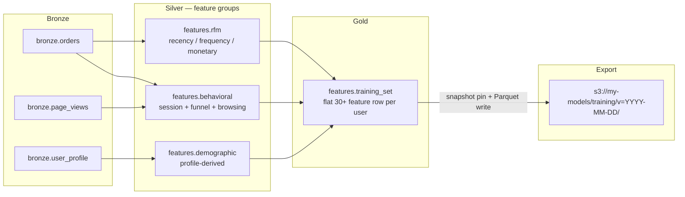

# ML feature engineering — point-in-time-correct feature assets

> **30-second pitch**: A churn / propensity / fraud model needs 30+ features built from `orders`, `page_views`, and `user_profile`. This recipe produces those features as Iceberg-backed assets with schema contracts, point-in-time correctness via snapshot reads, and a clean export to S3 (or local) that Databricks Model Serving / MLflow / Vertex / SageMaker pick up downstream. Nucleus owns the **feature pipeline**; model training and serving stay with the giants.
>
> **Time to implement**: ~1.5 hours for a fresh 5-engineer team (assuming the upstream sources already land as bronze).
> **Cost**: $0 local. Cloud: feature compute is cheap; storage scales with snapshot retention. ~$20-80 / month for typical SaaS-scale source data.

---

## Architecture



---

## Project layout

```text
churn-features/
├── nucleus_project.yaml
├── data/warehouse/
├── .nucleus/
└── assets/
    ├── __init__.py
    ├── features_rfm.py
    ├── features_behavioral.py
    ├── features_demographic.py
    ├── features_training_set.py
    └── checks.py
```

Each feature group is its own module so contract changes stay contained. The training-set asset is the **only** asset downstream consumers (model training jobs, MLflow runs) read from.

---

## Step 1 — Recency / frequency / monetary (RFM)

```python
# assets/features_rfm.py
"""Classic RFM feature group — built from bronze.orders snapshots."""
from __future__ import annotations

from pathlib import Path

import polars as pl

import nucleus
import nucleus.ctx as ctx

WAREHOUSE = Path("./data/warehouse")


@nucleus.asset(
    "features.rfm",
    deps=["bronze.orders"],
    schedule="@daily",
)
def features_rfm() -> pl.DataFrame:
    return ctx.sql(
        """
        SELECT
            customer_id,

            -- Recency
            DATE_DIFF('day', MAX(order_ts), NOW())            AS days_since_last_order,
            DATE_DIFF('day', MIN(order_ts), NOW())            AS days_since_first_order,

            -- Frequency
            COUNT(*)                                           AS orders_lifetime,
            COUNT(*) FILTER (WHERE order_ts >= NOW() - INTERVAL 30 DAY)  AS orders_30d,
            COUNT(*) FILTER (WHERE order_ts >= NOW() - INTERVAL 90 DAY)  AS orders_90d,
            COUNT(*) FILTER (WHERE order_ts >= NOW() - INTERVAL 365 DAY) AS orders_365d,

            -- Monetary
            SUM(amount)                                        AS revenue_lifetime,
            SUM(amount) FILTER (WHERE order_ts >= NOW() - INTERVAL 30 DAY)  AS revenue_30d,
            SUM(amount) FILTER (WHERE order_ts >= NOW() - INTERVAL 90 DAY)  AS revenue_90d,
            AVG(amount)                                        AS aov_lifetime,
            STDDEV_SAMP(amount)                                AS aov_stddev_lifetime,
            MAX(amount)                                        AS largest_order_amount,
            MIN(amount)                                        AS smallest_order_amount
        FROM {{ ref('bronze.orders') }}
        WHERE status = 'completed'
        GROUP BY customer_id
        """,
        warehouse_dir=WAREHOUSE,
    ).collect()
```

Note the `{{ ref('bronze.orders') }}` resolves to whatever snapshot is current when the asset materializes. To make a feature pipeline **point-in-time correct**, materialize against a pinned snapshot — see Step 5.

---

## Step 2 — Behavioral feature group

```python
# assets/features_behavioral.py
"""Behavioral features — sessions, funnel transitions, browsing depth."""
from __future__ import annotations

from pathlib import Path

import polars as pl

import nucleus
import nucleus.ctx as ctx

WAREHOUSE = Path("./data/warehouse")


@nucleus.asset(
    "features.behavioral",
    deps=["bronze.orders", "bronze.page_views"],
    schedule="@daily",
)
def features_behavioral() -> pl.DataFrame:
    return ctx.sql(
        """
        WITH sessions AS (
            SELECT
                customer_id,
                session_id,
                MIN(view_ts) AS session_start,
                MAX(view_ts) AS session_end,
                COUNT(*)     AS pages_in_session
            FROM {{ ref('bronze.page_views') }}
            GROUP BY customer_id, session_id
        ),
        per_user AS (
            SELECT
                customer_id,

                COUNT(*)                                     AS sessions_lifetime,
                AVG(pages_in_session)                        AS avg_pages_per_session,
                AVG(EXTRACT(EPOCH FROM (session_end - session_start))) AS avg_session_seconds,
                COUNT(*) FILTER (WHERE session_start >= NOW() - INTERVAL 7 DAY)  AS sessions_7d,
                COUNT(*) FILTER (WHERE session_start >= NOW() - INTERVAL 30 DAY) AS sessions_30d
            FROM sessions
            GROUP BY customer_id
        ),
        funnel AS (
            SELECT
                customer_id,
                COUNT(*) FILTER (WHERE state = 'cart_created')      AS carts,
                COUNT(*) FILTER (WHERE state = 'checkout_started')  AS checkouts,
                COUNT(*) FILTER (WHERE state = 'completed')         AS completions
            FROM {{ ref('bronze.orders') }}
            GROUP BY customer_id
        )
        SELECT
            COALESCE(p.customer_id, f.customer_id) AS customer_id,
            p.sessions_lifetime,
            p.avg_pages_per_session,
            p.avg_session_seconds,
            p.sessions_7d,
            p.sessions_30d,
            f.carts,
            f.checkouts,
            f.completions,
            CAST(f.checkouts AS DOUBLE) / NULLIF(f.carts, 0)        AS checkout_conv,
            CAST(f.completions AS DOUBLE) / NULLIF(f.checkouts, 0)  AS purchase_conv
        FROM per_user p
        FULL OUTER JOIN funnel f USING (customer_id)
        """,
        warehouse_dir=WAREHOUSE,
    ).collect()
```

---

## Step 3 — Demographic feature group

```python
# assets/features_demographic.py
"""Demographic features — derived from bronze.user_profile."""
from __future__ import annotations

from pathlib import Path

import polars as pl

import nucleus
import nucleus.ctx as ctx

WAREHOUSE = Path("./data/warehouse")


@nucleus.asset(
    "features.demographic",
    deps=["bronze.user_profile"],
    schedule="@daily",
)
def features_demographic() -> pl.DataFrame:
    return ctx.sql(
        """
        SELECT
            customer_id,
            DATE_DIFF('day', signup_date, NOW())             AS account_age_days,
            COALESCE(country_code, 'XX')                     AS country_code,
            CASE WHEN country_code IN ('US','CA','MX') THEN 'NA'
                 WHEN country_code IN ('GB','DE','FR','IT','ES') THEN 'EU'
                 WHEN country_code IN ('JP','KR','SG','AU','NZ') THEN 'APAC'
                 ELSE 'OTHER' END                            AS region_bucket,
            CASE WHEN tier = 'enterprise' THEN 1 ELSE 0 END  AS is_enterprise,
            CASE WHEN tier = 'free'       THEN 1 ELSE 0 END  AS is_free,
            CASE WHEN marketing_opt_in    THEN 1 ELSE 0 END  AS marketing_opt_in_flag,
            email_domain
        FROM (
            SELECT
                customer_id,
                signup_date,
                country_code,
                tier,
                marketing_opt_in,
                LOWER(SPLIT_PART(email, '@', 2)) AS email_domain
            FROM {{ ref('bronze.user_profile') }}
        ) base
        """,
        warehouse_dir=WAREHOUSE,
    ).collect()
```

---

## Step 4 — Training set (the contract surface)

The training-set asset is the **only** asset the downstream model trainer reads. Everything upstream is implementation detail; the training set is the contract.

```python
# assets/features_training_set.py
"""Training set — wide row per customer, 30+ features."""
from __future__ import annotations

from pathlib import Path

import polars as pl

import nucleus
import nucleus.ctx as ctx

WAREHOUSE = Path("./data/warehouse")


@nucleus.asset(
    "features.training_set",
    deps=["features.rfm", "features.behavioral", "features.demographic"],
    schedule="@daily",
)
def features_training_set() -> pl.DataFrame:
    return ctx.sql(
        """
        SELECT
            r.customer_id,

            -- RFM
            r.days_since_last_order,
            r.days_since_first_order,
            r.orders_lifetime,
            r.orders_30d,
            r.orders_90d,
            r.orders_365d,
            r.revenue_lifetime,
            r.revenue_30d,
            r.revenue_90d,
            r.aov_lifetime,
            r.aov_stddev_lifetime,
            r.largest_order_amount,
            r.smallest_order_amount,

            -- Behavioral
            COALESCE(b.sessions_lifetime,    0) AS sessions_lifetime,
            COALESCE(b.avg_pages_per_session, 0) AS avg_pages_per_session,
            COALESCE(b.avg_session_seconds,  0) AS avg_session_seconds,
            COALESCE(b.sessions_7d,          0) AS sessions_7d,
            COALESCE(b.sessions_30d,         0) AS sessions_30d,
            COALESCE(b.carts,                0) AS carts,
            COALESCE(b.checkouts,            0) AS checkouts,
            COALESCE(b.completions,          0) AS completions,
            COALESCE(b.checkout_conv,        0) AS checkout_conv,
            COALESCE(b.purchase_conv,        0) AS purchase_conv,

            -- Demographic
            d.account_age_days,
            d.country_code,
            d.region_bucket,
            d.is_enterprise,
            d.is_free,
            d.marketing_opt_in_flag,
            d.email_domain

        FROM {{ ref('features.rfm') }}            r
        LEFT JOIN {{ ref('features.behavioral') }} b USING (customer_id)
        LEFT JOIN {{ ref('features.demographic') }} d USING (customer_id)
        """,
        warehouse_dir=WAREHOUSE,
    ).collect()
```

That is one Iceberg snapshot, every snapshot ID retained, every row reproducible.

---

## Step 5 — Point-in-time correctness (snapshot pinning)

The model trainer must read the **exact** snapshot used for the training run that produced model `v=2026-05-15`. Two patterns:

**A. Tag the snapshot at training time**

```bash
nucleus run features.training_set
nucleus snapshot list features.training_set
# pick the snapshot id you just produced
nucleus snapshot tag create features.training_set v2026-05-15-train \
    --snapshot-id 8823671234
```

The tag survives `expire_snapshots` (per ADR-024). Future audits read the same snapshot via the tag, not a moving target.

**B. Read by tag from downstream tooling**

For v0.1, snapshot reads in `nucleus.ctx.read` are at the latest snapshot only — `snapshot=` and `version=` parameters land at v0.3+. For now, tagged snapshots are read directly via the catalog API in Python (the same `pyiceberg` surface the AMA uses):

```python
# Inside a training notebook / MLflow run launcher
# v0.3+: ctx.read("features.training_set", snapshot="v2026-05-15-train", warehouse_dir=...)

# v0.1 / v0.2 path — read by tag using the catalog directly:
from pyiceberg.catalog import load_catalog
catalog = load_catalog(
    "default",
    type="sql",
    uri="sqlite:///./.nucleus/catalog.db",
    warehouse="file://./data/warehouse",
)
table = catalog.load_table(("features", "training_set"))
arrow_t = table.scan(snapshot_id=table.refs["v2026-05-15-train"].snapshot_id).to_arrow()
```

The escape hatch is honest: v0.2 surfaces tags via the CLI but the typed `snapshot=` kwarg on `ctx.read` is a v0.3+ landing.

---

## Step 6 — Export for downstream training

Most ML platforms expect Parquet under a known prefix. The simplest export is one CLI invocation:

```bash
# materialize against the latest data
nucleus run features.training_set

# write a flat Parquet snapshot to S3 — read once from the catalog, write once to S3
python -c "
import nucleus.ctx as ctx
df = ctx.read('features.training_set', warehouse_dir='./data/warehouse', as_='arrow')

import pyarrow.parquet as pq
import pyarrow.fs
s3 = pyarrow.fs.S3FileSystem(region='us-east-1')
pq.write_table(df, 'my-models/training/v=2026-05-15/training.parquet', filesystem=s3)
"
```

Now any of the giants can pick it up:

- **Databricks**: read via Unity Catalog volumes or `dbfs:/mnt/...`; train on a serverless GPU job.
- **MLflow**: log the Parquet path as the `dataset` artifact for the run.
- **SageMaker / Vertex**: pass the S3 prefix as the `inputDataConfig`.

Nucleus's job ends here. **Model serving is explicitly out of scope** — see the next section.

---

## What Nucleus does NOT do (and where to point users instead)

- **Model serving / inference endpoints**: out of scope per Hard Constraint #7 (`AGENTS.md` §3 — no ML platform / agent hosting). Use Databricks Model Serving, MLflow Serving, SageMaker Endpoints, Vertex Online Prediction, BentoML, etc.
- **Hyperparameter tuning, distributed training, GPU scheduling**: out of scope. Same destinations as above; we hand off the Parquet snapshot.
- **Feature store with online retrieval (Redis-backed lookups)**: out of scope. Pair this recipe with Feast / Tecton / Hopsworks / Databricks Feature Store; have them ingest the gold training set as their source of truth.

The honest rule: if it requires a low-latency online layer or holds a model artifact, it is a downstream consumer of these features, not a Nucleus asset.

---

## Quality gates

```python
# assets/checks.py
from __future__ import annotations

from pathlib import Path

import polars as pl

import nucleus
import nucleus.ctx as ctx

WAREHOUSE = Path("./data/warehouse")


@nucleus.check("features.training_set")
def training_set_no_nulls_in_id() -> nucleus.CheckResult:
    df = ctx.read("features.training_set", warehouse_dir=WAREHOUSE).collect()
    bad = df.filter(pl.col("customer_id").is_null())
    return nucleus.CheckResult(
        passed=len(bad) == 0,
        metric=len(bad),
        message=f"{len(bad)} training rows with null customer_id",
    )


@nucleus.check("features.training_set", severity="warn")
def training_set_row_count_drift() -> nucleus.CheckResult:
    df = ctx.read("features.training_set", warehouse_dir=WAREHOUSE).collect()
    n = len(df)
    return nucleus.CheckResult(
        passed=n > 1_000,
        metric=n,
        message=f"training set has {n} rows (expected > 1000 — investigate upstream)",
    )
```

The `severity="warn"` row-count drift check is an early warning that an upstream join silently dropped users — a frequent feature-pipeline failure mode.

---

## When NOT to use Nucleus for this

- **Online feature serving (sub-second lookups during inference)**: needs Redis / DynamoDB / Feast / Hopsworks. Nucleus is the offline / batch authoring side; pair it with one of these for the online side.
- **Model artifact tracking**: MLflow / Weights & Biases / Comet own this. Nucleus tracks **data** snapshots (via Iceberg snapshot ids + tags), not model versions.
- **Time-windowed labels with strict point-in-time joins**: doable but verbose in v0.1 SQL. Tools designed for this (Feast, Tecton, Databricks Feature Store) carry first-class point-in-time semantics. Nucleus's snapshot pinning is the same contract at the **dataset** level, not the **row** level.
- **Petabyte-scale training inputs**: yield to giants. Mode-2 dispatch the heavy join to Databricks / Snowflake; keep the orchestration and the contract local.

---

## How this graduates to Databricks / Snowflake

- **Mode 1 — portability**: the `features.*` Iceberg tables are usable verbatim by Unity Catalog or Snowflake's Iceberg catalog. Existing model trainers see the same row shape; the catalog config changes, the contract does not.
- **Mode 2 — hybrid compute** (v0.3+): `features.training_set` is the heaviest join in this graph. Mark it `compute="databricks"` once it stops fitting the laptop budget; everything upstream stays local.
- **Databricks Feature Store / Snowflake Feature Store**: ingest `features.training_set` as their source asset. They own online serving + materialization scheduling; Nucleus owns the **contract** + the SQL that built it.

The handoff to a managed feature store is *additive*, not a *replacement*. The Iceberg snapshots already provide the audit trail that those tools layer their UI on top of.

---

## Cost (illustrative — refresh quotes before commitments)

| Mode | Order of magnitude | Notes |
| --- | --- | --- |
| Local laptop dev | $0 / mo | DuckDB + Polars do the joins in-process |
| Single 32 GB cloud VM + S3 + ~5 GB feature snapshot / day | ~$20-80 / mo | Storage retention is the dominant cost |
| Databricks Feature Store + Unity Catalog | dollars per DBU + Feature Store SKU | Wins when online serving + governance are needs |

---

## Cross-references

- [`docs/cookbook/cloud-credentials.md`](../cloud-credentials.md) — S3 export credentials, vault patterns
- [`docs/cookbook/production-deployment.md`](../production-deployment.md) — VM sizing for daily feature compute
- [`docs/cookbook/ai-copilot-setup.md`](../ai-copilot-setup.md) — Copilot for ad-hoc feature exploration
- [`docs/cookbook/recipes/ecommerce_elt_pipeline.md`](ecommerce_elt_pipeline.md) — bronze sources this recipe consumes
- [`nucleus_architecture_v4.1.md`](../../../nucleus_architecture_v4.1.md) §10 (Yield to giants), §20 (Non-goals — ML platform)
- [ADR-024 — Reliability guards (snapshot retention)](../../decisions/ADR-024-reliability-guards.md)
- [ADR-028 — Snapshot branch + tag CLI](../../decisions/ADR-028-snapshot-branch-tag-cli.md)
