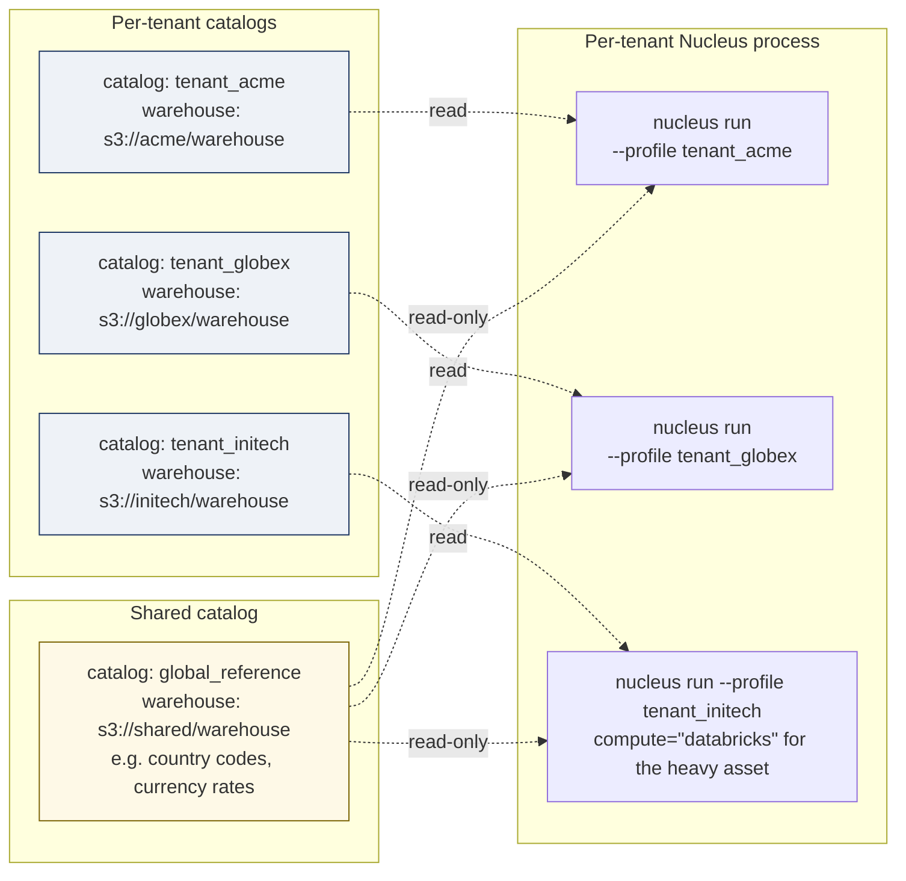

# Multi-tenant SaaS — catalog-per-tenant isolation pattern

> **30-second pitch**: A SaaS analytics product runs the same asset graph for hundreds of customer tenants. This recipe walks through the **catalog-per-tenant** pattern: one Iceberg catalog per customer (their isolation boundary), one shared catalog for cross-tenant reference data, and per-tenant compute dispatch (`compute=` Mode 2) for the noisy 1% who outgrow the shared VM. Schema contracts double as the multi-tenancy enforcement layer. Row-level security and OIDC-aware policies are explicitly **deferred to graduation** to a managed catalog.
>
> **Time to implement**: ~1.5 hours for a fresh 5-engineer team to set up the project structure, plus per-tenant onboarding (~5 minutes per new tenant once the script exists).
> **Cost**: $0 local; cloud cost scales with the *active* tenant set, not the total tenant count (cold tenants cost only storage).

---

## Honest scope statement

v0.2 multi-tenant isolation is a **structural** pattern: one catalog per tenant, one process per tenant when active, the operating system + storage permissions as the enforcement surface. It is **not**:

- **Row-level security inside a shared table** — that needs Unity Catalog row filters or Snowflake row access policies. Defer to graduation.
- **OIDC-mediated tenant authentication** — Hard Constraint #6 says Nucleus does not own identity. Delegate to your existing IdP via the BI tool / reverse proxy until [ADR-010](../../decisions/ADR-010-oidc-delegation-policy-v03.md) lands the catalog-side OIDC story at v0.5+.
- **Tenant-aware quotas / rate limits** — those are an L1 (Physics) concern that lives at the storage substrate and the engine layer (DuckDB `memory_limit` + your Linux cgroups), not in Nucleus's wrapper code.

The pattern below is the right answer for "100 tenants, each owns their data shape, occasionally one of them gets noisy." It is **not** the right answer for "10 000 tenants on one engine, sub-second tail-latency SLAs, cross-tenant analytics with strict data exfiltration controls" — that is a managed catalog problem.

---

## Architecture



The shared catalog is read-only from tenant processes. Cross-tenant joins are forbidden by construction — there is no shared connection that holds two tenant catalogs at once.

---

## Project layout

```text
saas-analytics/
├── nucleus_project.yaml              # default profile (used for shared.* assets)
├── profiles/                          # one nucleus_project.yaml-shaped file per tenant
│   ├── tenant_acme.yaml
│   ├── tenant_globex.yaml
│   └── tenant_initech.yaml
├── data/
│   ├── shared/warehouse/             # shared.* namespace (cold reference data)
│   └── tenants/
│       ├── acme/warehouse/           # tenant_acme isolation root
│       ├── globex/warehouse/
│       └── initech/warehouse/
└── assets/
    ├── __init__.py
    ├── shared_assets.py              # global reference (currency, country, ICD-10, etc.)
    ├── tenant_template.py            # the per-tenant graph; instantiated per profile
    └── checks.py
```

`profiles/<tenant>.yaml` carries the same shape as `nucleus_project.yaml`, with `storage.warehouse` and `catalog.path` swapped per tenant. The `assets/` modules are shared code; the **profile** picks which warehouse the SDK calls land against.

---

## Step 1 — Per-tenant `nucleus_project.yaml` shape

A tenant profile is a regular Nucleus project config — only the warehouse and catalog paths differ:

```yaml
# profiles/tenant_acme.yaml
project:
  name: tenant_acme
  profile: acme

catalog:
  type: filesystem
  path: ./data/tenants/acme/.nucleus/catalog.db

storage:
  warehouse: ./data/tenants/acme/warehouse
  snapshot_retain_days: 14

lineage:
  transport: file
  path: ./data/tenants/acme/.nucleus/lineage/events.jsonl

# Optional — yield-to-giants Mode 2 dispatch for noisy tenants (v0.3+)
compute:
  default: local
  overrides:
    marts.heavy_join: databricks
```

The `compute.overrides` block is a v0.3+ surface that lights up alongside Mode 2 hybrid dispatch. In v0.2 the only accepted value is `local` (per `src/nucleus/sdk/decorators.py:_validate_compute`); document the override now and the asset graph already wears the right hint when the v0.3+ landing arrives.

---

## Step 2 — Onboarding script (one tenant, one command)

```python
# scripts/onboard_tenant.py
"""Onboard a new SaaS tenant — create their catalog, warehouse, profile.

Usage:
    python scripts/onboard_tenant.py acme

The script is idempotent — re-running on an existing tenant is a no-op
on the directory layout and refreshes only the profile YAML.
"""
from __future__ import annotations

import sys
from pathlib import Path
from textwrap import dedent

ROOT = Path(__file__).resolve().parent.parent


def onboard(tenant_id: str) -> None:
    tenant_root = ROOT / "data" / "tenants" / tenant_id
    (tenant_root / "warehouse").mkdir(parents=True, exist_ok=True)
    (tenant_root / ".nucleus" / "lineage").mkdir(parents=True, exist_ok=True)
    (tenant_root / ".nucleus" / "runs").mkdir(parents=True, exist_ok=True)

    profile = ROOT / "profiles" / f"tenant_{tenant_id}.yaml"
    profile.parent.mkdir(parents=True, exist_ok=True)
    profile.write_text(dedent(f"""
        project:
          name: tenant_{tenant_id}
          profile: {tenant_id}

        catalog:
          type: filesystem
          path: ./data/tenants/{tenant_id}/.nucleus/catalog.db

        storage:
          warehouse: ./data/tenants/{tenant_id}/warehouse
          snapshot_retain_days: 14

        lineage:
          transport: file
          path: ./data/tenants/{tenant_id}/.nucleus/lineage/events.jsonl
    """).lstrip())
    print(f"onboarded tenant '{tenant_id}' at {tenant_root}")


if __name__ == "__main__":
    onboard(sys.argv[1])
```

Onboard a new tenant:

```bash
python scripts/onboard_tenant.py acme
python scripts/onboard_tenant.py globex
```

Each run produces a clean isolation root. The shared `nucleus_project.yaml` continues to point at `data/shared/warehouse/` for cross-tenant reference data.

---

## Step 3 — Tenant template assets

The asset graph is **the same code** for every tenant. Only the warehouse / catalog the materialization writes to differs.

```python
# assets/tenant_template.py
"""Per-tenant asset graph — runs against whichever profile is active."""
from __future__ import annotations

from pathlib import Path

import os
import polars as pl

import nucleus
import nucleus.ctx as ctx

# Resolve the tenant warehouse from an environment variable set by the launcher
# (or from the loaded profile). One process = one tenant; this is enforced by
# never holding two warehouse handles open in the same Python process.
WAREHOUSE = Path(os.environ["NUCLEUS_WAREHOUSE"]).resolve()
SHARED_WAREHOUSE = Path(os.environ["NUCLEUS_SHARED_WAREHOUSE"]).resolve()


@nucleus.asset("bronze.events", schedule="@hourly")
def bronze_events() -> pl.DataFrame:
    """Ingest tenant-specific events from their dedicated S3 prefix."""
    tenant_id = os.environ["NUCLEUS_TENANT_ID"]
    ctx.copy_from(
        f"s3://my-saas-events/{tenant_id}/events/*.ndjson",
        target="bronze.events",
        warehouse_dir=WAREHOUSE,
        format="json",
    )
    return ctx.read("bronze.events", warehouse_dir=WAREHOUSE).collect().head(0)


@nucleus.asset("silver.daily_active_users", deps=["bronze.events"], schedule="@daily")
def silver_daily_active_users() -> pl.DataFrame:
    return ctx.sql(
        """
        SELECT
            date_trunc('day', event_ts) AS day,
            COUNT(DISTINCT user_id)     AS dau
        FROM {{ ref('bronze.events') }}
        GROUP BY 1
        """,
        warehouse_dir=WAREHOUSE,
    ).collect()


@nucleus.asset(
    "marts.localized_dashboard",
    deps=["silver.daily_active_users"],
    schedule="@daily",
)
def marts_localized_dashboard() -> pl.DataFrame:
    """Join tenant DAU with the SHARED currency reference catalog.

    Cross-warehouse reads are explicit: one ctx.read against the tenant
    warehouse, one ctx.read against the shared warehouse, joined client-side
    in Polars. There is no SQL join across two catalogs in v0.2 — the
    pattern keeps tenant data from accidentally leaking into the shared
    namespace via mis-typed identifiers.
    """
    dau = ctx.read("silver.daily_active_users", warehouse_dir=WAREHOUSE).collect()
    fx = ctx.read("shared.currency_rates", warehouse_dir=SHARED_WAREHOUSE).collect()

    return (
        dau.join(fx, left_on="day", right_on="rate_date", how="left")
           .with_columns([
               (pl.col("dau") * pl.col("usd_rate")).alias("dau_usd_normalized"),
           ])
           .select(["day", "dau", "dau_usd_normalized"])
    )
```

Three patterns matter:

1. **Two `WAREHOUSE` paths, never combined in one SQL statement.** Cross-warehouse joins happen in Polars after each side is materialized — the read boundary doubles as the isolation boundary.
2. **`@nucleus.asset` keys are identical across tenants.** The asset key is namespaced by the *catalog* (the warehouse), not by the asset key. This keeps the asset graph code DRY.
3. **`compute=` hint in profile, not in code.** Tenant noisiness is an *operational* concern; per-tenant override lives in the profile, not in the source.

---

## Step 4 — Shared assets (read-only from tenants)

```python
# assets/shared_assets.py
"""Global reference assets — written by the platform team, read by tenants."""
from __future__ import annotations

import os
from pathlib import Path

import polars as pl

import nucleus
import nucleus.ctx as ctx

SHARED_WAREHOUSE = Path(os.environ["NUCLEUS_SHARED_WAREHOUSE"]).resolve()


@nucleus.asset("shared.currency_rates", schedule="@daily")
def shared_currency_rates() -> pl.DataFrame:
    """Daily FX rates pulled from the platform-managed source."""
    ctx.copy_from(
        os.environ["FX_FEED_URL"],
        target="shared.currency_rates",
        warehouse_dir=SHARED_WAREHOUSE,
        format="json",
    )
    return ctx.read("shared.currency_rates", warehouse_dir=SHARED_WAREHOUSE).collect().head(0)


@nucleus.asset("shared.country_codes")
def shared_country_codes() -> pl.DataFrame:
    """ISO 3166 country codes — slow-moving, written by hand once per quarter."""
    return pl.DataFrame({
        "country_code": ["US", "CA", "GB", "DE", "FR", "JP", "AU"],
        "country_name": ["United States", "Canada", "United Kingdom",
                         "Germany", "France", "Japan", "Australia"],
        "region_bucket": ["NA", "NA", "EU", "EU", "EU", "APAC", "APAC"],
    })
```

Filesystem permissions on `data/shared/warehouse/` are the read/write enforcement. Set `chmod 0750` (or the bucket equivalent) so tenant Linux users can read but not write — the platform-team service account is the only writer.

---

## Step 5 — Per-tenant launcher

```bash
#!/usr/bin/env bash
# scripts/run_tenant.sh
# Usage: ./scripts/run_tenant.sh acme bronze.events

set -euo pipefail
TENANT="$1"
ASSET="$2"

export NUCLEUS_TENANT_ID="$TENANT"
export NUCLEUS_WAREHOUSE="./data/tenants/${TENANT}/warehouse"
export NUCLEUS_SHARED_WAREHOUSE="./data/shared/warehouse"

# Use the per-tenant profile so the run ledger lands under the right .nucleus/runs/
NUCLEUS_PROFILE="profiles/tenant_${TENANT}.yaml" \
  nucleus run "$ASSET"
```

Run the same asset for two tenants:

```bash
./scripts/run_tenant.sh acme   bronze.events
./scripts/run_tenant.sh globex bronze.events
```

Each invocation is a single Python process with one open catalog. The OS keeps the worlds disjoint.

---

## Step 6 — Schema contracts as the multi-tenancy enforcement layer

Schema contracts double as the structural isolation guarantee. Two contracts make the multi-tenant intent explicit at runtime:

```python
# assets/checks.py
from __future__ import annotations

import os
from pathlib import Path

import polars as pl

import nucleus
import nucleus.ctx as ctx

WAREHOUSE = Path(os.environ["NUCLEUS_WAREHOUSE"]).resolve()


@nucleus.check("bronze.events")
def all_events_belong_to_one_tenant() -> nucleus.CheckResult:
    """Every row in bronze.events MUST carry the tenant_id of the active profile.
    A row with a different tenant_id means a leak from another tenant's source.
    """
    df = ctx.read("bronze.events", warehouse_dir=WAREHOUSE).collect()
    expected = os.environ["NUCLEUS_TENANT_ID"]
    bad = df.filter(pl.col("tenant_id") != expected)
    return nucleus.CheckResult(
        passed=len(bad) == 0,
        metric=len(bad),
        message=(
            f"{len(bad)} rows with foreign tenant_id "
            f"(expected={expected!r}) — investigate ingest source"
        ),
    )


@nucleus.check("marts.localized_dashboard", severity="warn")
def localized_dashboard_row_per_day() -> nucleus.CheckResult:
    df = ctx.read("marts.localized_dashboard", warehouse_dir=WAREHOUSE).collect()
    days = df["day"].n_unique()
    rows = len(df)
    return nucleus.CheckResult(
        passed=days == rows,
        metric=rows - days,
        message=f"{rows - days} duplicate days in localized_dashboard — joins may be loose",
    )
```

`severity="error"` (the default) on `all_events_belong_to_one_tenant` means: if a row from another tenant ever lands in this warehouse, the materialization is rejected and the snapshot is not committed. Better to halt the tenant pipeline than to leak.

---

## Step 7 — Anti-pattern callouts

Three patterns that *seem* tempting and are wrong for v0.2:

### 1. Row-level security via "WHERE tenant_id = current_user"

```sql
-- DO NOT do this in v0.2
SELECT * FROM events
WHERE tenant_id = CURRENT_USER();
```

DuckDB has no concept of "current_user" tied to your application's auth. Even if it did, applying a row-filter at query time is a soft enforcement — anyone with the file path can scan around it. Use the catalog-per-tenant boundary instead. **Defer row-level security to Unity Catalog / Snowflake when you graduate.**

### 2. One mega-warehouse with a "tenant_id" partition

Tempting because it's "fewer catalogs to manage." Reality:

- Cross-tenant analytics becomes too easy (one bug in a shared SQL accidentally joins two tenants).
- A noisy tenant's `MERGE INTO` blocks every other tenant's read on the same partition.
- GDPR right-to-delete (recipe #4) is now a multi-tenant orchestration problem.
- Backups can no longer be per-tenant.

The **catalog-per-tenant** pattern trades a small amount of operational overhead for a clean blast radius.

### 3. Sharing one Python process across tenants

```python
# DO NOT do this in v0.2
for tenant_id in tenant_ids:
    materialize_asset("bronze.events", warehouse_dir=tenant_warehouse(tenant_id))
```

The AMA, run ledger, advisory locks, and OpenLineage transport assume one project = one process. Sharing process state across tenants invalidates the lineage graph and creates lock-bypass races. **One tenant per OS process. Use Linux cgroups or a container per process to scale.**

---

## When NOT to use Nucleus for this

- **Single shared engine across thousands of tenants** with sub-second SLOs: Snowflake's multi-cluster warehouse model or Databricks' serverless SQL is the right substrate. Nucleus per-tenant catalog scales to *hundreds*, not *tens of thousands*, of active tenants on one VM.
- **Hard data residency boundaries** (e.g. EU tenants' data must never leave EU storage at any layer): the catalog-per-tenant is *correct*, but you need region-pinned warehouses and per-region runners. v0.2 single-node deployment doesn't ship a multi-region story; combine this recipe with [`production-deployment.md`](../production-deployment.md) per region.
- **Cross-tenant analytics for the platform team** (e.g. "what is the total DAU across all tenants?"): the read-only join on a *separate* analytics catalog that the platform owns, populated by a fan-in job — not by punching through tenant catalog boundaries.
- **Tenant churn at the rate of tens of new tenants per day**: v0.2 onboarding is a script (Step 2). At that churn rate you want a managed catalog with API-driven catalog provisioning.

---

## How this graduates to Databricks / Snowflake

The catalog-per-tenant pattern translates **directly** to Unity Catalog and Snowflake account-level isolation:

- **Mode 1 — portability**: each `data/tenants/<tenant>/warehouse/` becomes one Unity Catalog catalog. Existing tenant dashboards rewire to the managed catalog without changing the asset graph code.
- **Mode 2 — hybrid compute** (v0.3+): the `compute.overrides` block in the tenant profile dispatches noisy tenants' heavy assets to Databricks while letting the long tail run on the local stack.
- **Row-level security graduation**: now the row filters and column masks land in Unity Catalog / Snowflake Horizon. This recipe's structural isolation becomes the *baseline* defense; managed catalogs add the *policy* layer on top.

Tenant graduation is *per-tenant*, not all-at-once. A noisy 1% can run on Databricks while the long tail keeps the cheap local layout.

---

## Cost (illustrative — refresh quotes before commitments)

| Pattern | Order of magnitude | Notes |
| --- | --- | --- |
| 100 tenants, 5 GB each, single VM, ~10 active at once | ~$80-200 / mo | Storage + small VM dominate |
| Same with one tenant on Databricks dispatch | + dollars per DBU for that tenant only | Cost lands on the noisy tenant, not the platform |
| Snowflake account-per-tenant (high-end isolation) | dollars per tenant per month | Wins when contractual isolation matters |

The sweet spot is the small-VM-with-occasional-burst model: catalog-per-tenant gives you bookkeeping for "which tenants are active this hour," and Mode-2 dispatch gives you the per-tenant escape hatch.

---

## Cross-references

- [`docs/cookbook/cloud-credentials.md`](../cloud-credentials.md) — per-tenant IAM patterns + scoped IRSA / Workload Identity
- [`docs/cookbook/production-deployment.md`](../production-deployment.md) — per-region single-node baseline
- [`docs/cookbook/recipes/gdpr_right_to_delete.md`](gdpr_right_to_delete.md) — per-tenant deletion runbook
- [`AGENTS.md`](../../../AGENTS.md) Hard Constraint #6 (no custom identity store), #7 (no ML platform — but the pattern shape transfers to multi-tenant ML)
- [`docs/specs/nucleus_architecture_v4.1.md`](../../specs/nucleus_architecture_v4.1.md) §10 (Yield to giants — Modes 1/2/3), §20 (Non-goals)
- [ADR-001 — no custom commit service](../../decisions/ADR-001-no-custom-commit-service.md)
- [ADR-010 — OIDC delegation policy v0.5+](../../decisions/ADR-010-oidc-delegation-policy-v03.md)
- [ADR-024 — Reliability guards (per-asset advisory lock)](../../decisions/ADR-024-reliability-guards.md)
