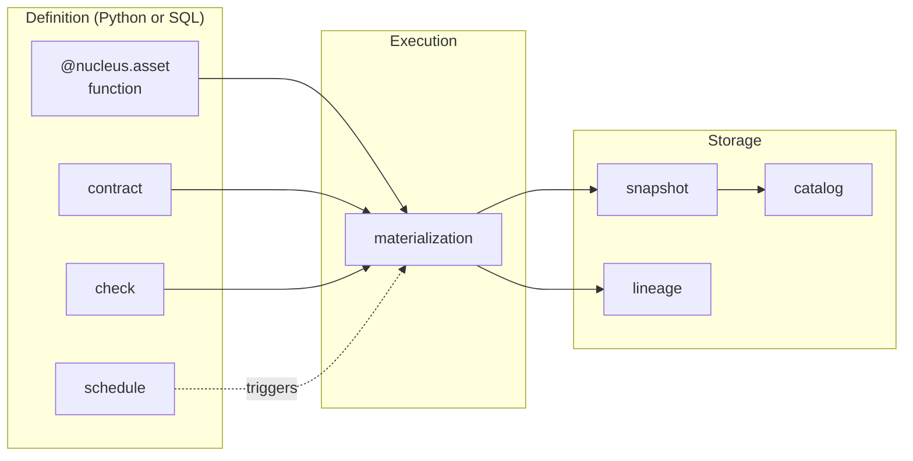

# Concepts

Nucleus has a deliberately small vocabulary. Learning these eight concepts covers ~95% of the mental model. Read them in order; each builds on the previous.

| # | Concept | One sentence |
|---|---------|-------------|
| 1 | [Asset](asset.md) | A named Iceberg table produced by a Python or SQL function |
| 2 | [Materialization](materialization.md) | One execution of an asset function, producing one Iceberg snapshot |
| 3 | [Snapshot](snapshot.md) | An immutable, versioned point-in-time state of an asset's data |
| 4 | [Contract](contract.md) | A declarative schema + quality definition that must hold every materialization |
| 5 | [Check](check.md) | An imperative assertion that runs after materialization |
| 6 | [Catalog](catalog.md) | The metadata store that tracks all assets and their Iceberg tables |
| 7 | [Lineage](lineage.md) | The dependency graph between assets and their data origins |
| 8 | [Schedule](schedule.md) | A cron expression that declares when an asset should be materialized |

## How they fit together

Read it as: an **asset** is a function plus its metadata (contract, check, schedule). Each time the asset runs — manually via `nucleus run` or automatically via the **schedule** — that single execution is a **materialization**. The materialization writes a new immutable **snapshot** to the **catalog** and emits a **lineage** event. Everything else in Nucleus is built on these primitives.

## Why such a small vocabulary?

Pillar 4 (familiar UX from proven giants) and the [anti-over-engineering directive](../philosophy/wrap-not-build.md) demand it. Borrowed terms wherever possible:

- **asset** + **materialization** + **schedule** — from Dagster
- **snapshot** + **catalog** + **partition** — from Apache Iceberg
- **contract** + **check** — common dbt / data-quality terminology

If you've used dbt or Dagster, the leap is small. If you haven't, eight terms is small enough to internalize in one read.

## What's deliberately not here

- **Job / task / pipeline output** — replaced by **asset** and **materialization**. The graph is the unit, not the run.
- **Version** — replaced by **snapshot**. Iceberg owns versioning; we surface it under the right name.
- **Plugin / extension / module** — Nucleus has no public plugin surface in v1. Extension comes via composability swaps documented in [`/docs/internal/swap/`](../governance/composability.md).
- **Metastore** <!-- banned-term: metastore --> — replaced by **catalog**. We say catalog because that's what the OSS ecosystem (Iceberg REST, Polaris, Lakekeeper, Unity) calls it.

If you find yourself reaching for one of those words, the [vocabulary table in `AGENTS.md` §7](https://github.com/nucleus-data/nucleus/blob/main/AGENTS.md#7-vocabulary-use-these-terms) shows the canonical replacement. Consistency in language prevents architecture drift.

## After concepts

Apply what you've learned in the [Guides](../guides/index.md) (task-oriented) or the [Cookbook](../cookbook/index.md) (pattern-oriented). Stuck on a term mid-task? The page links above are deep-linkable from any guide.
